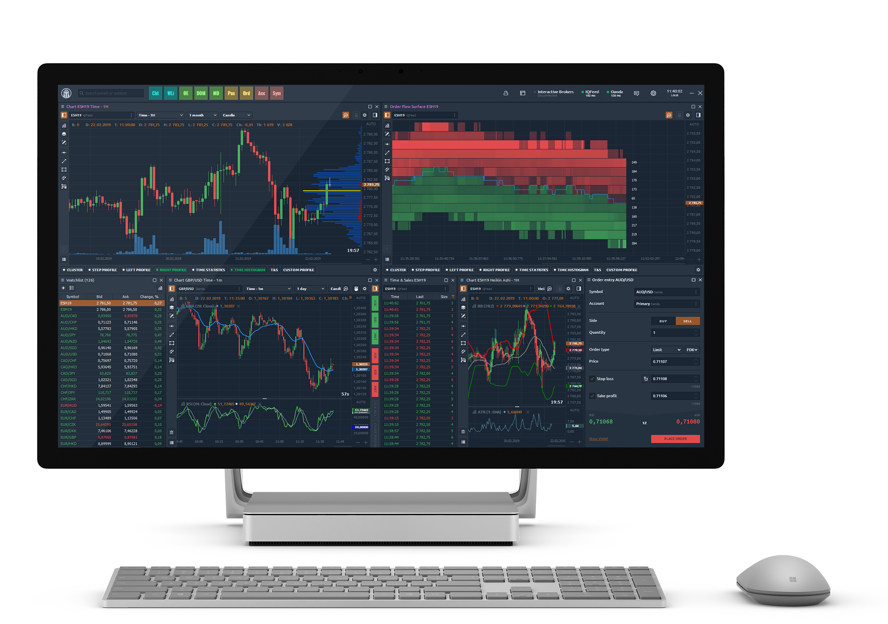

# Добро пожаловать в базу знаний Quantower

Чтобы получить ответы на вопросы, которые вы не можете найти в Базе знаний, свяжитесь с нами, используя следующие способы:

* [**Telegram индивидуальная поддержк**](https://t.me/quantower)**а (1 линия)**
* [**Telegram **](https://t.me/quantower)[**индивидуальная поддержк**](https://t.me/quantower)**а (2 линия)**
* [**Живой чат на нашем сайте **](https://www.quantower.com)(всплывающее окно в правом нижнем углу)
* По почте:  **info@quantower.com**

Для удобства навигации База знаний разделена на несколько категорий, которые позволят вам быстро найти нужную информацию:


[getting-started](getting-started/)



[analytics-panels](analytics-panels/)



[trading-panels](trading-panels/)



[portfolio-panels](portfolio-panels/)



[informational-panels](informational-panels/)



[miscellaneous-panels](miscellaneous-panels/)



[quantower-algo](quantower-algo/)



[customization](customization/)


