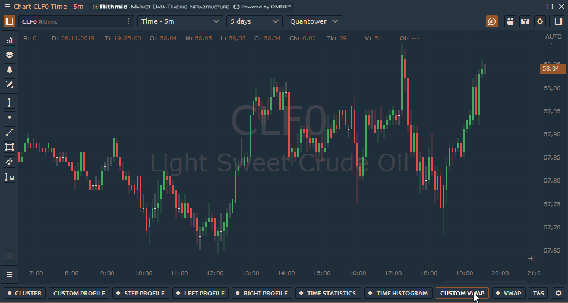
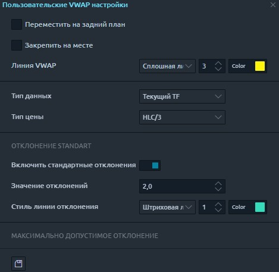
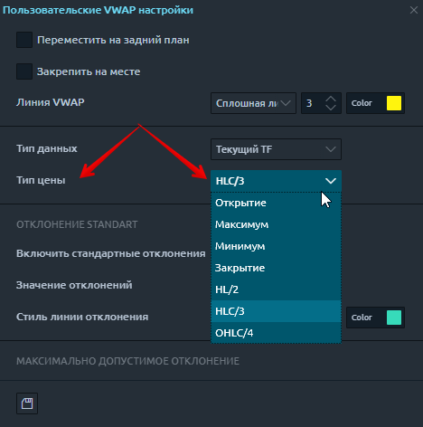

# Пользовательский VWAP

Укажите начальную точку на графике, и привязанный VWAP проведет линию к текущему моменту. Также вы можете указать конечную точку для линии, установить стандартное отклонение и максимально допустимое отклонение.

Нажав на значок «Шестеренка», вы можете настроить параметры выбранного VWAP.

* **Линия VWAP** - установите тип основной линии, ее толщину и цвет.
* **Тип данных** - установите данные для расчета VWAP: Ticks или Current TF. Тики будут использовать тиковые данные для расчета VWAP, и загрузка займет гораздо больше времени. Текущий TF будет использовать данные бара из текущего выбранного таймфрейма вашего графика. Он будет использовать данные типа цены и умножить их на объем бара.
* **Тип цены** - выберите цену для текущего типа данных TF (Open, High, Low, Close, HL / 2, HLC / 3, OHLC / 4)

* **Полосы стандартного отклонения**. Когда параметр активен, линии стандартного отклонения вверх и вниз от VWAP будут дополнительно рассчитаны на графике. В поле **«Значение»** укажите количество стандартных отклонений и цвета.
* **Максимально допустимое отклонение (МДО).** Параметр аналогичен стандартному отклонению, но рассчитывается как (максимум периода VWAP - минимум периода VWAP) / 2.
* **Координаты начальной точки** - определяет начальную точку для пользовательского VWAP.
* **Видимость на указанных таймфреймах** - этот параметр позволяет указать, на каких таймфреймах будет отображаться VWAP.
