# Настройки графика

Открыть настройки графика можно двумя способами:

**1\)** нажмите кнопку «Меню» в левом верхнем углу и выберите пункт «Настройки».

**2\)** Щелкните правой кнопкой мыши в любом месте графика и выберите пункт Настройки.

Общий вид меню настроек графика состоит из следующих подразделов. Рассмотрим их подробнее:

* \*\*\*\*[**Вид**](chart-settings.md#nastroiki-vneshnego-vida)\*\*\*\*
* \*\*\*\*[**Стиль данных**](chart-settings.md#stil-dannykh)\*\*\*\*
* \*\*\*\*[**Шкала времени**](chart-settings.md#shkala-vremeni)\*\*\*\*
* \*\*\*\*[**Шакала цен**](chart-settings.md#shakala-cen)\*\*\*\*
* \*\*\*\*[**Визуальная торговля**](chart-settings.md#vizualnaya-torgovlya)\*\*\*\*
* \*\*\*\*[**Запись заказа. Ввод ордеров.** ](chart-settings.md#vvod-ordera)\*\*\*\*
* \*\*\*\*[**Информационное окно**](chart-settings.md#informacionnoe-okno)\*\*\*\*
* **Объемные бары**
* **Горячие клавиши**

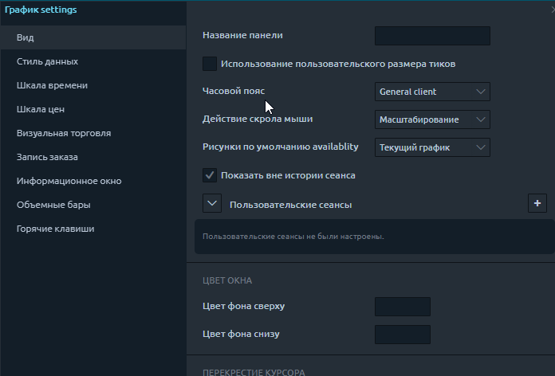

## Настройки внешнего вида

* **Название панели.** Вы можете переименовать панель диаграммы по своему желанию.
* **Использование пользовательского размера тиков.** Это, вероятно, одна из самых важных настроек на  графике. Чаще всего используется для кластерных диаграмм. Когда у вас есть очень волатильный инструмент, такой как BTC или любой другой инструмент, в ходе его торговли на каждом уровне кластера будут объемы. Иногда в них бывают пробелы. Кластеры можно сжимать по вертикали для лучшего отображения информации. В этом пункте меню необходимо указать степень сжатия. Ниже вы можете увидеть график Биткоин со сжатием 10 долларов.

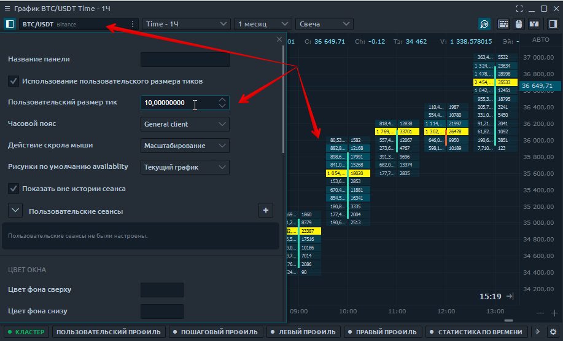

* **Часовой пояс.** Это настройки часового пояса диаграммы
* **Действие скрола мыши.** Это действие колеса мыши, когда пользователь вращает колесо. Доступны два варианта - прокрутка или масштабирование области графика.

* **Рисунки по умолчанию availability**.  Если вы выберете «Все диаграммы с одним и тем же символом», все рисунки будут проецироваться на другие диаграммы с тем же активом \(тикером\). А также позволяет изменять настройки цвета фигур на всех графиках одновременно. Таким образом можно настроить **полную синхронизацию технического анализа** на одновременно открытых нескольких поверхностях.

![&#x421;&#x438;&#x43D;&#x445;&#x440;&#x43E;&#x43D;&#x438;&#x437;&#x430;&#x446;&#x438;&#x44F; &#x442;&#x435;&#x445;&#x43D;&#x438;&#x447;&#x435;&#x441;&#x43A;&#x43E;&#x433;&#x43E; &#x430;&#x43D;&#x430;&#x43B;&#x438;&#x437;&#x430; &#x43D;&#x430; &#x43E;&#x434;&#x43D;&#x43E;&#x432;&#x440;&#x435;&#x43C;&#x435;&#x43D;&#x43D;&#x43E; &#x43E;&#x442;&#x43A;&#x440;&#x44B;&#x442;&#x44B;&#x445; &#x433;&#x440;&#x430;&#x444;&#x438;&#x43A;&#x430;&#x445; &#x43E;&#x434;&#x43D;&#x43E;&#x433;&#x43E; &#x438;&#x43D;&#x441;&#x442;&#x440;&#x443;&#x43C;&#x435;&#x43D;&#x442;&#x430;.](../../.gitbook/assets/risunki-po-umolchaniyu-kvantouer.png)



* **Пользовательская сессия.** Этот пункт предназначен для отображения торговых сессий.
* **Цвет окона.** Настройки цвета фона на графике.
* **Перекрестие курсора**. Это настройки курсора и его видимости на графиках с одним символом \(активом\).
* **Время до следующего бара.** Это настройки для отображения времени до следующего бара и изменения его цвета.
* **Сетка.** Настройки линий сетки на графике \(горизонтальная и вертикальная сетка\).
* **Дополнительно.** Используется для включения / отключения панелей инструментов и других данных на графике.

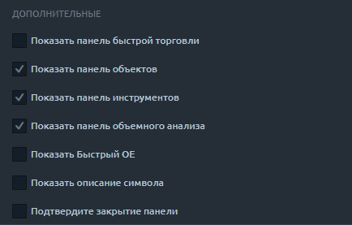

## Стиль данных

Эта вкладка управляет визуальными настройками данных диаграммы. Здесь вы можете изменить стиль диаграммы \(например, свечи, полосы, площадь, линия\) и установить цвета для полос вверх и вниз. Попробуйте настроить приятный для глаз интерфейс.

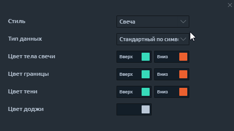

## Шкала времени

Используйте эту вкладку для настройки шкалы времени. Здесь вы можете выбрать размер и цвет шрифта. Вы также можете выбрать цвет фона для временной шкалы. Вы также можете управлять вертикальными разделителями периодов. Такие периоды как ежедневно, еженедельно, ежемесячно и ежегодно. Все эти периоды при необходимости можно отображать разными цветами.

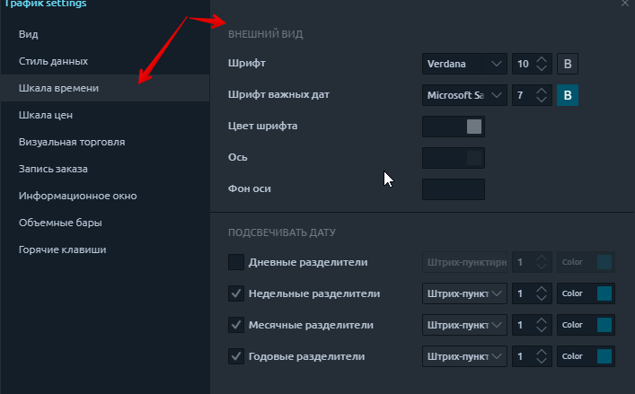

## **Шакала цен**

Эти настройки позволяют настраивать шкалу цен. Здесь есть 3 важных момента, давайте разберем каждый из них:

* **Тип шкалы.** Позволяет выбрать, какой тип шкалы будет отображаться на графике. Это может быть обычный дисплей. Отображение процентов или логарифмической шкалы.
* **Увеличить.** Здесь вы можете настроить вертикальное масштабирование графика.

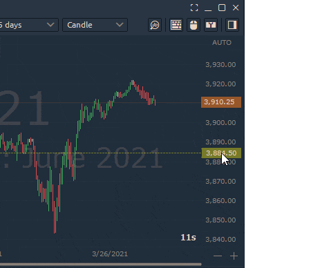

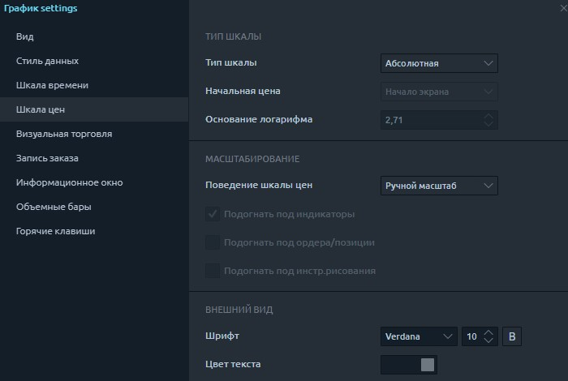

* Выделите цены. Регулирует цвет и шрифт текущей цены на графике. Дает возможность выделить минимумы и максимумы предыдущего дня и лимиты по инструменту

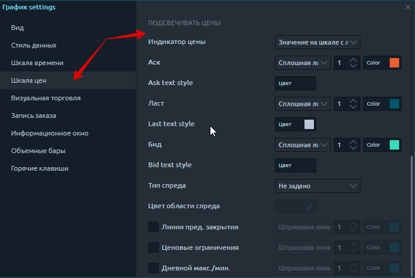

## **Визуальная торговля**

Эта вкладка позволяет включать настройки для отображения текущей позиции на графике и отображения уже завершенных сделок.

## Ввод ордера

Это настройки панели ввода ордеров. Самое интересное здесь то, что вы можете установить стандартное количество входных ордеров, которое соответствует вашим рискам. Это очень удобно для ручной торговли.

[Как пользоваться панелью ввода ордеров **читайте здесь**](https://app.gitbook.com/@quantower/s/quantower-ru/~/drafts/-MbBCIqhkEW3xvohXN2Y/trading-panels/order-entry)\*\*\*\*

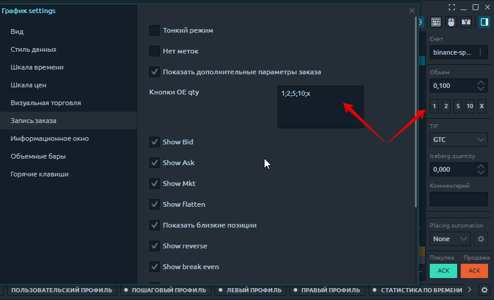

## Информационное окно

Эта вкладка настроек предназначена для отображения значений в верхнем левом углу. какие данные отображать вы можете выбрать сами. Например, мне важно знать значение громкости, и я только их отображаю. Вы также можете настроить шрифт этой информации.

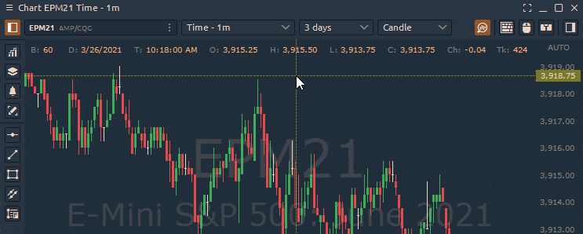

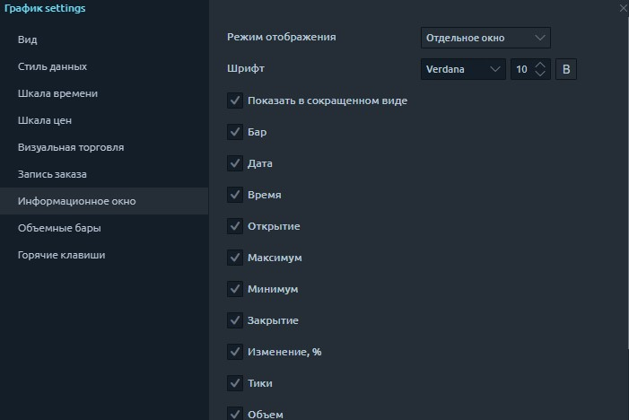

## Volume Bars

This tab is used to adjust the volume histogram at the bottom of the chart. You can choose the colors of the histogram that you like. You can also select a color scheme for coloring this chart. Adjusting the color of the volume histogram depending on the direction of the price bar or changing the color depending on whether the volume is higher or lower now.

## Hotkeys

This tab is for configuring your keyboard shortcuts. Here you can configure the volume change with one button. Drawing levels or trend channels. Cancel orders and many other useful functions. In general, almost any action can be assigned as you wish

