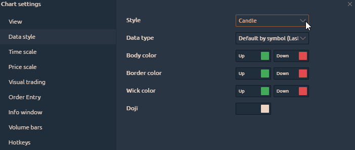

# Настройки графика

Открыть настройки графика можно двумя способами:

**1\)** нажмите кнопку «Меню» в левом верхнем углу и выберите пункт «Настройки».

**2\)** Щелкните правой кнопкой мыши в любом месте графика и выберите пункт Настройки.

Общий вид меню настроек графика состоит из следующих подразделов. Рассмотрим их подробнее:

* \*\*\*\*[**Вид**](chart-settings.md#nastroiki-vneshnego-vida)\*\*\*\*
* **Стиль данных**
* **Шкала времени**
* **Шакала цен**
* **Визуальная торговля**
* **Запись заказа**
* **Информационное окно**
* **Объемные бары**
* **Горячие клавиши**

## Настройки внешнего вида

* **Название панели.** Вы можете переименовать панель диаграммы по своему желанию.
* **Использование пользовательского размера тиков.** Это, вероятно, одна из самых важных настроек на  графике. Чаще всего используется для кластерных диаграмм. Когда у вас есть очень волатильный инструмент, такой как BTC или любой другой инструмент, в ходе его торговли на каждом уровне кластера будут объемы. Иногда в них бывают пробелы. Кластеры можно сжимать по вертикали для лучшего отображения информации. В этом пункте меню необходимо указать степень сжатия. Ниже вы можете увидеть график Биткоин со сжатием 10 долларов.

* **Часовой пояс.** Это настройки часового пояса диаграммы
* **Действие скрола мыши.** Это действие колеса мыши, когда пользователь вращает колесо. Доступны два варианта - прокрутка или масштабирование области графика.

* **Рисунки по умолчанию availability**.  Если вы выберете «Все диаграммы с одним и тем же символом», все рисунки будут проецироваться на другие диаграммы с тем же активом \(тикером\). А также позволяет изменять настройки цвета фигур на всех графиках одновременно. Таким образом можно настроить **полную синхронизацию технического анализа** на одновременно открытых нескольких поверхностях.

![&#x421;&#x438;&#x43D;&#x445;&#x440;&#x43E;&#x43D;&#x438;&#x437;&#x430;&#x446;&#x438;&#x44F; &#x442;&#x435;&#x445;&#x43D;&#x438;&#x447;&#x435;&#x441;&#x43A;&#x43E;&#x433;&#x43E; &#x430;&#x43D;&#x430;&#x43B;&#x438;&#x437;&#x430; &#x43D;&#x430; &#x43E;&#x434;&#x43D;&#x43E;&#x432;&#x440;&#x435;&#x43C;&#x435;&#x43D;&#x43D;&#x43E; &#x43E;&#x442;&#x43A;&#x440;&#x44B;&#x442;&#x44B;&#x445; &#x433;&#x440;&#x430;&#x444;&#x438;&#x43A;&#x430;&#x445; &#x43E;&#x434;&#x43D;&#x43E;&#x433;&#x43E; &#x438;&#x43D;&#x441;&#x442;&#x440;&#x443;&#x43C;&#x435;&#x43D;&#x442;&#x430;.](../../.gitbook/assets/risunki-po-umolchaniyu-kvantouer.png)



* **Пользовательская сессия.** Этот пункт предназначен для отображения торговых сессий.
* **Цвет окона.** Настройки цвета фона на графике.
* **Перекрестие курсора**. Это настройки курсора и его видимости на графиках с одним символом \(активом\).
* **Время до следующего бара.** Это настройки для отображения времени до следующего бара и изменения его цвета.
* **Сетка.** Настройки линий сетки на графике \(горизонтальная и вертикальная сетка\).
* **Дополнительно.** Используется для включения / отключения панелей инструментов и других данных на графике.

## Data style

This tab controls the visual settings of the chart data. Here you can change the Chart Style \(like Candles, Bars, Area, Line\) and set colors for the Up & Down Bars. Try to set up a nice interface for your eyes.

## Time scale

Use this tab to adjust the time scale. Here you can select the size and color of the font. You can also select the background color for the timeline. You can also control the vertical period separators. Such as Daily Period, Weekly Monthly and Yearly. All of these periods you can display in different colors as needed.

## Price Scale

These settings allow you to customize the price scale. There are 3 important points here, let's break down each one:

* **Scale type**. Allows you to select which type of scale will be displayed on the chart. This can be a normal display. The percentage display or a logarithmic scale. 
* **Zoom**. Here you can adjust the vertical scaling of the chart.

* **Highlight prices**. Adjusts the color and font of the current price on the chart. Gives the opportunity to highlight the minimums and maximums of the previous day and limits on the instrument

## Visual trading

This tab allows you to include settings to display the current position on the chart and display already completed trades.

## Order entry

These are the settings of the order entry panel. The most interesting thing here is that you can set the standard number of entry orders which correspond to your risks. This is very convenient for manual trading.

[How to use the order entry panel read here](../../trading-panels/order-entry/)

## Info Window

This settings tab is for displaying values in the upper left corner. which data to display you can choose for yourself. For example, it is important for me to know the volume value and I only display them. You can also adjust the font of this information.

## Volume Bars

This tab is used to adjust the volume histogram at the bottom of the chart. You can choose the colors of the histogram that you like. You can also select a color scheme for coloring this chart. Adjusting the color of the volume histogram depending on the direction of the price bar or changing the color depending on whether the volume is higher or lower now.

## Hotkeys

This tab is for configuring your keyboard shortcuts. Here you can configure the volume change with one button. Drawing levels or trend channels. Cancel orders and many other useful functions. In general, almost any action can be assigned as you wish

