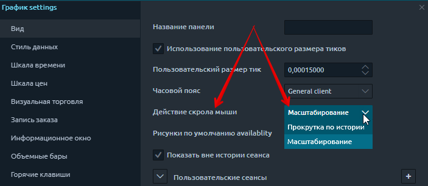
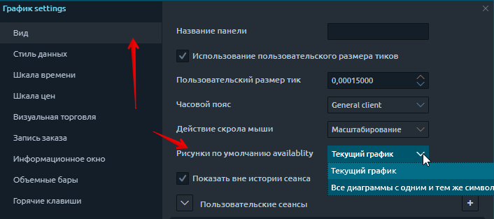
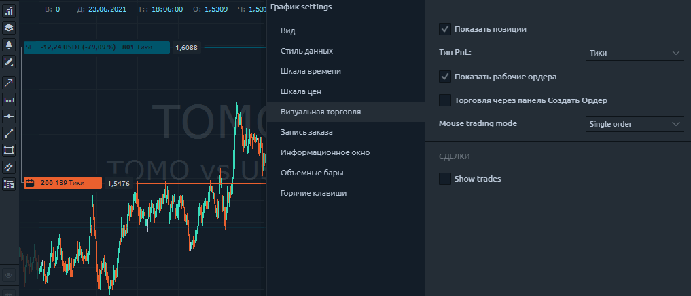
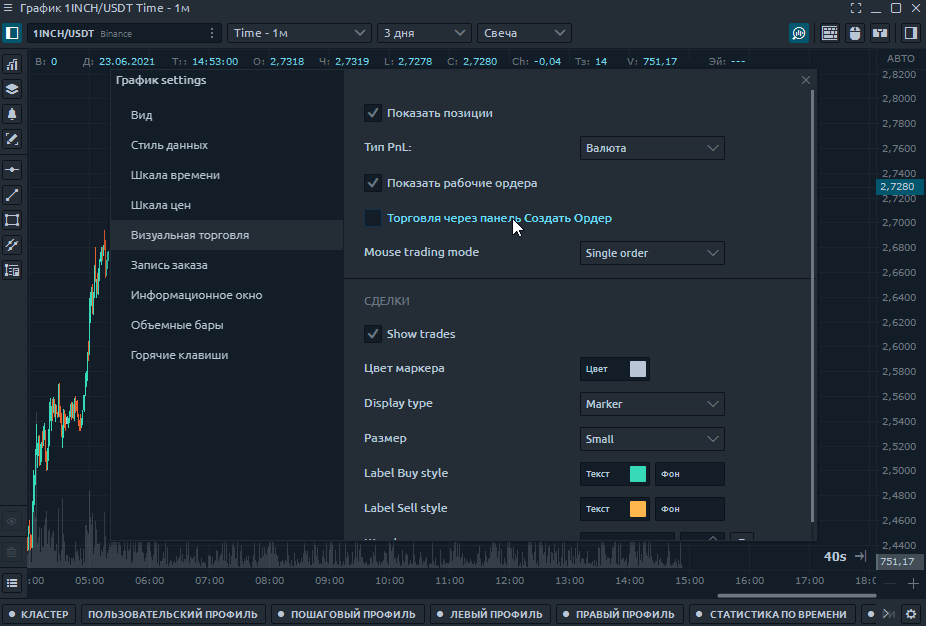
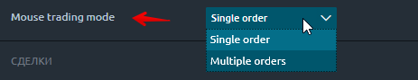
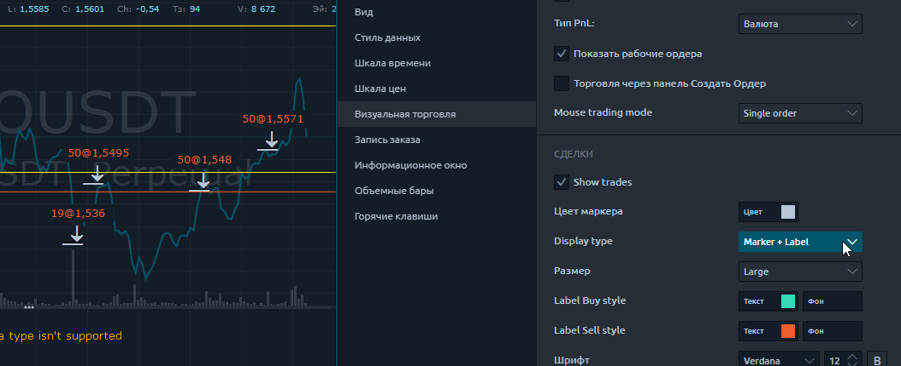
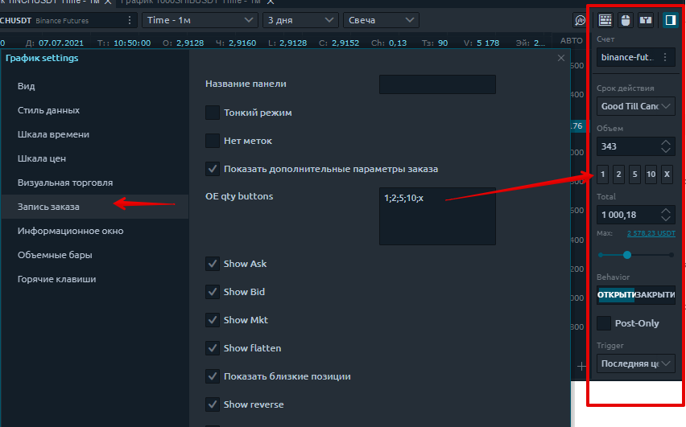
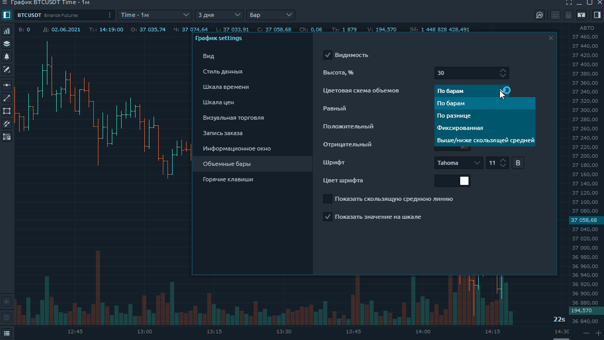

# Настройки графика

Открыть настройки графика можно двумя способами:

**1)** нажмите кнопку «Меню» в левом верхнем углу и выберите пункт «Настройки».

**2)** Кникните правой кнопкой мыши в любом месте графика и выберите пункт Настройки.

Общий вид меню настроек графика состоит из следующих подразделов. Рассмотрим их подробнее:

* ****[**Вид**](chart-settings.md#nastroiki-vneshnego-vida)****
* ****[**Стиль данных**](chart-settings.md#stil-dannykh)****
* ****[**Шкала времени**](chart-settings.md#shkala-vremeni)****
* ****[**Шакала цен**](chart-settings.md#shakala-cen)****
* ****[**Визуальная торговля**](chart-settings.md#vizualnaya-torgovlya)****
* ****[**Запись заказа. Ввод ордеров.** ](chart-settings.md#vvod-ordera)****
* ****[**Информационное окно**](chart-settings.md#informacionnoe-okno)****
* ****[**Объемные бары**](chart-settings.md#obemnye-bary)****
* ****[**Горячие клавиши**](chart-settings.md#goryachie-klavishi)****

## Настройки внешнего вида

* **Название панели.** Вы можете переименовать панель диаграммы по своему желанию.
* **Использование пользовательского размера тиков.** Это, вероятно, одна из самых важных настроек на  графике. Чаще всего используется для кластерных диаграмм. Когда у вас есть очень волатильный инструмент, такой как BTC или любой другой инструмент, в ходе его торговли на каждом уровне кластера будут объемы. Иногда в них бывают пробелы. Кластеры можно сжимать по вертикали для лучшего отображения информации. В этом пункте меню необходимо указать степень сжатия. Ниже вы можете увидеть график Биткоин со сжатием 10 долларов.

* **Часовой пояс.** Это настройки часового пояса диаграммы
* **Действие скрола мыши.** Это действие колеса мыши, когда пользователь вращает колесо. Доступны два варианта - прокрутка или масштабирование области графика.

* **Рисунки по умолчанию availability**.  Если вы выберете «Все диаграммы с одним и тем же символом», все рисунки будут проецироваться на другие диаграммы с тем же активом (тикером). А также позволяет изменять настройки цвета фигур на всех графиках одновременно. Таким образом можно настроить **полную синхронизацию технического анализа** на одновременно открытых нескольких поверхностях.

.png>)



* **Пользовательская сессия.** Этот пункт предназначен для отображения торговых сессий.
* **Цвет окона.** Настройки цвета фона на графике.
* **Перекрестие курсора**. Это настройки курсора и его видимости на графиках с одним символом (активом).
* **Время до следующего бара.** Это настройки для отображения времени до следующего бара и изменения его цвета.
* **Сетка.** Настройки линий сетки на графике (горизонтальная и вертикальная сетка).
* **Дополнительно.** Используется для включения / отключения панелей инструментов и других данных на графике.

## Стиль данных

Эта вкладка управляет визуальными настройками данных диаграммы. Здесь вы можете изменить стиль диаграммы (например, свечи, полосы, площадь, линия) и установить цвета для полос вверх и вниз. Попробуйте настроить приятный для глаз интерфейс.

## Шкала времени

Используйте эту вкладку для настройки шкалы времени. Здесь вы можете выбрать размер и цвет шрифта. Вы также можете выбрать цвет фона для временной шкалы. Вы также можете управлять вертикальными разделителями периодов. Такие периоды как ежедневно, еженедельно, ежемесячно и ежегодно. Все эти периоды при необходимости можно отображать разными цветами.

## **Шкала цен**

Эти настройки позволяют настраивать шкалу цен. Здесь есть 3 важных момента, давайте разберем каждый из них:

* **Тип шкалы.** Позволяет выбрать, какой тип шкалы будет отображаться на графике. Это может быть обычный дисплей. Отображение процентов или логарифмической шкалы.
* **Увеличить.** Здесь вы можете настроить вертикальное масштабирование графика.

* Выделите цены. Регулирует цвет и шрифт текущей цены на графике. Дает возможность выделить минимумы и максимумы предыдущего дня и лимиты по инструменту

## **Визуальная торговля**

Эта вкладка позволяет включать настройки для отображения текущей позиции на графике и отображения уже завершенных сделок.

.png>)

* **показать позиции.** Данная опция позволяет включать и выключать  отображение текущих позиций на графике.&#x20;
* **тип Pnl** позволяет выбрать отображение на открытой позиции прибыли/убытка в тиках или валюте.&#x20;


**тип Pnl** позволяет выбирать отображение позиции в валюте только для тех подключений, где существует такая возможность.&#x20;


* **показать рабочие ордера.** Опция позволяет включать и выключать  отображение рабочих ордеров на графике.&#x20;
* **торговля через панель создать ордер**. При включенной опции, режим торговли мышью будет отключен, а при клике мышкой на графике  автоматически будет открываться связанная панель ввода ордера для данной котировки. Аналогично режиму торговли мышью :&#x20;
  * кликом правой кнопки мыши будет открыта панель ввода лимитного ордера на сделку **"Продажа"** по отмеченной на графике цене;
  * кликом левой кнопки мыши будет открыта панель ввода ордера на сделку **"Покупка"** по отмеченной на графике цене;

* **режим торговли мышью.** Доступно к выбору два режима:&#x20;
  * **один ордер/позиция.** После установки ордера, режим торговли мышью автоматически отключится.&#x20;
  * **несколько ордеров/позиций.** Режим торговли мышью будет активен до того момента, пока не будет отключен.

Таким образом, используя режим торговли мышью "**несколько ордеров/позиций"** можно быстро мышкой на графике создать сетку ордеров подряд , не меняя режимов :

* **показать сделки**. При включении данной опции, совершенные сделки будут визуально отображены на графике. Индивидуально можно настроить цветовое оформление маркера сделки, размер, фон и текст.

## Ввод ордера

Это настройки панели ввода ордеров. Самое интересное здесь то, что вы можете установить стандартное количество входных ордеров, которое соответствует вашим рискам. Это очень удобно для ручной торговли.

[Как пользоваться панелью ввода ордеров **читайте здесь**](https://app.gitbook.com/@quantower/s/quantower-ru/\~/drafts/-MbBCIqhkEW3xvohXN2Y/trading-panels/order-entry)****

## Информационное окно

Эта вкладка настроек предназначена для отображения значений в верхнем левом углу. какие данные отображать вы можете выбрать сами. Например, мне важно знать значение громкости, и я только их отображаю. Вы также можете настроить шрифт этой информации.

## **Объемные бары**

Эта вкладка используется для настройки гистограммы объема в нижней части графика. Вы можете выбрать цвета гистограммы, которые вам нравятся. Вы также можете выбрать цветовую схему для раскраски этой диаграммы. Регулировка цвета гистограммы объема в зависимости от направления ценового бара или изменение цвета в зависимости от того, больше или меньше объем сейчас.

## Горячие клавиши

Эта вкладка предназначена для настройки сочетаний клавиш. Здесь вы можете настроить изменение громкости одной кнопкой. Отрисовка уровней или каналов тренда. Отмена заказов и множество других полезных функций. В общем, **практически любое действие можно назначить** по своему желанию.

.jpg>)
