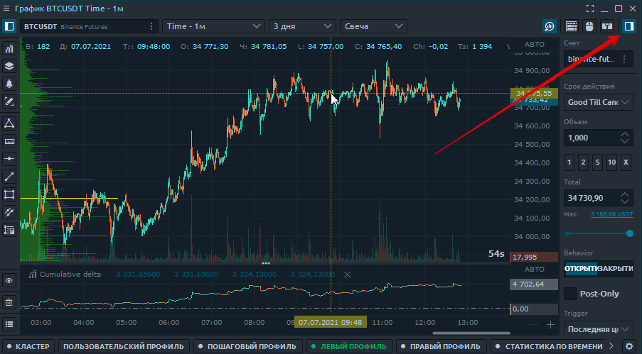
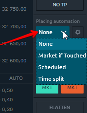
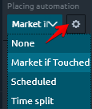

# Ввод ордера с графика

### Торговля с помощью панели инструментов быстрой торговли

Торговля с помощью панели инструментов быстрой торговли Панель инструментов быстрой торговли появляется при нажатии на кнопку, отмеченную на картинке. Если у вас его нет, вы должны включить его в настройках диаграммы. [Посмотрите, как это делается.](https://app.gitbook.com/@quantower/s/quantower-ru/~/drafts/-MbBUVhc4TPnNLe_OOl1/analytics-panels/chart/chart-settings)

**Объем**- это количество лотов для сделки. Здесь вы можете установить свои индивидуальные значения в соответствии со своим риском и управлением капиталом. 

Щелкнув правой кнопкой мыши на этой панели, вы можете установить количество монет по умолчанию для торговли.

### **Как установить свои индивидуальные значения в поле объем?**

-Перейдите в меню [**Настройки графика**](https://app.gitbook.com/@quantower/s/quantower-ru/~/drafts/-MbeyqYlB3IwnbmL6nJY/analytics-panels/chart/chart-settings)**,** раздел **запись заказа**  
- В поле "_кнопки ОЕ"_  вы можете выставить свои индивидуальные значения объема.  
-Кроме этого, в поле можно устанавливать не только значения, **но и формулы**. Для быстрого изменения значения объема исходя из вашей торговли:

После этого, введенные значения будут отображены на панели "Ввод ордера с графика", и останется **сохранить эти значения по умолчанию**, если их нужно использовать часто или постоянно.

**Триггер** - это метод расчета вашей прибыли или убытка. Вы можете выбрать по последней цене или по цене, указанной брокером.

Затем вы можете установить автоматический стоп-лосс и прибыль в пунктах. Установить размер лота и защитить его очень удобно. Укажите свои значения в соответствующих полях.

### **Автоматизация ценообразования**

Далее идет блок **кнопок для быстрого размещения** заказа по соответствующей цене.

Далее идет большой блок **функций для управления текущей позицией**. Вы можете удалять или ограничивать ордера или стопы. Вы также можете перевернуть свою позицию с помощью одной кнопки или установить без потерь. Это очень функциональные кнопки, не пропустите их.

### Как установить прибыль и стоп-ордера


Некоторые брокеры, такие как Binance, не разрешают стоп-приказы для лимитных приказов. \(Пока позиция НЕ открыта\) В этом случае используйте лимитные ордера противоположного направления.


-Используйте панель инструментов быстрой торговли с графика.   
-Установите свои значения для стоп-лосса или прибыли. Вы также можете использовать только один параметр.  
-Используйте кнопку, чтобы активировать сделку с помощью мыши, чтобы установить лимитный ордер


Если вы исполняете маркет ордер , указанные параметры стопа сохранят свои значения и будут установлены немедленно.


### Как установить несколько ордеров Profit и Stop для одной позиции 

Чтобы установить несколько стоп-приказов для одной позиции, выполните следующие действия. 

* Переключите настройки стоп-лимита и тейк-профита в мультирежим
* Введите данные для установки первых лимитных ордеров и сколько лотов или монет нужно закрыть
* Для следующих остановок введите аналогичные данные в следующей строке.
* Вы можете устанавливать заказы, кратные вашему общему объему.

### Стратегия размещения ордера

Стратегия размещения ордеров на панели может реализовывать расширенные торговые алгоритмы, такие как разделение ордеров по времени или объему, айсберг, локальный SL / TP, трейлинг и т. д


Этот блок реализовывает разные алгоритмы для разных подключений.   
И автоматически отображает **только доступные \(!\)** торговые алгоритмы для выбранного подключения. 


* Стратегия размещения ордера **Market if Touched \(MIT\)**  - это приказ на покупку \(или продажу\) инструмента ниже \(или выше\) рынка.
* Стратегия размещения ордера  **"Scheduled" \(**По расписанию\) отправит ваш заказ в указанный день и время.
* Стратегия размещения ордеров **«Time Split»** \(Разделение времени\) разделит размер вашего ордера на равные части и отправит их в несколько этапов в соответствии с указанным отображаемым количеством и выбранным временным интервалом.

После выбора стратегии с предложенного списка, кликнув на шестеренку, можно настроить условия

