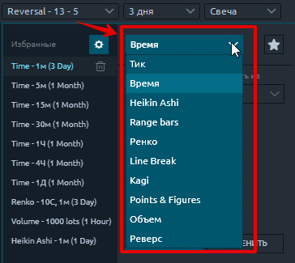
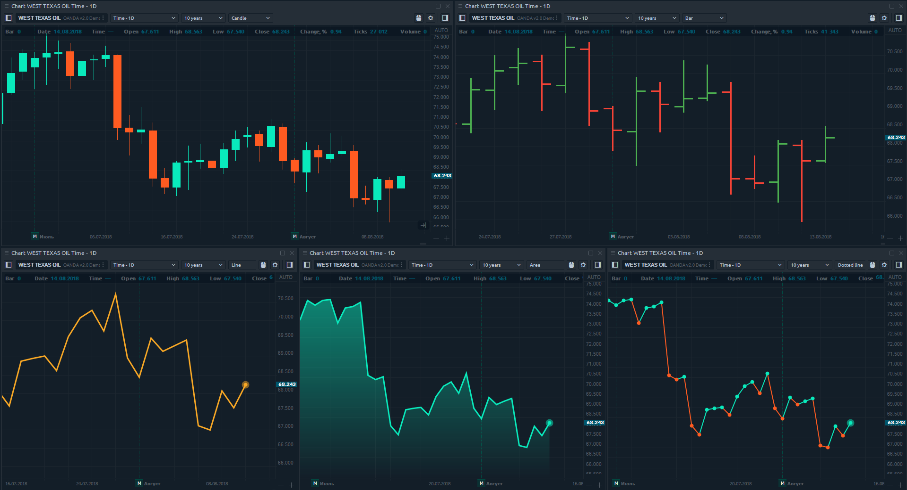

# Типы и стили графиков

Quantower предлагает множество типов диаграмм, которые помогут вам отображать данные диаграмм в различных форматах. Вы можете изменить тип графика в меню, как показано ниже.

## Типы и стили графиков

Quantower предоставляет 10 типов графика:

*  ****[**Тиковый график**](https://app.gitbook.com/@quantower/s/quantower-ru/~/drafts/-ManNs1UdDo_jqCBCJUa/analytics-panels/chart/chart-types/tick-chart)\*\*\*\*
*  ****[**График по времени**](https://help.quantower.com/analytics-panels/chart/chart-types/time-aggregation)\*\*\*\*
*  ****[**График Хайкен Аши**](https://help.quantower.com/analytics-panels/chart/chart-types/heiken-ashi)\*\*\*\*
*  ****[**Рендж бары** ](https://help.quantower.com/analytics-panels/chart/chart-types/range-bars)\(Range Bars\)
*  ****[**Ренко** ](https://help.quantower.com/analytics-panels/chart/chart-types/renko)\*\*\*\*
* \*\*\*\*[**График линейного прорыва**](https://help.quantower.com/analytics-panels/chart/chart-types/line-break) \(Line Break\)
* \*\*\*\*[**График Каги** ](https://help.quantower.com/analytics-panels/chart/chart-types/kagi)\*\*\*\*
* \*\*\*\*[**График Крестики-нолики**](https://help.quantower.com/analytics-panels/chart/chart-types/points-and-figures) \(Point and Figure charts\) ****
* \*\*\*\*[**Столбиковый график объема**](https://app.gitbook.com/@quantower/s/quantower-ru/~/drafts/-Mb1nY6tTQju6DlBSkFL/analytics-panels/chart/chart-types/volume-bars) \(volume bars\)
* \*\*\*\*[**График реверс**](https://app.gitbook.com/@quantower/s/quantower-ru/~/drafts/-ManNs1UdDo_jqCBCJUa/analytics-panels/chart/chart-types/reversal-bars) ****\(Reversal Bars\)

Графики также могут быть представлены в **6 разных стилях:**

* **Свеча**
* **Бар**
* **Линия**
* **Линия с точкой**
* **Область**
* **Квантоуэр**

