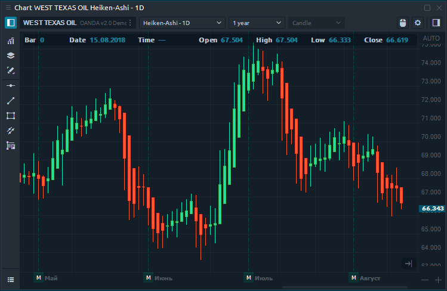

# График Хайкен Аши \(Heiken Ashi\)

## Общая информация

График Хайкен-Аши \(HA\) - это модифицированный тип классического свечного графика, который основан на пересчете данных OHLC. Полученная свеча отфильтровывает некоторый шум, чтобы лучше уловить тренд и точки разворота.

Для построения диаграммы HA используются следующие расчеты:

* HA Close = \(O+H+L+C\)/4
* HA Open = \(HA Open \(previous bar\) + HA Close\(previous bar\)\)/2
* HA High = Maximum \(H, HA Open, HA Close\)
* HA Low = Minimum \(L, HA Open, HA Close\)

## Создание нового графика Хайкен-Аши

Чтобы открыть новую диаграмму HA, вам нужно выбрать Heiken-Ashi из выпадающего списка  и указать параметры сборки - Value и Build from. Нажмите \[Применить\], и график будет построен. Если количества свечей \(данных\) недостаточно, то выбирайте большую глубину истории, например 1 год или 5 лет.

Вы можете создать несколько предустановленных настроек для быстрого построения графиков. Для этого необходимо настроить параметры и добавить в избранное, нажав на значок звездочки.


Heiken-Ashi используется только со стилем диаграммы Candle.


