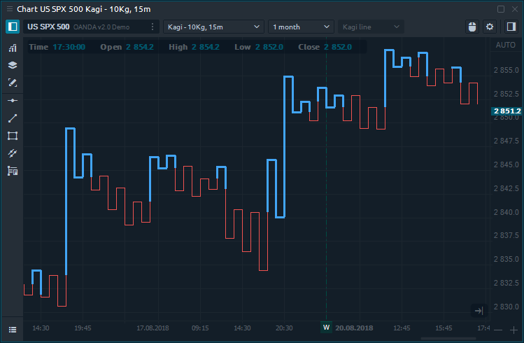
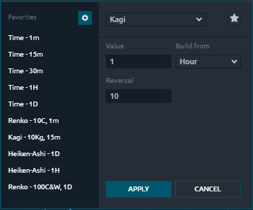

# График Каги \(Kagi\)

## Общая информация

.Как диаграмма P & F и бары диапазона, диаграмма Kagi полностью независима от времени и основана только на ценовом действии. График каги состоит из вертикальных линий, соединенных горизонтальными линиями.

## График Каги расчет

На график Каги влияют два основных параметра:

* **Built from and its value**- это параметр, на основании которого будет печататься график. Если вы установите 5 минут, то цены закрытия будут взяты из 5-минутного закрытия.
* **Реверс** - количество движения цены, необходимое для изменения направления линии Каги. Например, если вы установите для параметра разворота 10 тиков, это означает, что цене нужно изменить не менее 10 тиков, чтобы напечатать линию разворота.

