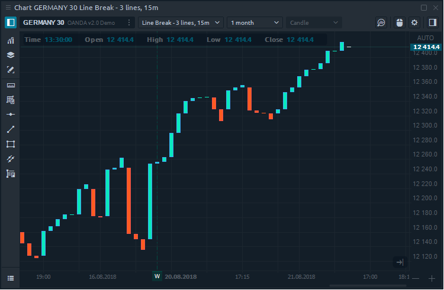
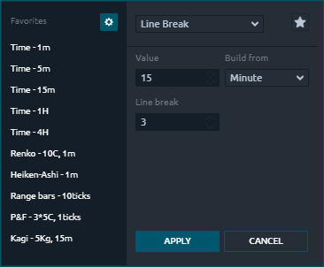
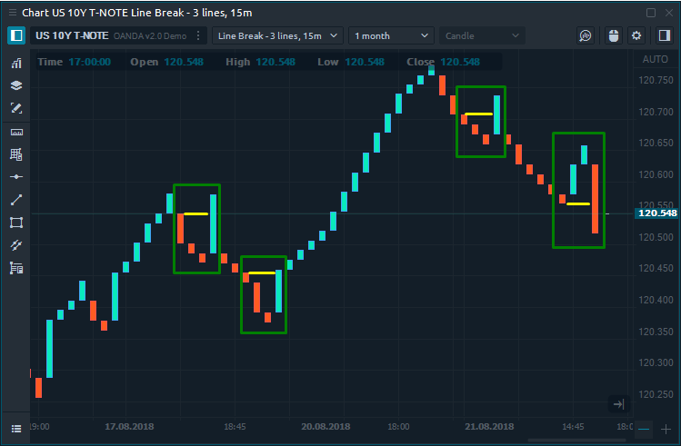

# График линейного прорыва (Line Break)

## Общая информация о графике

**Line Break **очень похож на другие графики, не зависящие от времени, такие как Kagi, P\&F, Range Bars. График с линейным разрывом печатает серию столбцов, которые представляют растущие и падающие цены. Ключевым параметром, участвующим в построении графика, является количество последних столбцов для построения текущего бара.

Важно отметить, что столбцы на этом графике обычно называют «линиями». Прорыв линии основан на ценах закрытия, поэтому он берет текущую цену и сравнивает ее с ценами закрытия предыдущих баров (линий). Количество предыдущих баров, участвующих в расчете, указывается в настройках графика.

## Расчет Графика линейного прорыва

Наиболее частое значение параметра Line Break - 3. Это означает, что цена закрытия текущей линии сравнивается с ценой закрытия третьей линии назад.

Каждая новая цена закрытия имеет три возможных исхода:

* новая линия того же цвета - строится, когда цена идет в том же направлении.
* новую линию противоположного цвета - строится, когда изменение цены достаточно, чтобы гарантировать разворот.
* новые линии не добавляются, если цена не расширяет тренд или изменения недостаточно, чтобы гарантировать разворот.

В приведенном выше примере показаны области, где был изменен цвет линии. Желтая линия показывает уровень третьего бара, при его пробое цвет линии меняется.
