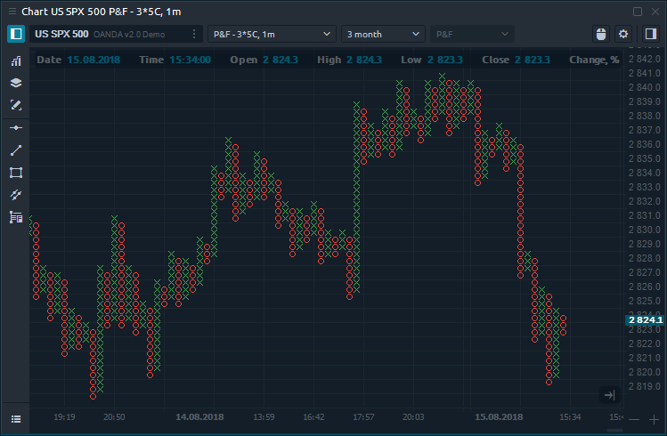
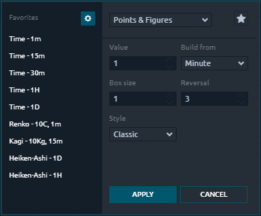
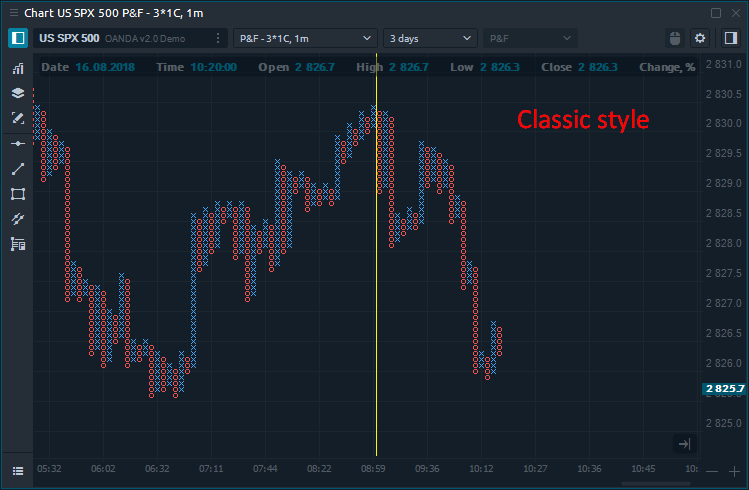
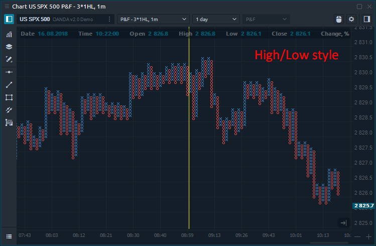

# График Крестик-нолик

## Общая информация

Пункты и цифры - один из самых популярных типов графиков, который позволяет трейдерам анализировать только цену без привязки ко времени, тем самым устраняя рыночный шум. В отличие от обычных свечных графиков, P & F состоит из столбцов X и O, которые отражают рост или падение цен соответственно.

P&F charts provide a unique look at price action that has several advantages:

* Filter insignificant price movements and noise
* Focus on important price movements
* Determine support and resistance levels
* Identify trends and reversal points
* Remove the time aspect from the analysis process

## How is the Point & Figure chart built?

The plotting of P & F chart depends on several basic parameters:

* **Box size**, which determines the price range \(the number of ticks\) for X-Columns or O-Columns. Each X and O occupies an area called _**Box**_, the size of which is determined by the Box Size parameter. No Xs or Os are displayed if prices rise or fall by an amount that is less than the box size.
* **Reversal**, a parameter that indicates the number of Box Sizes that the price should go in the opposite direction to begin a new column. A new column, therefore, signals a change in the price trend.
* **Build from** parameter specifies the time frame of the data that is used to build the Point and Figure bars.

To build a chart, you can use two styles:

* **Classic**, which uses only the closing price \(last price\) to plot the chart. 
* **High / Low** is based on High and Low prices.

The difference between these calculation styles you can see on the screenshots below.

