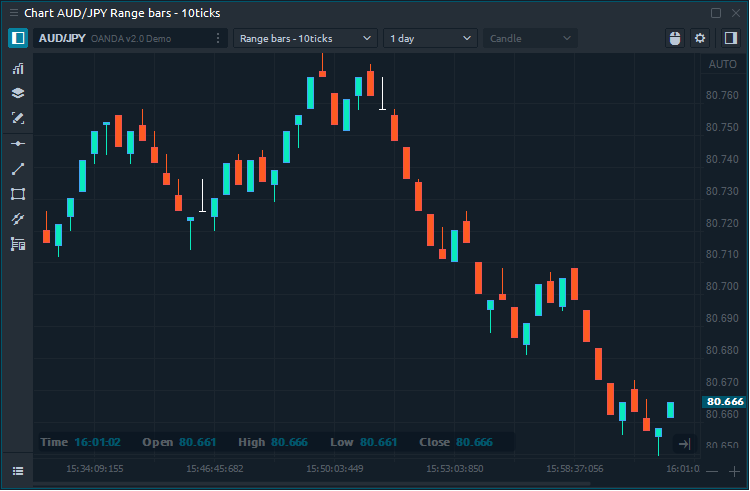

# Рендж бары (Range Bars)

[**Рендж бары **](https://help.quantower.com/analytics-panels/chart/chart-types/range-bars)(Range Bars)   График состоит из баров (свечей) в определенном диапазоне, который определяется трейдером в настройках графика. Range Bars не зависит от времени, а только от движения цены. Таким образом, если цена имеет низкую волатильность и остается в диапазоне меньше указанного в параметрах, то новые бары (свечи) строиться не будут. Следовательно, чем выше волатильность торгового инструмента, тем больше баров будет построено; и наоборот, в периоды более низкой волатильности будет построено меньше баров.

## Расчет графика Рендж бары (Range Bars)

Для построения Range Bars диапазона есть три простых правила.

* Каждая полоса диапазона должна иметь диапазон максимума / минимума, равный указанному диапазону.
* Каждый новый диапазонный бар должен открываться за пределами диапазона максимума / минимума предыдущего бара.
* Каждый бар диапазона должен закрываться либо на своем максимуме, либо на минимуме.
