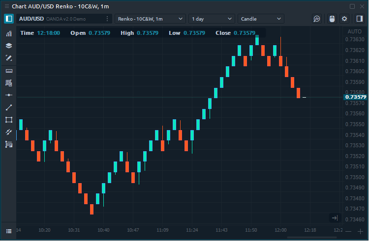
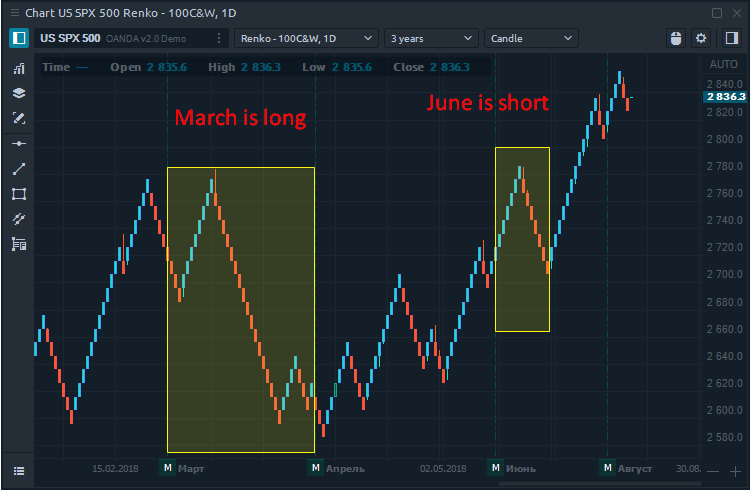
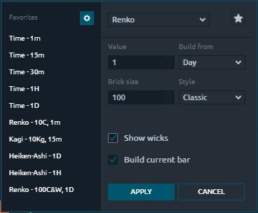
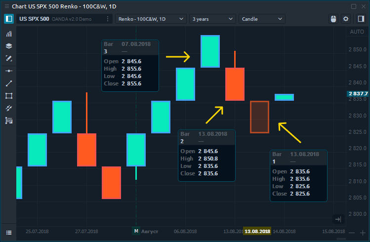
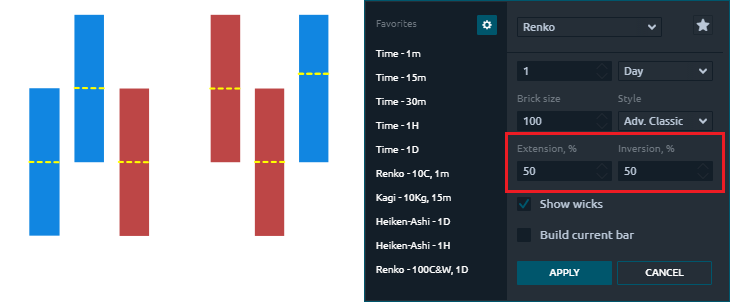
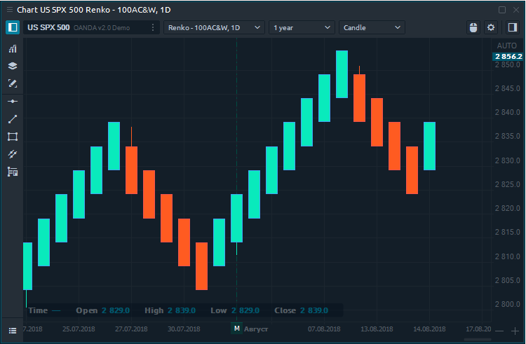
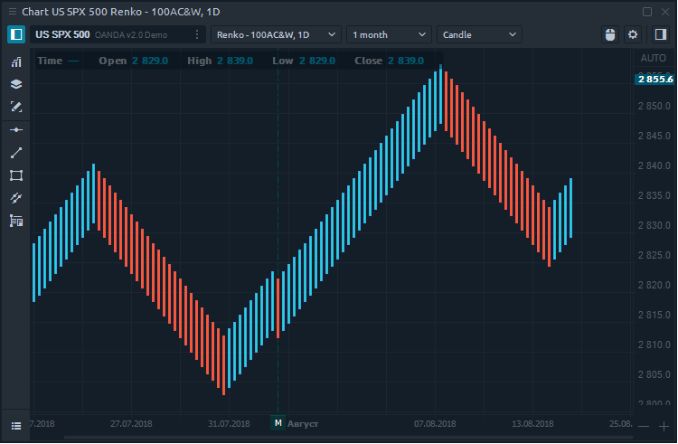
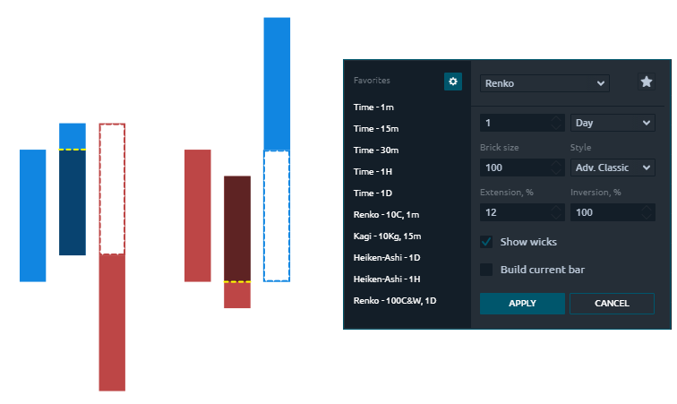
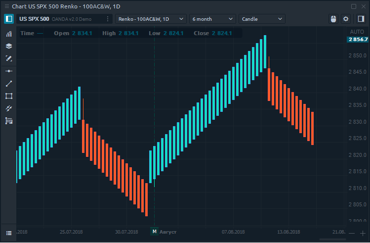

# График Ренко \(Renko\)

## Общая информация

График Ренко полностью не зависит от времени, основан только на движении цены и помогает отфильтровывать шум, который может возникать на других типах графиков. Ренко строится из кирпичей, которые создаются только тогда, когда цена превышает тело предыдущего кирпича на определенный размер, который задается трейдером в параметрах графика.

## Расчет графика Renko

Построение графика Ренко основано на кирпичах, размер которых задает трейдер. Благодаря этому график Ренко игнорирует время и фокусируется только на изменении цены. Например, если установить размер кирпича 10 пунктов, новый кирпич будет построен, когда цена достигнет 10 или более пунктов. В противном случае цена на графике Ренко не изменится.

* Если раньше был кирпич вверх, а цена поднялась еще на 10 пунктов, создается новый кирпичик вверх.
* Если раньше был кирпич вниз, и цена упала еще на 10 пунктов, создается новый кирпич вниз.
* Если раньше был кирпич вверх, цена должна упасть на 20 пунктов, чтобы создать новый кирпич вниз.
* Если раньше был кирпич вниз, цена должна подняться на 20 пунктов, чтобы создать новый кирпичик вверх.

## Стили \(методы\) расчета

В настройках графика Ренко вы можете выбрать один из нескольких стилей, на основе которых будет строиться график:

* **Классический** - с использованием только цены закрытия \(или последней цены\)

* **High / Low** - использование высоких и низких цен. Если предыдущий кирпич рос, то текущий кирпич сначала учитывает высокие цены, а затем низкие цены. Если цена падает, метод сначала учитывает низкие цены, а затем высокие цены.
* **Advanced Classic \(Advanced High / Low\)** - этот метод позволяет строить нестандартные графики Ренко на основе цены закрытия \(или цены максимума / минимума\). Для этого воспользуйтесь дополнительными настройками графика -

  расширение \(%\) и инверсия \(%\).

* **Показать фитили** - позволяет вам добавлять фитили к кирпичам Ренко, показывая фактические максимумы и минимумы внутри кирпича.
* **Построить текущую панель** - это опция, которая показывает / визуализирует создание текущего кирпича в реальном времени. Если вы выберете одну минуту для агрегирования времени, все кирпичи Ренко, которые были бы созданы на основе движения цены, будут построены сразу через одну минуту.

## Нестандартные графики Ренко

Среднее Ренко сглаживает график больше, чем классическое ренко, потому что цена открытия находится в середине кирпича. Они будут показывать меньше откатов, а развороты тренда заметить легче. Значение расширения и инверсии 50% приведет к созданию кирпичей Median Renko.

Геометрическое ренко даст вам очень плавные развороты, а графики более сглажены, чем при медианном ренко. Одно из особых свойств этой формы Renko заключается в том, что при использовании процента расширения и инверсии 12,5% наклон кирпичей вверх будет 45 °, а для кирпичей вниз -45 °.

**Турбо Ренко** сглаживает большинство откатов и показывает только развороты с высокой вероятностью. Turbo Renko использует расширение кирпича на 12% и инверсию на 100%. Цена должна развернуться целым кирпичом, чтобы сформировать разворот, показанный пунктирными кирпичиками.

