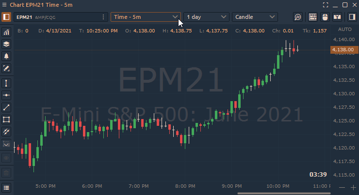

# Тиковый график

Тиковый график строит новый бар после определенного количества сделок, например, после каждых 610 сделок. Базовые диаграммы \(например, основанные на времени\) рисуют новый столбец через заданный период времени, например, каждые 5 минут или часов.

Например, каждый столбец на 610 тиковом графике представляет 610 сделок любого размера. Тик может быть сделкой по одному контракту или по 10 000 контрактов. Вот почему так важно сочетать использование тиковых графиков с объемом.

Чтобы установить этот тип диаграммы, откройте Меню таймфреймов и выберите в раскрывающемся меню — **Tick**.

