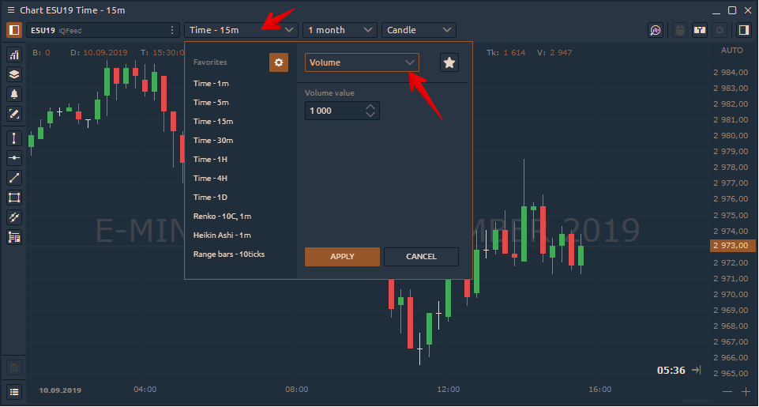

# Столбиковый график объема \(volume bars\)

Бары объема строятся на основе данных объема - тикового или биржевого объема, если таковой имеется. Время не участвует в этом агрегировании.

Каждая полоса на линейчатой ​​диаграмме громкости содержит определенный уровень громкости. Этот уровень объема достигается путем накопления объема каждого из нижележащих баров. Когда уровень громкости достигнут, следующая полоса громкости начинает накапливать объем от нижележащих баров.

## How to set Volume Bars chart?

Open the Timeframe switcher and select from the list the Volume Bars chart type. Set the necessary value of lots \(or ticks\) that will be included in each bar \(candle\).

