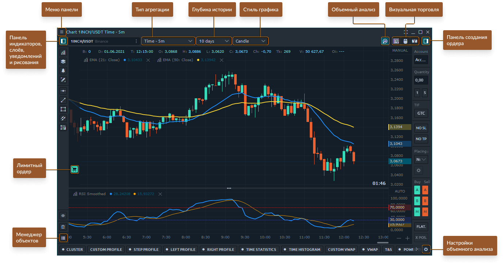

# График в Quantower настройки

Панель с Графиками - одна из самых важных панелей для активного трейдера. Точные рыночные данные, графические и аналитические инструменты - неотъемлемые компоненты панели, которые позволяют принимать правильные торговые решения.

Основные части панели диаграмм в Quantower

* **Верхняя панель инструментов** графика с основными элементами управления (таймфреймы, глубина истории, стили графиков)
* &#x20;**область графика** с отображением ценовых данных, индикаторов, позиций
* &#x20;**боковое меню** с элементами управления индикаторами, рисунками, наложениями и диспетчером объектов
* ввод ордеров на графике с помощью горячих кнопок для быстрой торговли
* нижняя панель инструментов с инструментами **анализа объема**

## Верхняя панель инструментов графика

Верхняя панель инструментов позволяет вам выбрать торговый инструмент, установить тип и стиль графика, таймфрейм, данные о глубине рынка, а также вызвать дополнительные панели инструментов.

* Боковое меню с [**инструментами рисования**](https://app.gitbook.com/@quantower/s/quantower-ru/\~/drafts/-MamLTWw6L0Sl7XngBX2/analytics-panels/chart/drawing-tools), [**наложениями**](https://app.gitbook.com/@quantower/s/quantower-ru/\~/drafts/-MamLTWw6L0Sl7XngBX2/analytics-panels/chart/chart-overlays) и [**индикаторами**](https://app.gitbook.com/@quantower/s/quantower-ru/\~/drafts/-MamLTWw6L0Sl7XngBX2/analytics-panels/chart/technical-indicators)****
* &#x20;[**Поиск символа**](https://app.gitbook.com/@quantower/s/quantower-ru/\~/drafts/-MamLTWw6L0Sl7XngBX2/general-settings/instruments-lookup)**,** где вы можете найти торговый символ из списка
* Выпадающий список таймфреймов с типами диаграмм.[ **Вот список типов и стилей диаграмм**](https://help.quantower.com/analytics-panels/chart/chart-types), где вы можете найти подробное объяснение того, как их построить.
* **Глубина истории** для выбранного таймфрейма
* **Стили диаграммы** - столбик, свеча, линия, область, пунктирная линия, стиль диаграммы Quantower
* [**Инструменты объемного анализа**](https://app.gitbook.com/@quantower/s/quantower-ru/\~/drafts/-MamLTWw6L0Sl7XngBX2/analytics-panels/chart/volume-analysis-tools) **** - активирует меню управления инструментом объемного анализа в нижней части панели диаграммы.
* **Режим торговли с клавиатуры** - активирует режим торговли с клавиатуры для быстрой торговли. Вы можете изменить горячие клавиши для торговли в настройках графика.
* **Мышь, Торговый режим** для размещения ордеров через область графика с помощью мыши.
* **Быстрый ввод ордеров** с лучшими ценами Bid и Offer (Ask), где вы можете размещать ордера или открывать новую позицию по рыночной цене
* **Боковая панель ввода ордеров** с помощью торговых кнопок, где вы можете установить количество ордеров, TIF для разных типов ордеров

## Боковое меню с рисунками, индикаторами, наложениями

Меню боковой панели позволяет добавить индикатор на диаграмму, инструмент рисования или наложение, а также управлять всеми объектами через диспетчер объектов.

Для трейдеров, которые часто обращаются к определенным элементам рисования, есть возможность добавить их на боковой панели для быстрого вызова. Для этого возле каждого рисунка есть значок «Звездочка», после активации которого вы добавляете их в список избранного.
