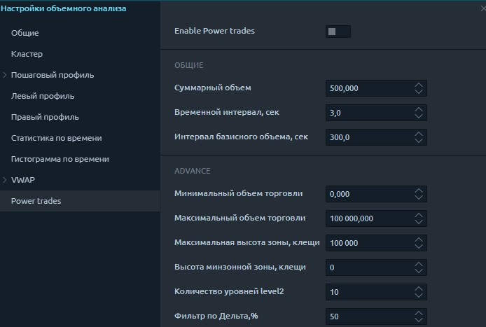
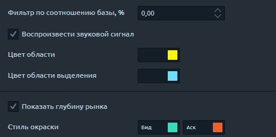

# Power Trades

[**Инструменты анализа объема** ](https://app.gitbook.com/@quantower/s/quantower-ru/~/drafts/-MbaIEqkN7fJ8JCch2GG/analytics-panels/chart/volume-analysis-tools)позволяют понять причины движения цены, уточнить и подтвердить уровни поддержки и сопротивления, а также оценить дисбаланс между покупателями и продавцами. Но инструменты объема привязаны к определенному времени \(таймфрейму\), не позволяя увидеть исполнение крупных ордеров в данный момент.

Используя Power Trades, вы можете увидеть исполнение большого количества ордеров за очень короткое время, что с большой вероятностью повлияет на изменение цены.



## Что такое  Power Trades?

Power Trades показывает зоны с исполнением большого количества ордеров за очень короткое время, что с большой вероятностью повлияет на изменение цены. Давайте посмотрим на несколько примеров.

## Как Power Trades находит зоны?

На рынке происходит непрерывный процесс размещения, изменения и исполнения ордеров. Все это влияет на изменение цены и ожидания трейдеров относительно будущей цены.

Когда на определенном уровне появляется большой ордер, цена с большей вероятностью подойдет к этому ордеру, и он будет исполнен, потому что рынок всегда ищет уровни с ликвидностью. Это уже относится к потоку заказов и механике сопоставления заказов, поэтому мы опускаем принципы сопоставления заказов.

Важно лишь понимать, что «аномальные события» на рынке происходят в определенное время. Одно из таких событий - выполнение значительного объема заказов в очень короткие сроки.

Например, давайте установим общий объем 2'000 контрактов и временной интервал в 3 секунды для фьючерса E-mini SP500. Это означает, что сканирование будет основано на доступной истории и покажет на графике только те зоны, которые имеют такой объем за указанное время.

Дополнительно стоит установить значение дельты, чтобы отфильтровать зоны с односторонними сделками. Чем больше значение дельты, тем выше вероятность разворота цены.

## Основные настройки Power Trades

Следующие настройки участвуют в расчете индикатора и напрямую влияют на результаты.

* **Суммарный объем** - минимальное значение объема, которым следует торговать в течение указанного временного интервала.
* **Временной интервал, sec** - время, в течение которого следует торговать общим объемом.
* **Интервал базисного объема, сек** - этот параметр показывает, сколько% занял торгуемый объем от общего объема за указанное время.
* **Минимальный объем торговли** - при расчете индикатора учитываются исполненные сделки, размер каждой из которых равен или больше установленного значения. Например, мы можем установить 100 контрактов, и все сделки с объемом не меньше указанного будут учитываться при расчете зоны.
* **Максимальный объем торговли** - при расчете индикатора учитываются исполненные сделки, размер каждой из которых не превышает установленного значения.
* **Высота зоны, тики** - этот параметр покажет только те зоны, где высота меньше или равна указанному значению \(в тиках\).
* **Количество уровней Level2** - количество уровней, участвующих в вычислении Дисбаланса, и столбец Level 2 Ratio в таблице результатов.
* **Фильтр по дельте,%** - параметр покажет зоны, у которых значение дельты больше или равно указанному в настройке. Значение должно быть указано модулем, поэтому в таблице будут отображаться как положительные, так и отрицательные значения дельты. Рекомендуем обратить внимание на зоны с дельтой выше / ниже 50% \(с учетом специфики каждого торгового инструмента\).
* **Фильтр по соотношению базы,%** - параметр покажет зоны, у которых значение базового объема \(%\) больше или равно заданному в настройке.

Настройки, не влияющие на расчет индикатора. В основном это визуальные и звуковые настройки.

* **Воспроизвести звуковой сигнал** - опция включает / выключает звуковой сигнал при появлении новой зоны.
* **Цвет области** - установить цвет для всех найденных областей на графике.
* **Цвет выделенной области** - установка цвета выделенной области на графике.
* Показать глубину рынка - опция показывает / скрывает глубину рынка внизу таблицы.

## Power Trades поиск зон.

Когда Power Trades включен, он сразу же начинает поиск зон в соответствии с настройками. Поиск зон происходит на протяжении всей истории, доступной на графике, поэтому при значительной глубине истории ее расчет может занять много времени.

