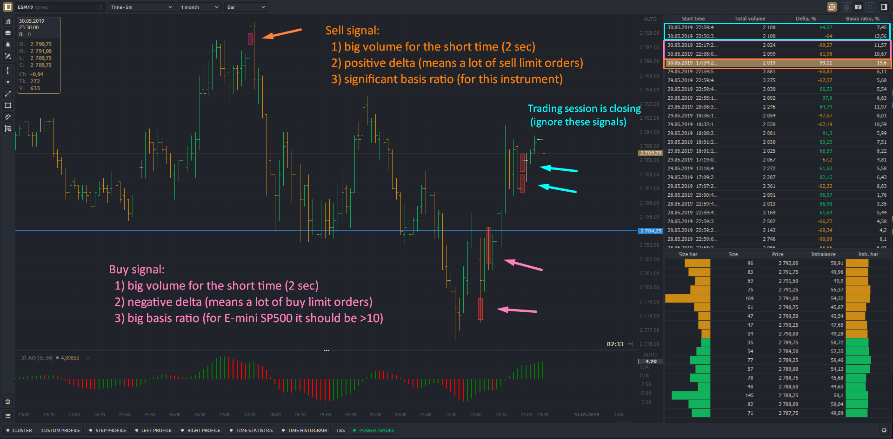
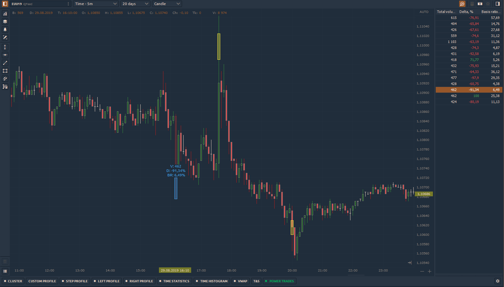
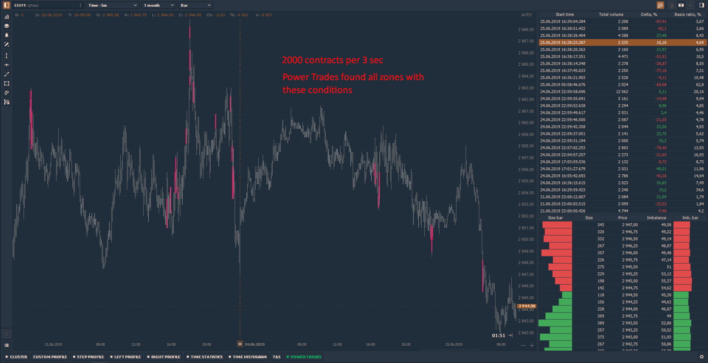
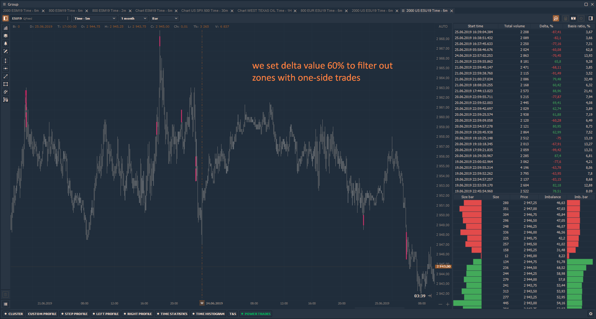
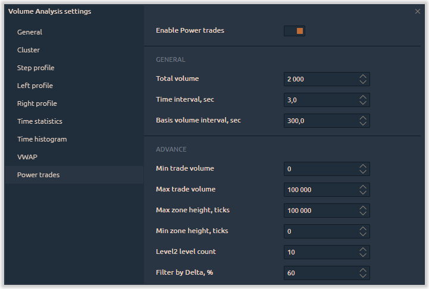

# Power Trades

[**Инструменты анализа объема** ](https://app.gitbook.com/@quantower/s/quantower-ru/~/drafts/-MbaIEqkN7fJ8JCch2GG/analytics-panels/chart/volume-analysis-tools)позволяют понять причины движения цены, уточнить и подтвердить уровни поддержки и сопротивления, а также оценить дисбаланс между покупателями и продавцами. Но инструменты объема привязаны к определенному времени \(таймфрейму\), не позволяя увидеть исполнение крупных ордеров в данный момент.

Используя Power Trades, вы можете увидеть исполнение большого количества ордеров за очень короткое время, что с большой вероятностью повлияет на изменение цены.



## Что такое  Power Trades?

Power Trades показывает зоны с исполнением большого количества ордеров за очень короткое время, что с большой вероятностью повлияет на изменение цены. Давайте посмотрим на несколько примеров.

## How does Power Trades find the zones?

There is a continuous process of placing, changing and executing orders in the market. All this affects the price change and the expectations of traders regarding the future price.

When a large order appears at a certain level, the price is more likely to come to this order and it will be executed because the market is always looking for levels with liquidity. This already applies to the order flow and the mechanics of orders matching, so we will omit the principles on which the orders are matched.

It is only important to understand that "**abnormal events**" occur in the market at certain times. _Execution of a significant volume of orders in a very short time is one of such events._

For example, let's set the _Total Volume of 2'000 contracts and Time Interval in 3 seconds_ on the E-mini SP500 futures. This means that the scan will be based on the available history and will show on the chart only those zones that have such a volume for the specified time.

Additionally, it is worth to set a delta value to filter out the zones with one-side trades. The more delta value, the high probability that the price will reverse.

## Main settings of Power Trades

The following settings are involved in the calculation of the indicator, and directly affect the results.

* **Total Volume** — the minimum value of the volume that should be traded during the specified time interval
* **Time Interval, sec** — the time over which the Total Volume should be traded
* **Basis Volume Interval, sec** — this parameter shows how much % took the traded volume in the total volume for the specified time.
* **Min Trade Volume** — the indicator calculation takes into account the executed trades, each with the size equal to or greater than the set value. For example, we can set 100 contracts, and all trades with the volume not less than the specified one will be taken into account in the calculation of the zone.
* **Max Trade Volume** — the indicator calculation takes into account the executed trades, each with the size not exceeding the set value.
* **Zone Height, ticks** — this parameter will show only those zones where the height is less than or equal to the specified value \(in ticks\).
* **Level2 level count** — the number of levels that are involved in the calculation of **Imbalance** and the _Level 2 Ratio_ column in the table of results.
* **Filter by Delta,%** — the parameter will show zones that have a delta value greater than or equal to that specified in the setting. The value must be specified by module, so the table will show both positive and negative delta values. _We recommend to **pay attention to the zones with the delta above/below 50%**_ \(taking into account the specifics of each trading instrument\).
* **Filter by Basis Ratio, %** — the parameter will show zones that have a **Basis Volume \(%\)** value greater than or equal to that specified in the setting.

Settings that do not affect the indicator calculation. These are mostly visual and sound settings

* **Play alert sound** — the option turns on / off the sound signal when a new zone appears.
* **Area color** — set color for all found areas on the chart
* **Highlight area color** — set color for the selected area on the chart
* **Show Market Depth** — the option shows / hides the Market Depth at the bottom of the table.

## Power Trades and DOM tables

When the Power Trades is enabled, it immediately starts searching for zones according to the settings. The search for zones takes place throughout the entire history available on the chart, so at a significant depth of history its calculation can take a long time.

