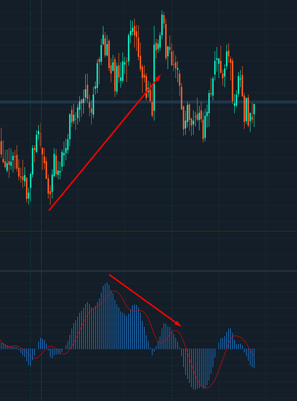

# Moving Average Convergence/Divergence

## Description

Moving average convergence/divergence\(MACD\) indicator graphically describes the mathematical difference between fast and slow exponential moving averages. The third line is called a “signal line”. Common periods of moving averages are: 26 for a slow EMA, 12 for a fast and 9 for a signal line.

## Formula

Fast EMA - Slow EMA

## Most useful cases

* **Divergence/Convergence** - Divergence/Convergence pattern is a form of price action when new high\(low\) on the price scale not confirmed with a new high of  MACD. Such price and indicator’s behavior can be interpreted as the weakness of current existing trend.

* **Crossover** - Crossover pattern occurs when MACD value crosses the signal line upward or downward. This signal can be used as a trigger to open buy/sell position.
* **Crossing zero line** - this is a trend reversing signal and it can be very useful in case of determining a correction of existing trend, beginning of a new trend wave or starting a new trend.

