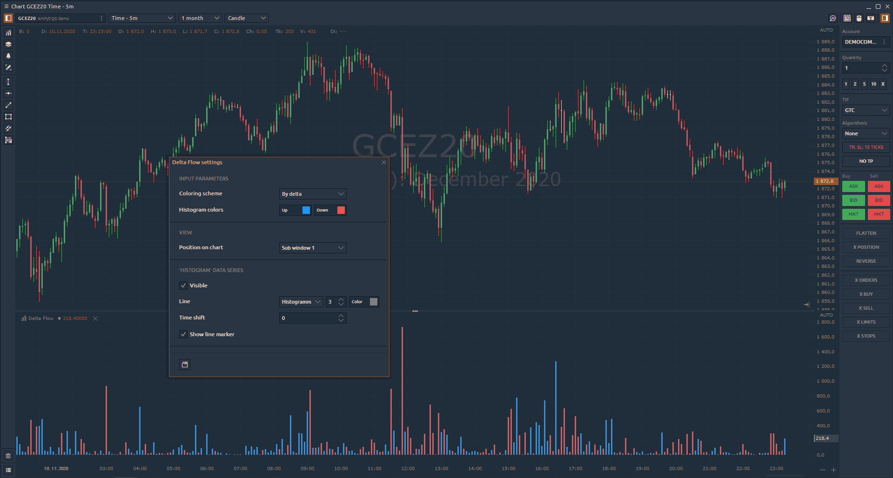
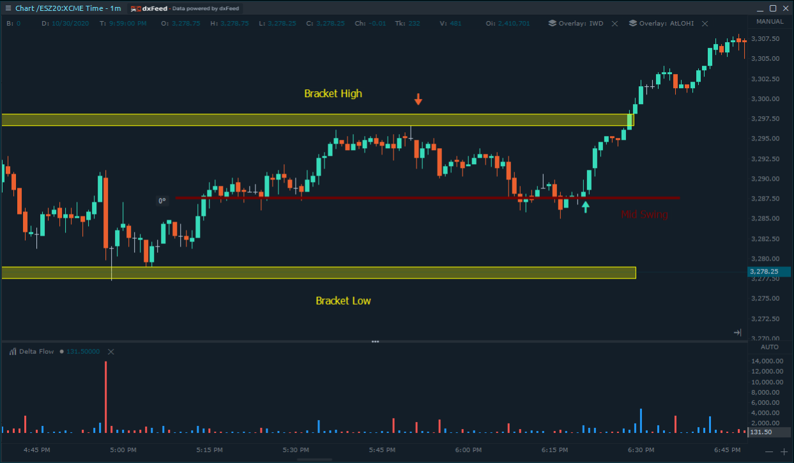

# Delta Flow

## Обзор индикатора Delta Flow

**Delta Flow** рассчитывается как Delta \* \(High - Low\) и описывает влияние агрессивных ордеров на рыночную цену через значение Delta.

В этом примере ESZ20 находился в состоянии торможения, демонстрируя явную активность в районе Mid Swing.

Когда цена приблизилась к области «верхнего предела», рыночная активность упала, показав отсутствие продолжения, и перешла в узкий диапазон. Ни покупателя, ни продавца не видно ...

В какой-то момент дельта-поток начал обнаруживать активность в сторону снижения, указывая на потенциальное движение вниз. Это наша возможность ненадолго. SL выше верхней границы кронштейна, TP1 при среднем колебании, TP2 при низком уровне кронштейна.

На нисходящем движении агрессия продаж делает еще один шаг, позволяя цене достичь TP1.

На последнем колебании ниже «Mid Swing» агрессия улетучилась. На этом этапе рекомендуется соблюдать осторожность.

По мере того, как цены возвращаются выше уровня «Mid Swing», появляются значительные шаги агрессии, которые дают нам сигнал закрыть оставшуюся часть нашего ордера до флэта.

На этом этапе мы можем либо отойти в сторону, либо развернуть нашу сделку в длинную позицию.

В сценарии длинной сделки: SL ниже последнего минимума Swing ниже «Mid Swing», TP1 High Bracket High, TP2 выше Bracket в качестве раннера.

Когда достигается TP1, повествование отличается от предыдущей сделки. Покупательская агрессия все еще присутствует, что позволяет нам позволить остальной позиции развиваться дальше. На каком-то этапе наступает агрессия, давая нам сигнал выйти из сделки.

## Delta Flow настройка

**Схема окраски:**

**По дельте** - цвет бара на индикаторе соответствует цвету положительной или отрицательной дельты;  
**По полосе** - цвет полосы на индикаторе соответствует цвету полосы на графике \(вверх или вниз\).

