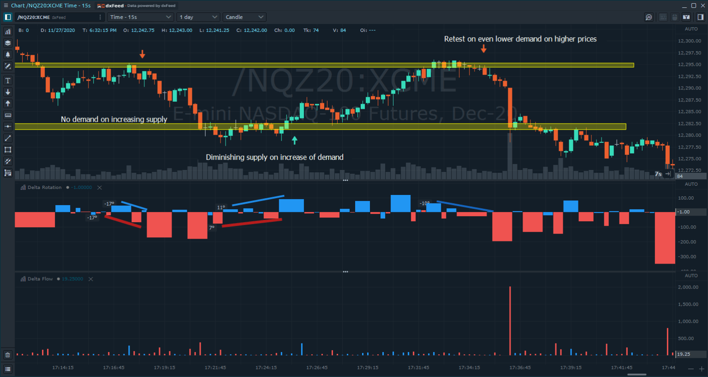
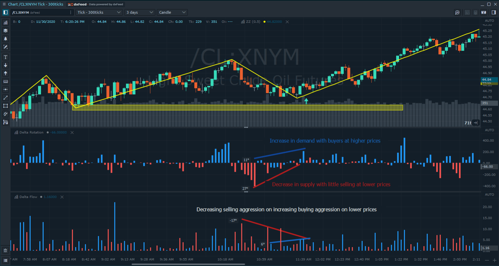

# Delta Rotation

Дельта-ротация описывает спрос и предложение на оборот рынка через Дельту. Это позволяет нам оценить, может ли каждое ценовое движение быть связано с увеличением спроса / предложения или, наоборот, с уменьшением спроса и предложения.

Следующие ниже примеры охватывают разные точки входа от контрольных точек, основанные на изменениях спроса и предложения.

![&#x414;&#x435;&#x43B;&#x44C;&#x442;&#x430;-&#x432;&#x440;&#x430;&#x449;&#x435;&#x43D;&#x438;&#x435; \(&#x43F;&#x435;&#x440;&#x432;&#x430;&#x44F; &#x433;&#x438;&#x441;&#x442;&#x43E;&#x433;&#x440;&#x430;&#x43C;&#x43C;&#x430;\) &#x438; &#x434;&#x435;&#x43B;&#x44C;&#x442;&#x430;-&#x43F;&#x43E;&#x442;&#x43E;&#x43A; \(&#x432;&#x442;&#x43E;&#x440;&#x430;&#x44F;\) &#x434;&#x430;&#x44E;&#x442; &#x445;&#x43E;&#x440;&#x43E;&#x448;&#x438;&#x435; &#x440;&#x435;&#x437;&#x443;&#x43B;&#x44C;&#x442;&#x430;&#x442;&#x44B; &#x43D;&#x430; &#x444;&#x43E;&#x43D;&#x434;&#x43E;&#x432;&#x43E;&#x43C; &#x440;&#x44B;&#x43D;&#x43A;&#x435;.](../../../../.gitbook/assets/example-2.png)

