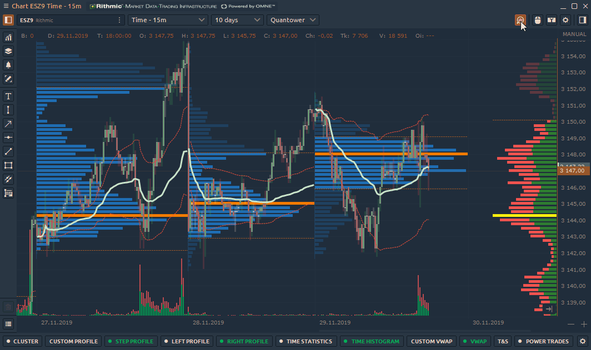
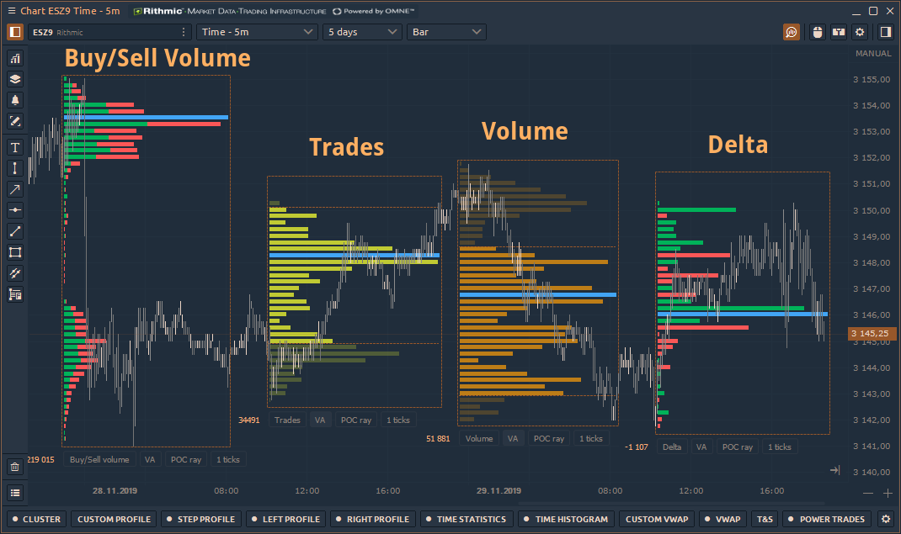

# Инструменты объемного анализа, профили объема, кластер, VWAP

Quantower предоставляет [**инструменты анализа объемов**](https://www.quantower.com/volumeanalysistools), расширенные аналитические функции, которые позволяют вам видеть торгуемый объем на каждом уровне цен, оценивать баланс между покупателями и продавцами и понимать намерения трейдеров относительно будущей цены.

Инструменты объемного анализа включают фирменные и хорошо известные аналитики:

* \*\*\*\*[**Кластер** ](https://help.quantower.com.ru/analytics-panels/chart/volume-analysis-tools/cluster-chart)\(Footprint график ли OrderFlow график\);
* \*\*\*\*[**Профили объема**](https://help.quantower.com.ru/analytics-panels/chart/volume-analysis-tools/volume-profiles) — Пошаговый, Правый, Левый и Пользовательский профили объема;
* \*\*\*\*[**Статистика по времени** ](https://help.quantower.com.ru/analytics-panels/chart/volume-analysis-tools/time-statistics)— объемные данные для каждого бара в виде таблицы;
* \*\*\*\*[**Гистограмма по времени** __](https://help.quantower.com.ru/analytics-panels/chart/volume-analysis-tools/time-histogram)— данные объема на каждом баре в виде вертикальной гистограммы;
* \*\*\*\*[**Пользовательский VWAP** ](https://help.quantower.com.ru/analytics-panels/chart/anchored-vwap)— может быть прикреплен к любому выбранному бару в качестве отправной точки расчета;
* [**VWAP**](../vwap.md) — мульти VWAP для одного графика
* [**T&S бара**](https://help.quantower.com/analytics-panels/chart/volume-analysis-tools/historical-time-and-sales)— таблица всех сделок для любого выбранного бара.



На GIF-изображении ниже показано, как можно активировать панель инструментов для анализа объема:


**Зеленый цвет** означает, что выбранный инструмент анализа объема полностью загрузил данные.

**Желтый цвет** указывает на то, что выбранный инструмент загружает данные.


## Типы данных инструментов объемного анализа

Almost all volume analysis tools have the same **Data Types**, which can be specified in the settings:

* **Trades** — it's the number of contracts \(trades\) that executed at each price level.
* **Buy \(or Sell\) trades** — it's the number of Buy \(or Sell\) trades that executed at each price level.
* **Volume** — the total size of all positions that executed at each price level or price range.
* **Buy \(or Sell\) Volume** — the total size of all Buy \(or sell\) positions that executed at each price level or price range.
* **Buy \(or Sell\) Volume, %** — shows how many percent of the total volume relates to Buy \(or Sell\) trades
* **Buy / Sell Volume** — simultaneous display of buy and sell volume on one histogram
* **Delta and Delta %** — shows the difference in traded Volume between Buyers and Sellers. It allows evaluating who controls the price on the market at a given time.  Delta % = Delta / Volume \* 100
* **Cumulative Delta** — the data is built by adding the current delta value with each subsequent delta value for the certain period of time \(or number of bars\). 

* **Average size** — the average volume of the position that was executed at a certain price or price range.
* **Average Buy size** — the average volume of a Buy position that was executed at a specific price or price range.
* **Average Sell size** — the average volume of a Sell position that was executed at a specific price or price range.
* **Max one trade volume \(value and %\)** — shows the maximum volume of a single trade that has executed at a certain price or price range \(depending on the Custom Step \(ticks\) setting\).
* **Filtered volume \(value and %\)** — this parameter displays volumes that exceed the size specified in the filter. If the volume size is smaller than the one specified in the filter, then the values will be zero.
* **Buy \(or Sell\) filtered volume** — the parameter displays Buy \(or Sell\) volumes that exceed the size specified in the filter.

