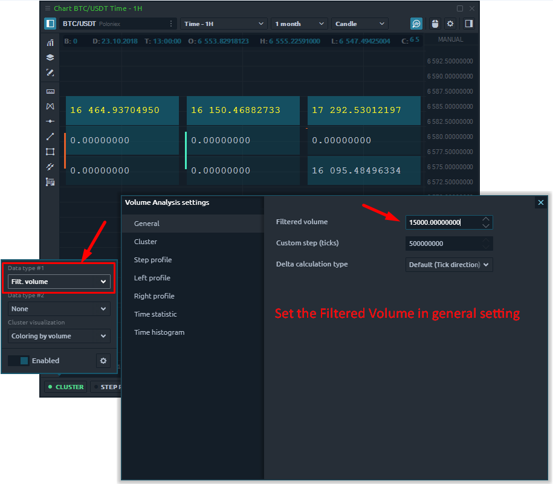

# Кластер



## Что такое кластерный график?

**Кластер график**, известная как график футпринт на других торговых платформах, представляет собой расширенный тип диаграммы, который показывает полное представление свечной диаграммы. Это позволяет заглянуть внутрь цены и увидеть все рыночные действия. Кластерный график сочетает в себе несколько важных характеристик, таких как время, цены OHLC, объем торгов, количество сделок на покупку и продажу.

Используя эту информацию, трейдер может оценить:

* объем торгов, выполненных по каждой цене
* зоны максимального накопления объема
* зоны повышенного торгового интереса \(максимальное количество сделок\)
* количество покупателей и продавцов на каждом уровне цен

## Как включить кластерный график?

Перед активацией кластерной диаграммы необходимо включить панель инструментов Volume Analysis. Для этого в правом верхнем углу панели диаграммы **щелкните значок «Лупа**». Внизу диаграммы появится панель инструментов с инструментами анализа объема - кластер, [**пошаговый профиль, левый профиль, правый профиль,**](https://app.gitbook.com/@quantower/s/quantower-ru/~/drafts/-MbGJgxlm-Fa2OVgQcQw/analytics-panels/chart/volume-analysis-tools/volume-profiles) ****[статистика по времени](https://app.gitbook.com/@quantower/s/quantower-ru/~/drafts/-MbGJgxlm-Fa2OVgQcQw/analytics-panels/chart/volume-analysis-tools/time-statistics), [гистограмма по времени](https://app.gitbook.com/@quantower/s/quantower-ru/~/drafts/-MbGJgxlm-Fa2OVgQcQw/analytics-panels/chart/volume-analysis-tools/time-histogram), [**T&S по барам**](https://app.gitbook.com/@quantower/s/quantower-ru/~/drafts/-MbGJgxlm-Fa2OVgQcQw/analytics-panels/chart/volume-analysis-tools/historical-time-and-sales)**,** [**пользовательский объем.**](https://app.gitbook.com/@quantower/s/quantower-ru/~/drafts/-MbGJgxlm-Fa2OVgQcQw/analytics-panels/chart/volume-analysis-tools/volume-profiles#custom-volume-profile)\*\*\*\*

1. Щелкните **кластер** и включите его.
2. Выберите тип данных \(вы можете выбрать один или два разных типа данных одновременно\)
3. Настройте визуализацию данных
4. Используйте расширенные настройки \(значок шестеренки\) для более подробной настройки диаграммы.


Для более эффективного анализа с помощью кластерной диаграммы вы можете одновременно отображать два разных типа данных на одной панели.


## Общие настройки кластерного графика

Кластерный график имеет различные настройки, позволяющие отображать объемные данные с разных сторон. Например, вы можете выбрать разные типы данных для каждого бара, а также настроить цвета, что упростит восприятие и анализ объемов, сделок и т. Д.

Основные типы данных для кластерной диаграммы:

* **Сделки** - это количество контрактов \(сделок\), заключенных на каждом ценовом уровне.
* **Сделки на покупку \(или продажу\)** - это количество сделок на покупку \(или продажу\), выполненных на каждом ценовом уровне.
* **Объем** - общий размер всех позиций, исполненных на каждом ценовом уровне или ценовом диапазоне.
* **Объем покупки \(или продажи\)** - общий размер всех позиций на покупку \(или продажу\), выполненных на каждом ценовом уровне или ценовом диапазоне.
* **Объем покупки \(или продажи\),%** - показывает, сколько процентов от общего объема относится к сделкам на покупку \(или продажу\).
* **Дельта и Дельта%** - показывает разницу в торговом объеме между покупателями и продавцами. Это позволяет оценить, кто в данный момент контролирует цену на рынке. Дельта% = Дельта / Объем \* 100
* **Средний размер** - средний объем позиции, которая была исполнена по определенной цене или ценовому диапазону.
* **Средний размер покупки** - средний объем позиции на покупку, которая была исполнена по определенной цене или в ценовом диапазоне.

  Средний размер продажи - средний объем позиции на продажу, которая была исполнена по определенной цене или ценовому диапазону.

* **Максимальный объем одной сделки \(значение и%\)** - показывает максимальный объем одной сделки, которая была исполнена по определенной цене или ценовому диапазону \(в зависимости от настройки Custom Step \(ticks\)\).
* **Отфильтрованный объем \(значение и%\)** - этот параметр отображает объемы, превышающие размер, указанный в фильтре. Если размер тома меньше указанного в фильтре, то значения будут нулевыми.
* **Отфильтрованный объем Buy \(или Sell\)** - параметр отображает объемы Buy \(или Sell\), превышающие размер, указанный в фильтре.

## How to set the filtered volume?

For all volume analysis tools, there are general settings that allow you to set Filtered volume, and configure the step for aggregating volume data. On highly liquidity assets like Bitcoin or futures on the S&P500, the trading volume for a trading session is large. Set the minimum volume values that will be displayed on the chart. This will allow you to focus on significant price levels and more clearly see zones of support/resistance.


Each instrument has individual settings for the filtered volume depending on liquidity.


Select **Filtered Volume** as the data type in clusters to display them on the chart. All values that are less than the filtered volume are presented as zeros.

## What is Custom step and how to set it properly?

Cluster chart shows volume data at each price level for a specified period. But with a large number of levels, the cluster chart becomes difficult to read.

**Custom step** summarizes the volume data of as many price levels as specified in the setting. By default, the value of the custom step is set to 1 tick, which means the volume data are shown at each price level.

