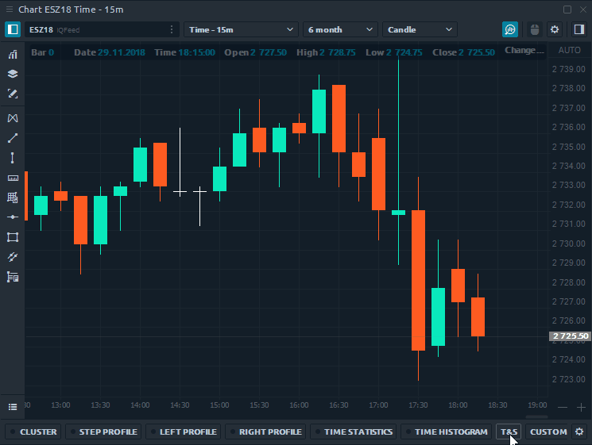
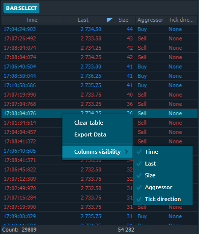

# T&S Лента сделок истории каждой свечи, бара  с графика

Инструмент **«T&S»** показывает все сделки для выбранного бара в форме «Лента сделок». После того, как вы активировали Исторические T&S и выбрали желаемый исторический бар на графике, все его сделки будут показаны в таблице в порядке их исполнения. 

Включите кнопку **«Bar Select»** и выберите столбец, бар, \(свечу\), для которого вы хотите загрузить данные. Когда этот режим выключен, вы можете продолжить работу с графиком, при этом загруженные данные останутся в таблице.

## Параметры таблицы

By default, the table displays five columns — _Time, Last price, Trade Size, Aggressor flag, Tick direction_. You can move any column of the table left or right, as well as sort or filter data.

By right-clicking on the table, a context menu will appear with several options:

* **Clear table**. Delete all data from the table
* **Export data** to external .csv or .html file
* **Column visibility.** Enable or disable columns in the table

