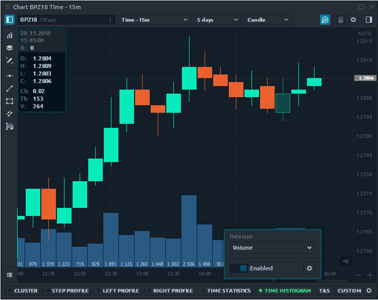
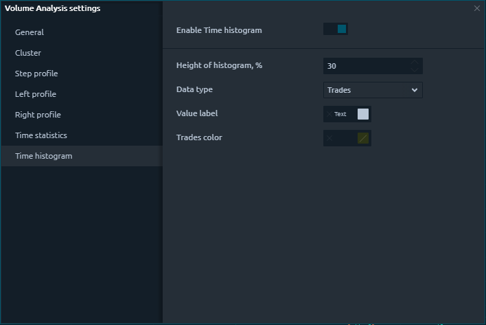
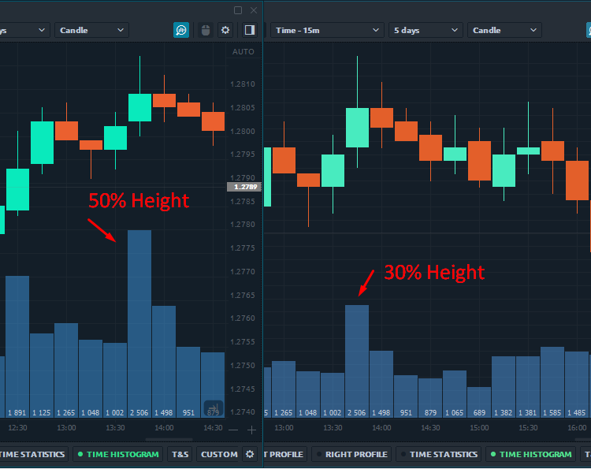

# Time histogram

**Time Histogram** is similar to [Time Statistics](https://help.quantower.com/analytics-panels/chart/volume-analysis-tools/time-statistics) tool that shows volume data as a vertical histogram for each bar. But unlike Time statistics, it allows you to visually evaluate the data for each bar, not only by colors but also by the shape of the histogram.

Click on the **Time Histogram** and switch the button **"Enable"** to activate the functionality on the chart. Time Histogram supports an extensive list of Data types that you can change either in the settings or directly in the activation mode.

* **Enable Time Histogram** — activates the functionality to display on the chart. After you activate it, the loading process of tick and volume data will begin. The yellow color will indicate that data is loading. Green color means that the data for the selected history depth is fully downloaded.

* **Height of Histogram, %** — determines what part of the chart area will be occupied for displaying volume data. If you set the value to 50%, then half of the chart area will be filled by Time Histogram data.

* **Data types** — various types of volume data that can be displayed on a chart. There are trades, volume, bid & ask trades and volume, filtered data, etc. The full list with descriptions of these data types you can find in our Help documentation that describes general information about [**Volume Analysis Tools**](https://help.quantower.com/analytics-panels/chart/volume-analysis-tools).
* **Value label and Data type color** — here you set the color settings for the font and the histogram, respectively.

## The main Data Types for Time Histogram:

* **Trades** — it's the number of contracts \(trades\) that executed at each price level.
* **Buy \(or Sell\) trades** — it's the number of Buy \(or Sell\) trades that executed at each price level.
* **Volume** — the total size of all positions that executed at each price level or price range.
* **Buy \(or Sell\) Volume** — the total size of all Buy \(or sell\) positions that executed at each price level or price range.
* **Buy \(or Sell\) Volume, %** — shows how many percent of the total volume relates to Buy \(or Sell\) trades
* **Delta and Delta %** — shows the difference in traded Volume between Buyers and Sellers. It allows evaluating who controls the price on the market at a given time.  Delta % = Delta / Volume \* 100
* **Cumulative Delta** — the data is built by adding the current delta value with each subsequent delta value for the certain period of time \(or number of bars\). 
* **Average size** — the average volume of the position that was executed at a certain price or price range.
* **Average Buy size** — the average volume of a Buy position that was executed at a specific price or price range.
* **Average Sell size** — the average volume of a Sell position that was executed at a specific price or price range.
* **Max one trade volume \(value and %\)** — shows the maximum volume of a single trade that has executed at a certain price or price range \(depending on the Custom Step \(ticks\) setting\).
* **Filtered volume \(value and %\)** — this parameter displays volumes that exceed the size specified in the filter. If the volume size is smaller than the one specified in the filter, then the values will be zero.
* **Buy \(or Sell\) filtered volume** — the parameter displays Buy \(or Sell\) volumes that exceed the size specified in the filter.

