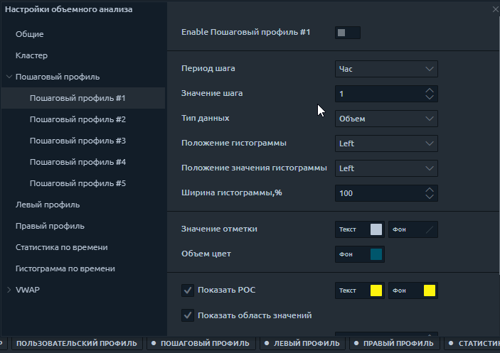

# Профили объема

**Профиль объема** отображает торговую активность за определенный период времени на определенных ценовых уровнях. Это означает, что он показывает, что было куплено и продано на этих текущих уровнях, и отображает их в виде гистограммы сбоку от вашего графика. Профиль объема позволяет увидеть зоны максимального торгового интереса и, как следствие, «истинные» уровни поддержки / сопротивления.

Платформа Quantower предлагает четыре типа профилей объема:

* [**Step Volume Profile**](volume-profiles.md#step-volume-profile) ****Пошаговый профиль объема 
* \*\*\*\*[**Left Volume Profile**](volume-profiles.md#left-and-right-volume-profiles)\*\*\*\*
* \*\*\*\*[**Right Volume Profile**](volume-profiles.md#left-and-right-volume-profiles)\*\*\*\*
* \*\*\*\*[**Custom Volume Profile**](volume-profiles.md#custom-volume-profile)\*\*\*\*

## Пошаговый профиль объема 

Пошаговый профиль отображает профили объема с определенным временным шагом. Например, установите период шага равным 1 часу, и вы увидите профили с одинаковыми почасовыми шагами на графике. Изменяя типы данных, вы увидите распределение торгового объема, выполненных сделок, а также дельту для каждого часа торговой сессии.

Вы можете включить профиль шага через панель инструментов анализа объема или их настройки.

### Общие настройки профиля шага

* **Период шага и значение шага** - определяют шаг построения профиля. Период шага имеет четыре типа: минута, час, день, неделя.
* **Тип данных** - выберите любой из ****[**20+ типов данных** ](https://app.gitbook.com/@quantower/s/quantower-ru/~/drafts/-MbGwguxgp06fdcWVgd1/analytics-panels/chart/volume-analysis-tools#data-types-of-volume-analysis-tools)для создания профиля шага
* **Положение гистограммы** - расположение профиля слева или справа относительно начальной точки.
* **Положение значения гистограммы** - определяет положение значения данных: слева, справа или нет
* **Ширина гистограммы \(в %\)** - показывает ценовую зону с 70% торговой активности за указанный временной диапазон. По умолчанию установлено значение 70%, но пользователь может изменить его по своему усмотрению.
* Показать границы области значений - отображение внешних границ области значений в виде пунктирных линий.
* Выделить максимальное значение - уровни с максимальным значением выделяются заданным цветом
* **Показать итоги** - эта опция суммирует данные, на основе которых построен профиль.

## Левый и правый профиль объема

**Левый и правый профиль объема** можно разместить слева и справа от графика соответственно. Например, вы можете установить дельта-данные для одного профиля, а для другого - общий объем за тот же период времени. Вы можете объединить несколько профилей, созданных для разных периодов времени, в один **комбинированный профиль** и поместить его в левую или правую позицию графика.

## Custom Volume Profile

Custom profile allows you to create a profile for any time range. For instance, you want to see the distribution of the delta on the flat chart or for the impulse bar. As with other volume analysis tools, you can choose any available data types for display.

After you have placed a custom profile on the chart, a control panel with five options will appear next to it.

* Dublicate profile with the same range and settings
* Move profile to the background or foreground
* Lock current position of the profile. Prohibits the profile movement.
* **Additional settings** for selected profile
* Delete selected profile

## Additional settings for custom profile

In addition to the settings for quick management of custom profile, there are additional settings. Let's take a closer look at what you can customize.

There are a lot of various settings, but the most intersting are:

* **Value Area** — shows the price area with 70% of trading activity for the specified time range. The value of 70% is set by default, but the user can change it at his discretion.
* **POC Ray** — extends the level of maximum volume \(Point of Control\) to the price scale
* **Show Total** — shows/hides the total number under certain profile
* **Custom step \(ticks\)** summarizes the volume data of as many price levels as specified in the setting. By default, the value of the custom step is set to 1 tick, which means the volume data are shown at each price level.

