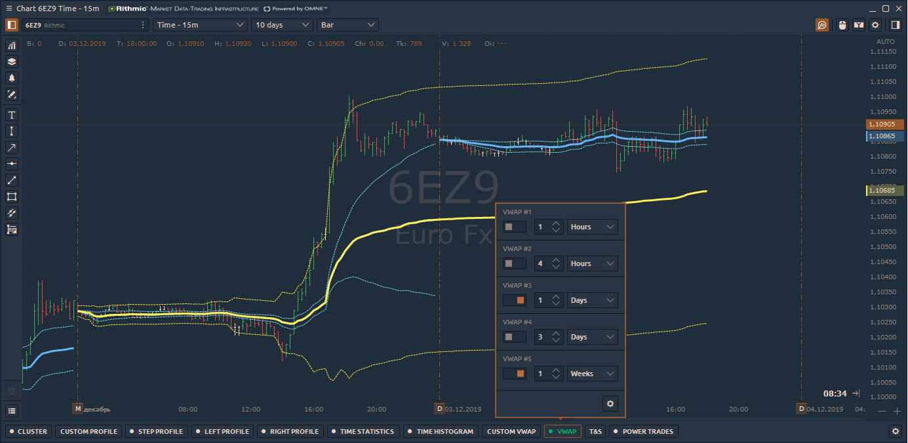
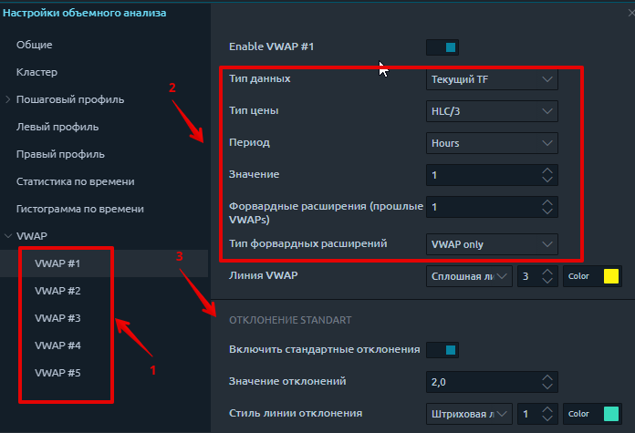
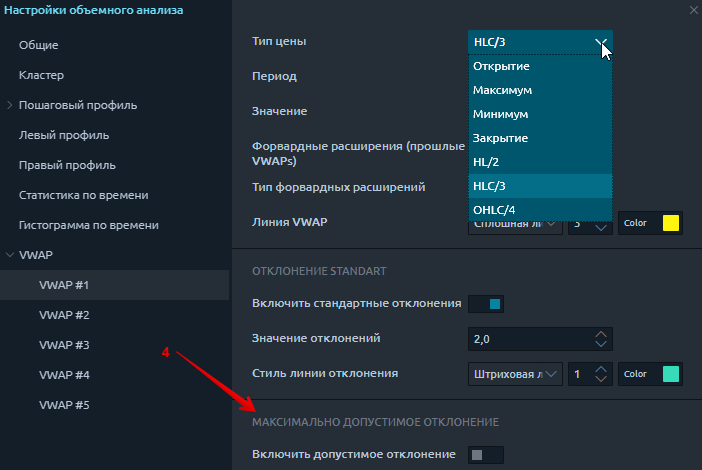
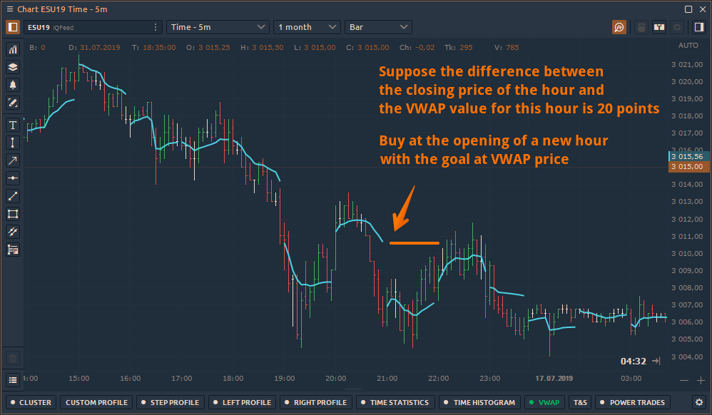
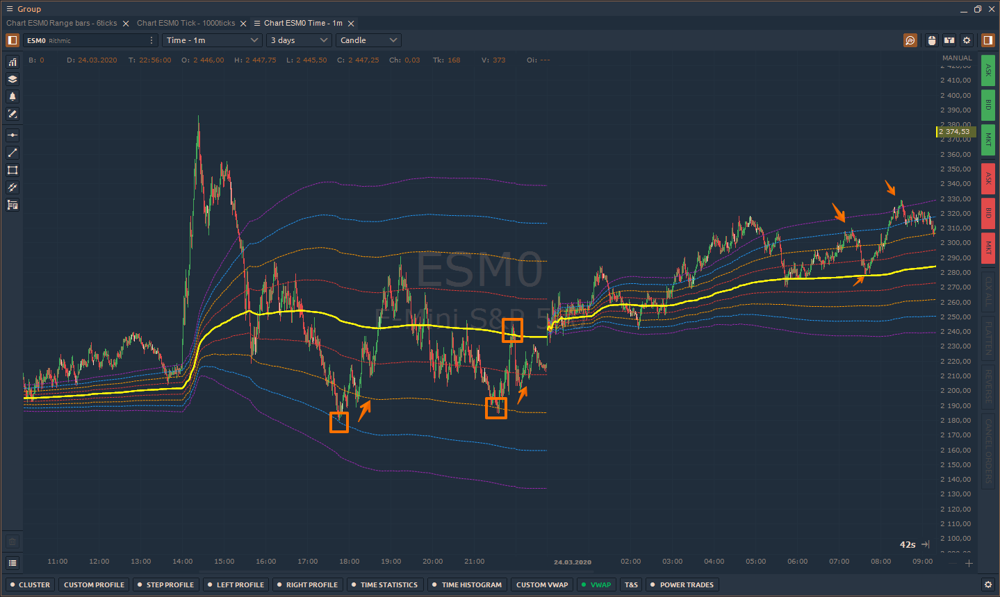
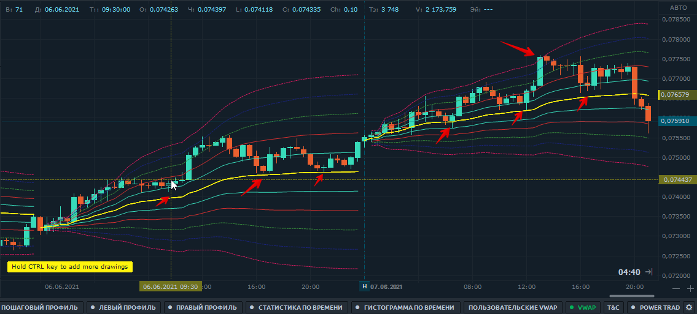

# VWAP - Средневзвешенная цена по объему

Средневзвешенная цена по объему известна как **VWAP** - это «эталонная» цена актива для любого периода торгового дня или сессии. Средняя цена взвешивается по объему для оценки пероцененности или недооцененности текущей цены по сравнению с ценой VWAP.

Индикатор рассчитывается для любого периода времени по следующему алгоритму:

* средняя цена \(AP\) рассчитывается для каждого бара или свечи. Расчет производится для каждого изменения цены текущей свечи. AP = \(H + L + C\) / 3
* средняя цена умножается на объем, который прошел в текущей свече или баре. Например, в реальном времени новая сделка увеличит объем и, таким образом, уравновесит цену. 
* таким образом, для каждого изменения цены или объема мы получим значение AP \* V.

  указанные выше значения суммируются и делятся на общий объем за указанный период.

         **VWAP = \(Sum of Average Price \* Traded Volume\) / Cumulative Volume**

## Как добавить VWAP в график?

Индикатор VWAP расположен на панели инструментов Volume Analysis. При нажатии на нее появляется меню с основными настройками и переключателем включения / выключения индикатора.

Меню быстрых настроек содержит:

* Включенный переключатель показывает или скрывает индикатор VWAP на графике.
* Базовый период и значение - определяет количество баров \(длительность\), по которым будет рассчитываться VWAP.

## Расширенные настройки индикатора

При нажатии на значок «Шестеренка» откроются дополнительные настройки.

**1. Переключайтесь между разными VWAP** и устанавливайте настройки для каждого из них.

Платформа Quantower предоставляет 5 отдельных VWAP, которые можно разместить одновременно на одном графике.

**2.** Установите **основные настройки** для линии VWAP:

* **Тип данных** - установите данные для расчета VWAP: Ticks или Current TF. Тики будут использовать тиковые данные для расчета VWAP, и загрузка займет гораздо больше времени. Текущий TF будет использовать данные бара из текущего выбранного таймфрейма вашего графика. Он будет использовать данные типа цены и умножить их на объем бара.
* **Тип цены** - выберите цену для текущего типа данных TF \(Open, High, Low, Close, HL / 2, HLC / 3, OHLC / 4\)
* **Период** - определяет количество баров \(продолжительность\), по которым будет рассчитываться VWAP.
* **Форвардные расширения** \(тип и номер\)
* **Линия VWAP** - визуальные настройки самого VWAP

**3. Полосы стандартного отклонения**

Когда параметр активен, линии стандартного отклонения вверх и вниз от **VWAP** будут дополнительно рассчитаны на графике. В поле **«Значение»** укажите количество стандартных отклонений и цвета.

**4. Максимально допустимое отклонение \(MPD\)**

MPD аналогичен стандартному отклонению, но рассчитывается как \(максимум периода VWAP - минимум периода VWAP\) / 2.

## Как использовать VWAP в торговле?

VWAP имеет множество приложений в мире торговли. Это полезно как для институциональных инвесторов, так и для розничных внутридневных трейдеров. Ниже приведены некоторые хорошо известные применения VWAP:

* Это помогает покупать дешево и продавать дорого. Если цена ниже VWAP, она считается недооцененной, а цена выше VWAP считается переоцененной.
* Пересечение цен выше / ниже линии VWAP на графике указывает на смещение импульса или изменение тренда.
* VWAP также используется в качестве торгового ориентира институциональными инвесторами, которые не беспокоятся о сроках совершения сделки, но обеспокоены негативным влиянием своих сделок на цену ценной бумаги.
* VWAP служит ориентиром для цен на один день. Таким образом, он лучше всего подходит для внутридневного анализа. Чартисты могут сравнивать текущие цены со значениями VWAP, чтобы определить внутридневной тренд.
* Индикатор VWAP можно использовать как динамическую линию поддержки / сопротивления при боковом движении.

### \#1 Вернуться к 1 часу VWAP

Мы обнаружили, что для внутридневной торговли можно торговать возвратом цены к VWAP на малых таймфреймах. Например, рассмотрим фьючерс на ES \(e-mini S & P500\) на 5-минутном графике с часовым VWAP.

Важным моментом в этой тактике является то, что расстояние между значением VWAP и ценой закрытия должно быть значительным.

### 2 Торговля с полосами STD

Cтандартные отклонения - это объективное статистическое измерение, которое позволяет количественно оценить дисперсию в наборе данных, при этом небольшое значение указывает на то, что большинство точек данных близко к среднему, а большее значение указывает на более широкий разброс.

Применяя этот инструмент к торговле с VWAP, служащим нашим средним значением, мы можем изобразить эти отклонения в виде полос, чтобы создать видимую единицу измерения для характеристики движения рынка и измерения волатильности.

Полосы отклонения отображаются непрерывно рядом с VWAP, автоматически корректируясь по мере поступления новых данных. Обычно они начинаются с малого и расширяются по мере того, как цена начинает отрываться от средней рыночной, но при отсутствии заметного объема или волатильности они остаются стабильными в течение дня.

**Настройка  VWAP с несколькими полосами STD**

\*\*\*\*

