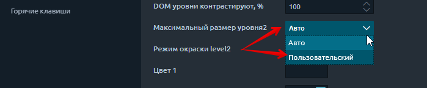

# Поверхность DOM

Используя панель **Поверхность DOM**, трейдер видит все изменения лимитных ордеров в книге заказов \(в зависимости от глубины рыночных данных\), которая представлена ​​в виде тепловой карты. На панели отображается размещение лимитных ордеров, их изменение, отмена или исполнение крупными участниками рынка, а также дисбаланс между покупателями и продавцами.

В отличие от других типов графиков, например таких, как кластер, поток заказов показывает не только агрессивные рыночные ордера, но и **лимитные ордера, которые имеют большее влияние на поведение цены.**



## Как интерпретировать диаграмму поверхности DOM

Изменение цен из-за совпадения лимитных и рыночных ордеров:

* Ордер Market Sell совпадает с ордером Buy Limit по лучшей цене предложения.
* Ордер Market Buy совпадает с ордером Sell Limit по лучшей цене предложения.

**Журнал ордеров** показывает объем заявок и предложений на разных уровнях цен, который может быть представлен в виде таблицы DOM или  **тепловой карты на графике.**

В любой момент времени на рынке размещаются новые ордера, а существующие ордера либо изменяются / отменяются, либо исполняются. Отслеживать все эти изменения через таблицу DOM очень сложно, поэтому визуальное представление этого процесса в виде тепловой карты более полезно.

Основное преимущество визуализации тепловой карты перед классическим представлением DOM заключается в том, что вы сразу видите зону скопления крупных ордеров, ожидающих исполнения. Эти зоны высокой ликвидности являются «магнитом» для цены, поскольку они часто психологически совпадают с ценовыми уровнями или значениями популярных технических индикаторов \(MA 200, MA 50, Daily High / Low и т. Д.\). Поэтому даже в краткосрочной перспективе цена может подойти к этим уровням.

Также тепловая карта показывает динамику \(увеличение или уменьшение объема\) лимитных ордеров на определенных ценовых уровнях. Благодаря градиентной цветовой схеме трейдер видит зоны повышенного интереса, которые показаны ярким цветом. Уровни с минимальным количеством заказов имеют тусклый цвет. Это позволяет визуально оценить сильные уровни поддержки и сопротивления, а также понять причины резкого изменения цены.

## Инструменты анализа поверхности и объема модели DOM

Помимо визуализации потока лимитных ордеров, существуют инструменты анализа объема, которые показывают распределение торгового объема, дельты и других данных за выбранный период времени.

Более подробную информацию о каждом инструменте можно найти в нашей документации в разделе _«Аналитические панели - График -_ [_Инструменты анализа объема»_.](https://help.quantower.com.ru/analytics-panels/chart/volume-analysis-tools)

## Общие настройки

В общих настройках панели есть ряд настроек, которые идентичны другим панелям, но некоторые относятся к **Поверхности DOM.**

-**Количество уровней DOM** - показывает количество уровней цен в каждом направлении от Best Bid и Best Offer.

-**Максимальный размер level2** - позволяет регулировать яркость уровней в зависимости от заданного значения громкости. Есть два режима: **Авто, Пользовательский.**

Например, установим значение 20. Все уровни, на которых объем равен или превышает это значение, будут иметь самый яркий цвет. Все уровни с уровнем объема меньше установленного значения будут иметь менее яркую окраску, пропорциональную их объему.

## Дополнительные столбцы DOM Surface

В правой части панели расположены по умолчанию установлены три гистограммы - **размер, совокупный размер, дисбаланс книги заказов.**

![&#x414;&#x43E;&#x43F;&#x43E;&#x43B;&#x43D;&#x438;&#x442;&#x435;&#x43B;&#x44C;&#x43D;&#x44B;&#x435; &#x441;&#x442;&#x43E;&#x43B;&#x431;&#x446;&#x44B; DOM Surface &#x441; &#x440;&#x430;&#x437;&#x43C;&#x435;&#x440;&#x43E;&#x43C; &#x43A;&#x43D;&#x438;&#x433;&#x438; &#x437;&#x430;&#x43A;&#x430;&#x437;&#x43E;&#x432;, &#x441;&#x43E;&#x432;&#x43E;&#x43A;&#x443;&#x43F;&#x43D;&#x44B;&#x43C; &#x440;&#x430;&#x437;&#x43C;&#x435;&#x440;&#x43E;&#x43C; &#x438; &#x434;&#x438;&#x441;&#x431;&#x430;&#x43B;&#x430;&#x43D;&#x441;&#x43E;&#x43C; &#x43A;&#x43D;&#x438;&#x433;&#x438; &#x437;&#x430;&#x43A;&#x430;&#x437;&#x43E;&#x432;](../.gitbook/assets/poverkhnost-dom-gistogrammy.png)

* **Размер \(журнал ордеров\)** Эта гистограмма показывает объем лимитных ордеров на каждом ценовом уровне. Пользователь может визуально сравнить размер каждой полосы для определения самого сильного уровня.
* **Совокупный размер** На этой гистограмме отображается сумма размеров лимитных ордеров для каждого последующего уровня. Эта гистограмма позволяет оценить доминирующую сторону рынка.
* **Дисбаланс \(Дисбаланс журнала ордеров\)** Эта гистограмма показывает процент того, насколько объем заказов на покупку превышает количество заказов на продажу \(и наоборот\) для каждого уровня цен. Он измеряет, является ли книга лимитных заказов на покупку или на продажу. Чем больше дисбаланс превышает одну сторону, тем выше вероятность движения цены в сторону дисбаланса. Фактически, это хороший предсказатель направления цены.

