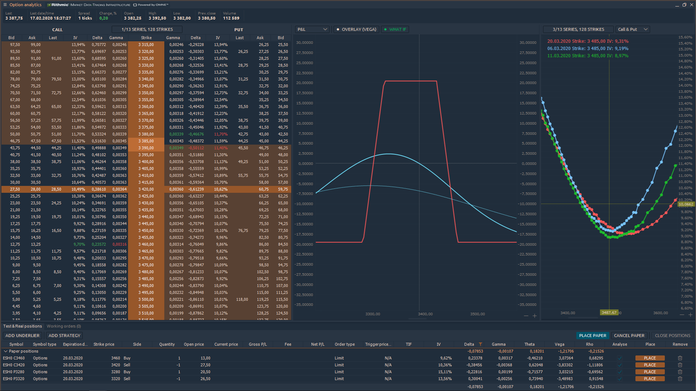
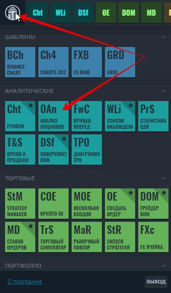
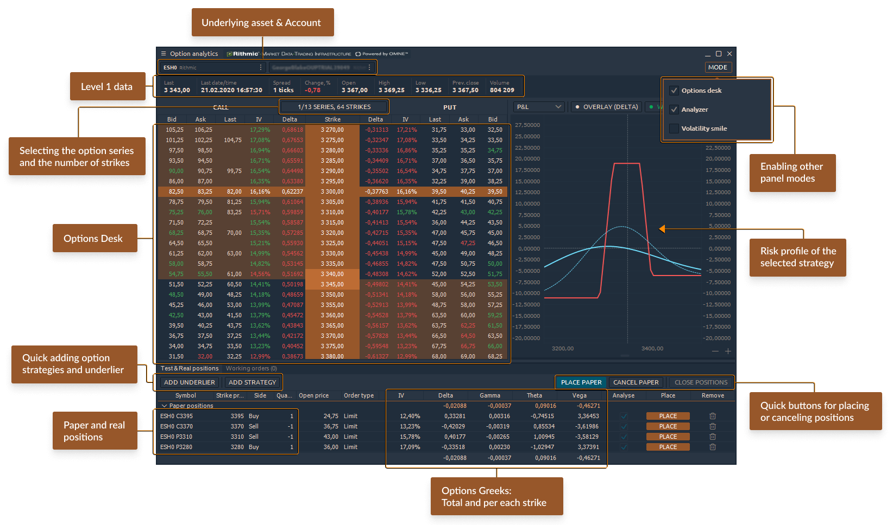

# Анализ опционов

Option Analytics - это профессиональная панель для трейдеров опционов, которая позволяет проводить сильный анализ опционов и отправлять ордера в один клик.

Чтобы открыть новую панель Анализ опционов, перейдите в Главное меню \(значок с логотипом\) и выберите Options Analytics в разделе Analytics.

## Ключевые элементы панели Анализ опционов

**Базовый актив и счет для выбора торгового инструмента**, имеющего серию опционов, и выбора торгового счета \(в случае нескольких счетов\)

**«Режим» управляет видимостью дополнительных панелей** - Options Desk, Options Risk Analyzer, Volatility Smile \(Skew\)

**Панель данных уровня 1** предоставляет основную информацию о текущих ценах Ask, Bid, Last, спреде и дневном диапазоне выбранного символа.

## **Таблица опционов**

\(1\) - этот элемент управления позволяет управлять одновременно видимыми сериями опционов и страйками.

\(2\) - Щелкните правой кнопкой мыши заголовок таблицы, чтобы отобразить контекстное меню, в котором трейдер может выбрать видимые столбцы.

\(3\) - Столбец «Бумага» - это интерактивный столбец, который используется для добавления позиции бумаги в портфолио, для этого - щелкните ячейку столбца и установите значение.

\(4\) - Щелкните правой кнопкой мыши по строке, чтобы отобразить контекстное меню удара.

\(5\) - Двойной щелчок по ячейкам Ask / Bid откроет панель ввода ордеров.

## Совместный режим Option Desk и Analyzer

Добавьте позиции Paper в панели опционов, и анализатор стратегии сразу же покажет профиль опциона. Этот режим позволит вам видеть все изменения в панели опционов - цены, волатильность, греческие значения опционов - и профили опционов на одном экране.

## Анализатор

Анализатор позволяет пользователям видеть профиль существующего портфолио. Профиль иллюстрирует поведение портфеля в случае изменения цены базового инструмента, изменения волатильности или временного спада. Также в Анализаторе есть возможность добавить оверлей к основному графику. Это может быть один из греков: Delta, Gamma, Vega, Theta или Rho.

\(1\) - этот элемент управления позволяет выбрать тип данных диаграммы. Возможные варианты: P / L, Delta, Gamma, Theta, Vega, Rho.

\(2\) - Этот элемент управления позволяет добавить оверлей к основному графику.

\(3\) - Нажав на эту кнопку, пользователь может применить сценарии «Что, если».

![&#x418;&#x441;&#x43F;&#x43E;&#x43B;&#x44C;&#x437;&#x443;&#x439;&#x442;&#x435; &#x430;&#x43D;&#x430;&#x43B;&#x438;&#x437; &#x441;&#x446;&#x435;&#x43D;&#x430;&#x440;&#x438;&#x44F; &#xAB;&#x427;&#x442;&#x43E;, &#x435;&#x441;&#x43B;&#x438;&#xBB;, &#x447;&#x442;&#x43E;&#x431;&#x44B; &#x43E;&#x446;&#x435;&#x43D;&#x438;&#x442;&#x44C; &#x432;&#x43B;&#x438;&#x44F;&#x43D;&#x438;&#x435; &#x432;&#x43E;&#x43B;&#x430;&#x442;&#x438;&#x43B;&#x44C;&#x43D;&#x43E;&#x441;&#x442;&#x438; &#x438;&#x43B;&#x438; &#x432;&#x440;&#x435;&#x43C;&#x435;&#x43D;&#x43D;&#x43E;&#x433;&#x43E; &#x441;&#x43F;&#x430;&#x434;&#x430; &#x43D;&#x430; &#x43F;&#x43E;&#x437;&#x438;&#x446;&#x438;&#x44E;.](../.gitbook/assets/what-if-analysis.png)

Трейдер может моделировать сценарии временного спада и воздействия волатильности одновременно или по отдельности, задав соответствующие значения. Одновременно можно нарисовать до 5 линий. Все линии «Что, если» нарисованы пунктиром.

## **Бумаги, позиции, рабочие ордера**

В нижней части панели находится сводная таблица с позициями по бумагам, реальными позициями и рабочими ордерами.

\(1\) - Кнопка Добавить базовый символ позволяет добавить бумажную позицию базового символа в список существующих позиций.

\(2\) - Горячие кнопки дают возможность производить групповые действия с портфолио, такие как: разместить документы, отменить документы или закрыть реально существующие позиции.

\(3\) - Щелкните правой кнопкой мыши заголовок таблицы, чтобы отобразить контекстное меню, в котором трейдер может выбрать видимые столбцы.

\(4\) - Нажав на флажки Anayse, пользователь может включить или исключить определенные позиции из портфеля.

\(5\) - Кнопка Place позволяет разместить позицию бумаги

\(6\) - Значок «Удалить» позволяет удалить позицию бумаги.

