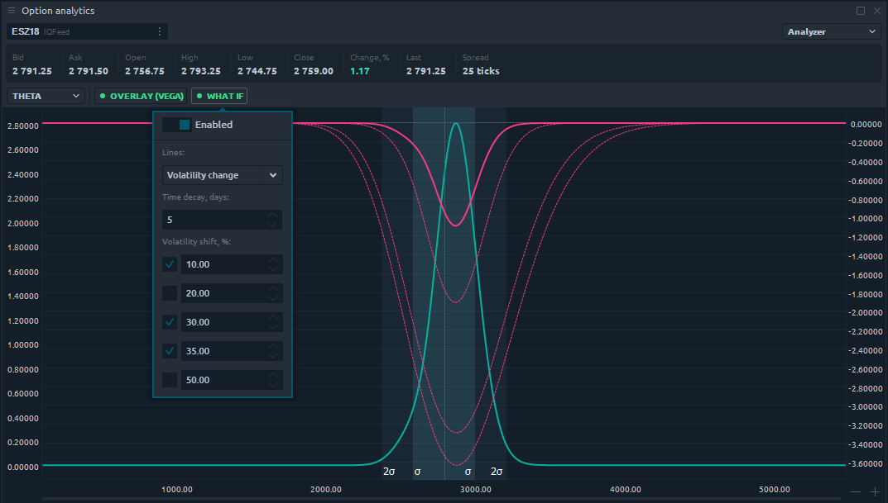

# Анализ опционов

Option Analytics - это профессиональная панель для трейдеров опционов, которая позволяет проводить сильный анализ опционов и отправлять ордера в один клик.

Чтобы открыть новую панель Анализ опционов, перейдите в Главное меню \(значок с логотипом\) и выберите Options Analytics в разделе Analytics.

## Ключевые элементы панели Анализ опционов

**Базовый актив и счет для выбора торгового инструмента**, имеющего серию опционов, и выбора торгового счета \(в случае нескольких счетов\)

**«Режим» управляет видимостью дополнительных панелей** - Options Desk, Options Risk Analyzer, Volatility Smile \(Skew\)

**Панель данных уровня 1** предоставляет основную информацию о текущих ценах Ask, Bid, Last, спреде и дневном диапазоне выбранного символа.

## **Таблица опционов**

\(1\) - этот элемент управления позволяет управлять одновременно видимыми сериями опционов и страйками.

\(2\) - Щелкните правой кнопкой мыши заголовок таблицы, чтобы отобразить контекстное меню, в котором трейдер может выбрать видимые столбцы.

\(3\) - Столбец «Бумага» - это интерактивный столбец, который используется для добавления позиции бумаги в портфолио, для этого - щелкните ячейку столбца и установите значение.

\(4\) - Щелкните правой кнопкой мыши по строке, чтобы отобразить контекстное меню удара.

\(5\) - Двойной щелчок по ячейкам Ask / Bid откроет панель ввода ордеров.

## Совместный режим Option Desk и Analyzer

Добавьте позиции Paper в панели опционов, и анализатор стратегии сразу же покажет профиль опциона. Этот режим позволит вам видеть все изменения в панели опционов - цены, волатильность, греческие значения опционов - и профили опционов на одном экране.

## **Analyzer**

Analyzer allows users to see the profile of existing portfolio. The profile illustrates a behavior of portfolio in cases of underlying instrument price change, volatility change or time decay. Also Analyzer provides a possibility to add an overlay to main chart. It can be one of Greeks: Delta, Gamma, Vega, Theta or Rho

\(1\) - This controll allows to select a chart's data type. Possible options are: P/L, Delta, Gamma, Theta, Vega, Rho  
\(2\) - This controll allows to add an overlay to main chart

\(3\) - By clicking on this button user can apply "What if" scenarios.

Trader is able to simulate the time decay and volatility impact scenarios simultaneously or separately by setting corresponding values. Up to 5 lines can be drawn at the same moment of time. All "What if" lines are drawn in dashed style.

## **Papers, Positions, Working orders**

The bottom part of the panel contains combined table with paper positions, real positions and working orders

\(1\) - Add underlier button allows to add a paper position of underlying symbol to the list of existing positions.  
\(2\) - Hot buttons provide a possibility to make group actions with portfolio suh as: place papers, cancel papers or close real existing positions.  
\(3\) - Right click on table's header will show a context menu where trader can select visible columns.  
\(4\) - By clicking on Anayse checkboxes user can include or exclude certain positions from portfolio.  
\(5\) - Place button allows to place a paper position  
\(6\) - Remove icon allows to remove a paper position

