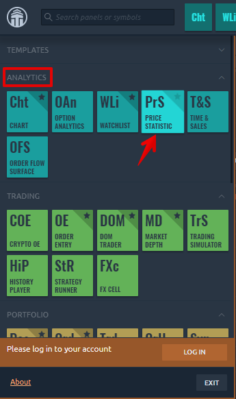
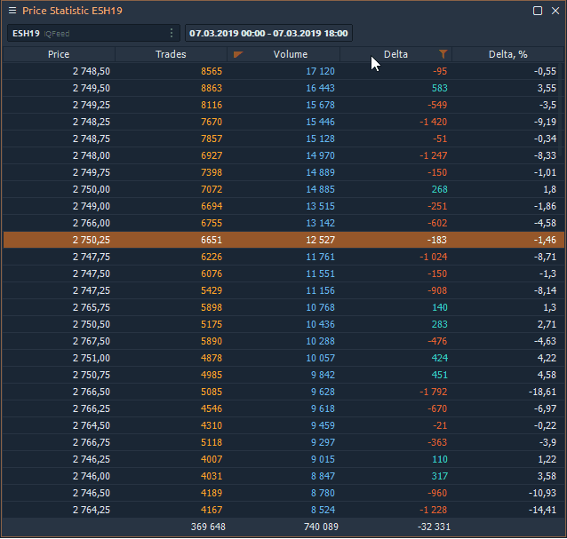

# Статистика цен

Статистика цен - это, по сути, профиль объема, представленный в табличной форме. Панель объединяет [**данные об объеме**](https://app.gitbook.com/@quantower/s/quantower-ru/~/drafts/-MbkLu7tVnWGiBHvG2pl/analytics-panels/chart/volume-analysis-tools/volume-profiles) для каждой цены за выбранный период времени. Активировав необходимые столбцы, вы сразу увидите Сделки, Объем, Дельта, Средний и Максимальный объемы. Система фильтрации и уведомлений покажет важные для трейдера данные.

## Ценовая статистика и профиль объема. Какая разница?

Как мы уже говорили, панель «Статистика цен» содержит данные в виде таблицы, которая показывает профиль объемов. Ниже приведено изображение, показывающее, как панель связана с объемным профилем.

Основное отличие и преимущество статистики цен заключается в том, что в таблице представлены все доступные данные об объеме для определенной цены, которые можно отсортировать или загрузить во внешний файл csv для дальнейшего анализа.

Профиль объема и данные в таблице статистики цен строятся на текущий день. Если вы отсортируете столбец объема в порядке убывания, цена в таблице \(2766 долларов США\) будет соответствовать строке POC в профиле объема.

## How to enable it?

In the main menu of the platform in the _**Analytics category**_, find the Price Statistic panel and click on it to launch it.

## Availalbe Data types in Price Statistic

Each column in the table corresponds to a specific data type that you can show / hide through the panel settings or by right-clicking on the table.

* **Trades** — it's the number of contracts \(trades\) that executed at each price level.
* **Buy \(or Sell\) trades** — it's the number of Buy \(or Sell\) trades that executed at each price level.
* **Volume** — the total size of all positions that executed at each price level or price range.
* **Buy \(or Sell\) Volume** — the total size of all Buy \(or sell\) positions that executed at each price level or price range.
* **Buy \(or Sell\) Volume, %** — shows how many percent of the total volume relates to Buy \(or Sell\) trades
* **Delta and Delta %** — shows the difference in traded Volume between Buyers and Sellers. It allows evaluating who controls the price on the market at a given time.  Delta % = Delta / Volume \* 100
* **Average size** — the average volume of the position that was executed at a certain price or price range.
* **Average Buy size** — the average volume of a Buy position that was executed at a specific price or price range.
* **Average Sell size** — the average volume of a Sell position that was executed at a specific price or price range.
* **Max one trade volume \(value and %\)** — shows the maximum volume of a single trade that has executed at a certain price or price range \(depending on the Custom Step \(ticks\) setting\).
* **Filtered volume \(value and %\)** — this parameter displays volumes that exceed the size specified in the filter. If the volume size is smaller than the one specified in the filter, then the values will be zero.
* **Buy \(or Sell\) filtered volume** — the parameter displays Buy \(or Sell\) volumes that exceed the size specified in the filter.

