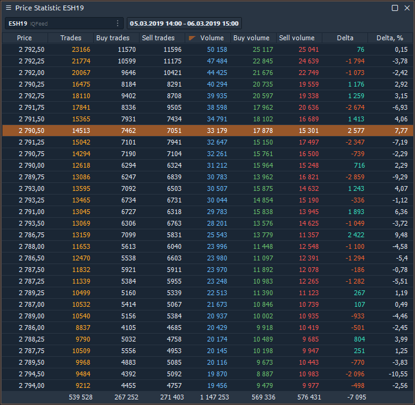
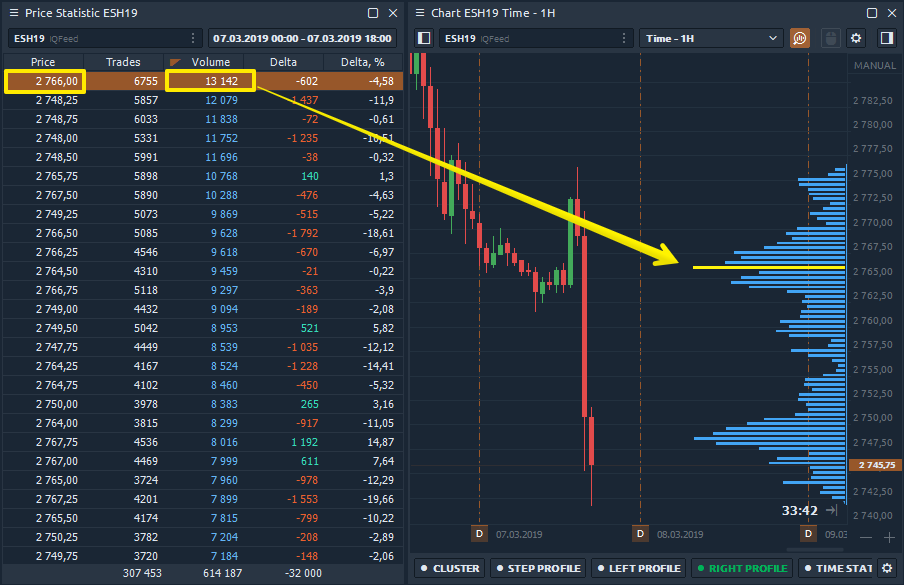
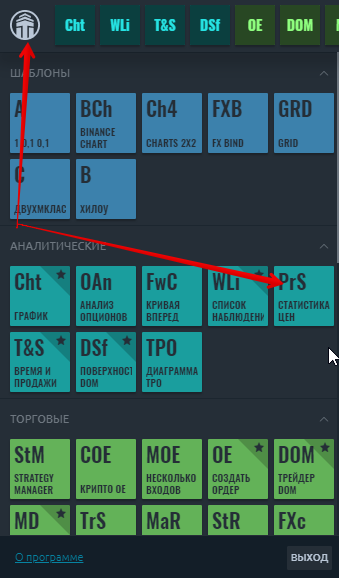
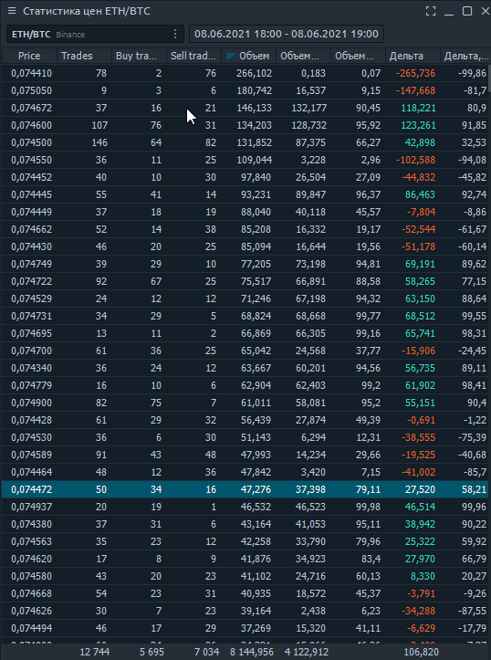

# Статистика цен

Статистика цен - это, по сути, профиль объема, представленный в табличной форме. Панель объединяет [**данные об объеме**](https://app.gitbook.com/@quantower/s/quantower-ru/~/drafts/-MbkLu7tVnWGiBHvG2pl/analytics-panels/chart/volume-analysis-tools/volume-profiles) для каждой цены за выбранный период времени. Активировав необходимые столбцы, вы сразу увидите Сделки, Объем, Дельта, Средний и Максимальный объемы. Система фильтрации и уведомлений покажет важные для трейдера данные.

## Ценовая статистика и профиль объема. Какая разница?

Как мы уже говорили, панель «Статистика цен» содержит данные в виде таблицы, которая показывает профиль объемов. Ниже приведено изображение, показывающее, как панель связана с объемным профилем.

Основное отличие и преимущество статистики цен заключается в том, что в таблице представлены все доступные данные об объеме для определенной цены, которые можно отсортировать или загрузить во внешний файл csv для дальнейшего анализа.

Профиль объема и данные в таблице статистики цен строятся на текущий день. Если вы отсортируете столбец объема в порядке убывания, цена в таблице \(2766 долларов США\) будет соответствовать строке POC в профиле объема.

## Как это включить?

В главном меню платформы в категории «Аналитика» найдите панель «Статистика цен» и нажмите на нее, чтобы запустить ее.

## Доступные типы данных в статистике цен

Каждый столбец в таблице соответствует определенному типу данных, который можно показать / скрыть в настройках панели или щелкнув таблицу правой кнопкой мыши.

* Сделки - это количество контрактов \(сделок\), заключенных на каждом ценовом уровне.
* Сделки на покупку \(или продажу\) - это количество сделок на покупку \(или продажу\), выполненных на каждом ценовом уровне.
* Объем - общий размер всех позиций, исполненных на каждом ценовом уровне или ценовом диапазоне.
* Объем покупки \(или продажи\) - общий размер всех позиций на покупку \(или продажу\), выполненных на каждом ценовом уровне или ценовом диапазоне.
* Объем покупки \(или продажи\),% - показывает, сколько процентов от общего объема относится к сделкам на покупку \(или продажу\).
* Дельта и Дельта% - показывает разницу в торговом объеме между покупателями и продавцами. Это позволяет оценить, кто в данный момент контролирует цену на рынке. 
* Дельта% = Дельта / Объем \* 100
* Средний размер - средний объем позиции, которая была исполнена по определенной цене или ценовому диапазону.
* Средний размер покупки - средний объем позиции на покупку, которая была исполнена по определенной цене или в ценовом диапазоне.
* Средний размер продажи - средний объем позиции на продажу, которая была исполнена по определенной цене или ценовому диапазону.
* Максимальный объем одной сделки \(значение и%\) - показывает максимальный объем одной сделки, которая была исполнена по определенной цене или ценовому диапазону \(в зависимости от настройки Custom Step \(ticks\)\).
* Отфильтрованный объем \(значение и%\) - этот параметр отображает объемы, превышающие размер, указанный в фильтре. Если размер тома меньше указанного в фильтре, то значения будут нулевыми.
* Отфильтрованный объем Buy \(или Sell\) - параметр отображает объемы Buy \(или Sell\), превышающие размер, указанный в фильтре.

