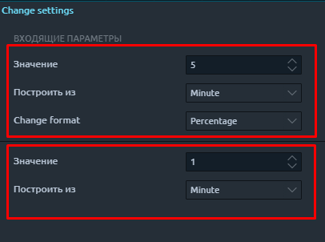

# Change - Индикатор изменения цены


**Change индикатор** считает абсолютное изменение цены или в %  за любой указанный период выбранной торговой пары  и выводит это значение на график или в список наблюдения для сортировки и отбора торговых пар.


**Основные преимущества и особенности индикатора:**

* **Пользовательский выбор периода.** Вы можете настроить изменение цены за любой период времени. За минуту, 5 минут, час, день и тд.
* **Можно выбрать по каким данным получить изменение цены.** Индикатор может произвести расчет по абсолютным значениям цены или рассчитать результат в %.
* **Поддержка разных таймфреймов.** Индикатор позволяет агрегировать данные с любого указанного периода и выводит значения на текущий график.
* **Выбор и фильтрация торговых пар по изменению цены за любой период.** Индикатор доступен в списке наблюдения, поэтому можно производить отбор торговых пар фильтрацией или сортировкой по % изменения цены за указанный период.
* **Уведомления по % изменению.** Добавив индикатор в список наблюдения, можно настроить уведомления на значение изменения цены по торговой паре.

Что бы добавить индикатор на график, нажмите на панели слева кнопку с индикаторами и со списка индикаторов выберите **Change**

**Основные настройки индикатора Change**

.png>)

* **Значение -** значение периода, за который нужно получить данные изменения цены
* **Построить из -** период, значение которого задано в поле Value
* **Change format -** выбрать формат результата изменения  в % или в абсолютном значении

**Как добавить индикатор Change в список наблюдения**

**Настройки индикатора в списке наблюдения состоят из двух блоков входящих параметров, которые можно задать:**

Алгоритм находит нужный бар в истории по заданным условиям, берет его цену закрытия и сравнивает с текущей ценой**.**

* **Первый блок параметров.**  Задается период, за который нужно получить изменение цены. И выбирается формат вывода данных  в % или в абсолютном значении.
* **Второй блок.** Указывается значение и период графика, с которого будет происходить расчет. Для более точного расчета, рекомендуется строить данные из наименьшего периода, например 1 мин, 1 сек., тик.

**Примеры :**

**Показать изменение в % за 1 час, данные взять с минутных свечей.**\
****Алгоритм отсчитает 60 минутных свечей, так как во втором блоке указан минутный график для агрегации данных  и сравнит цену закрытия найденного бара с текущей ценой. Результат выведет в %.

**Показать изменение в % за 1 час, данные взять с часовых свечей.**\
****Алгоритм сравнит цену закрытия предыдущей часовой свечи, так как во втором блоке указан часовой график для агрегации данных, с текущей ценой. Результат выведет в %.


Индикатор **Change** не генерирует торговые сигналы (!!), а лишь информирует о изменении рыночной ситуации за выбранный период.&#x20;


**Выбор и фильтрация торговых пар по изменению цены за любой период.**

Благодаря тому, что индикатор доступен к добавлению в список наблюдения торговых пар, появляются широкие возможности по его использованию при выборе торговых пар, для поиска и выбора торговых пар с сильным движением цены. Вы можете одновременно добавить этот индикатор с разными параметрами, для двойной или тройной фильтрации, в зависимости от Вашей торговой системы и в зависимости от необходимого результата на выходе.  Как настраивать фильтры, сортировку и уведомления в списке наблюдения описано в статье [**Список наблюдения**. ](https://help.quantower.com.ru/analytics-panels/watchlist)

