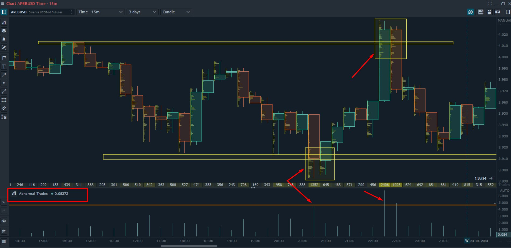

# Abnormal Trades

**Abnormal Trades** это индикатор, который позволяет найти бары и места на графике, где прошло большое количество сделок за выбранный период времени. Индикатор также доступен для добавления в список наблюдения, для быстрого поиска, сортировки и выбора инструментов с высоким количеством сделок за любой. Поиск и отбор инструмента происходит по коэффициенту _**соотношения количества сделок на текущем баре к среднему количеству за указанный период**_.

<figure><figcaption></figcaption></figure>


**Abnormal Trades** (**К**-коэффициент) показывает во сколько раз на текущей свече количество сделок превышает среднее значение за последний указанный период. \
\
Коэффициент рассчитывается в реальном времени, не дожидаясь закрытия свечи, что дает возможность быстро реагировать в момент появления большого количества сделок за выбранный период в рынке.

**n** - количество предыдущих баров для сравнения количества сделок на текущем баре.&#x20;

**К= Количество трейдов на текущем баре / среднее количество трейдов на этом инструменте за предыдущие n баров.**


Так как для разных торговых инструментов, таймфреймов и разных периодов рынка свои индивидуальные значения среднего и аномального количества трейдов, то индикатор рассчитывает относительное значение, что позволяет его применить для всех инструментов и таймфреймов.

### Добавление Abnormal Trades на график

<figure><figcaption>
Добавление Abnormal Trades на график
</figcaption></figure>

### **Добавление Abnormal Trades в Watchlist**

**Период** — количество баров истории, для расчета среднего значения количества трейдов на выбранном инструменте.\
**Агрегация** — таймфрейм баров, на которых будет производиться расчет и поиск аномальных трейдов.

<figure><figcaption>
Добавление Abnormal trades в Watchlist
</figcaption></figure>

### Как иcпользовать индикатор Abnormal Trades

Учитывая, что Abnormal Trades может применяться к разным таймфреймам, в списке наблюдения можно комбинировать этот параметр с другими индикаторами на младших (МТФ) или старших таймфреймах (СТФ).

К, Abnormal Trades обновляется в текущем времени по данным последней свечи. Так как в списке наблюдения, доступен параметр сдвига, то можно искать бар с большим количеством сделок на предыдущей свече, на третьей с текущего момента и тд. А это дает расширенные возможности для поиска паттернов и торговых формаций

Как фильтровать, сортировать и создавать уведомления, подробно описано в статье [Менеджер фильтров и уведомлений ](https://help.quantower.com.ru/general-settings/setup-actions-and-advanced-filters)

Abnormal Trades не выделяет **внутри свечи диапазон**, в каком были эти трейды, а фиксирует факт исполнения на текущей свече большого количества сделок. Поэтому, если необходимо визуально увидеть аномальную зону трейдов внутри определенного бара на истории или в режиме реального времени, то нужно добавить пошаговый профиль, равный таймфрейму текущего графика на основании агрегации трейдов, или добавить [Power trades](../../chart/power-trades.md).

<figure><figcaption></figcaption></figure>

### Работа индикатора Abnormal Trades с другими индикаторами

Abnormal Trades лучше работает в связке с другими параметрами, его можно использовать, комбинируя с другими индикаторами. Ниже представленны примеры распространенных комбинаций, для поиска свечей с использованием индикатора Abnormal Trades.

* **Высокий объем + высокое количество трейдов. Пробой уровня, манипуляция и сбитие стопов.**

<figure><figcaption></figcaption></figure>

* **Аномальный объем свечи при крайне низком количестве сделок на свече (нииже в несколько раз). Поиск крупных трейдов.**

<figure><figcaption></figcaption></figure>

* **Аномальный объем + высокое количество трейдов при низком TR (диапозон свечи).**  Большой объем не может "сдвинуть" цену далее по направлению движения. При большом усилии, свеча не получает нужного движения цены. Сильное сопротивление, айсберги, встречные трейды, либо момент разъедания встречного лимитного объема.

<figure><figcaption></figcaption></figure>

<figure><figcaption></figcaption></figure>

* **Аномальное количество сделок + аномальный объем + пин бар.** Если по тренду то как правило манипуляции крупных игроков с набором позиции на стопах участников. Пример описывался в индикаторе [Abnormal Volume](https://help.quantower.com.ru/analytics-panels/technical-indicators/volume/abnormal-volume#primery-abnormal-volume).\
  Для комбинации с пинбаром есть отдельный индикатор для списка наблюдения - Pin Bar.

<figure><figcaption>
пример 2
</figcaption></figure>

<figure><figcaption>
Пример 2
</figcaption></figure>

Быстрый поиск важных зон на графике позволяет существенно улучшить показатели торговли путем быстрого выбора монет, соответствующих торговой системе трейдера.&#x20;

Исходя из вышесказанного, сам по себе индикатор не является готовой торговой системой. Но благодаря алертам, сообщениям в телеграм бот и звуковым уведомлениями по аномальному К трейдов, решается одна из важных проблем трейдера, как быстрый поиск зон с зоной аномально высокого количества сделок, что бы не пропустить удачный момент для входа.

Если необходима помощь с настройкой индикатора — обращайтесь в нашу службу [**на нашем сайте** ](https://www.quantower.com/)(всплывающее окно в правом нижнем углу).
