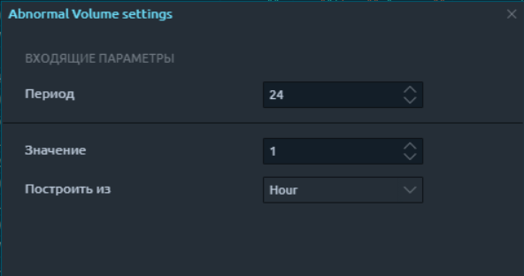

# Abnormal Volume

**Abnormal Volume** доступен для добавления в список наблюдения, для быстрого поиска, сортировки и выбора инструментов с высоким объемом на любом таймфрейме. Поиск и отбор инструмента происходит по коэффициенту соотношения последнего объема на средний объем за период.


**Значение индикатора ("К")** показывает во сколько раз на текущей свече объем превышает среднее значение за последний указанный период.

Коэффициент рассчитывается в реальном времени, не дожидаясь закрытия свечи, что дает возможность быстро реагировать в момент появления большого объема в рынке.


В разный период рыночной активности, на одном и том же инструменте меняется средний объем за период. Kоэффициэнт повышенного объема не привязан к количеству, сумме или монете. Это относительное значение, которое позволяет сравнивать, сортировать и выбирать различные инструменты, при этом, учитывая среднее значение объемов именно по конкретному инструменту за указанный период. Это позволяет его использовать не только на классических финансовых инструментах, **но и на криптовалютах.**&#x20;

_Пиковый, повышенный, аномальный, разворотный, пробивающий, останавливающий_ - так часто трейдеры называют очень высокий объем относительно предыдущих в зависимости от стадии рынка. &#x20;

**Abnormal Volume** не является сам по себе готовой стратегией для торговли, но он незаменим в связке с другими сигналами для поиска точных и прибыльных точек входа в стратегиях, которые учитывают повышенный или, наоборот, пониженный объем.

### Настройки индикатора Abnormal Volume&#x20;


На данном примере будет **рассчитываться коэффициент К** индикатора **Abnormal Volume** в реальном времени, во сколько раз объем, прошедший на последней **часовой свече** больше, чем средний объем за **24 часа**.


**"Значение"** и "**Построить из"** - выбор таймфрейма для поиска повышенного объема;\
"**Период"** - количество предыдущих свечей для сравнения со средним значением.&#x20;

Таким образом, можно гибко настраивать и периоды для сравнения и таймфреймы для поиска аномального объема.

### **Abnormal Volume в списке наблюдения**

Что бы добавить **Abnormal Volume** в список наблюдения и настроить или звуковое уведомление или сообщение, нужно выбрать его с предложенного списка встроенных индикаторов.

Если трейдер в своей стратегии учитывает среднее значение объемов за более длительный период, то аномальный объемом может считаться объем с **К=10 и выше среднего.** В коротком диапазоне средних значений, пороговое значение коэффициента аномального объема может быть и **меньше 10**. \
\
&#x20;Как фильтровать, сортировать инструменты в списке наблюдения и создавать  уведомления по условию, описано подробно в ["Менеджере фильтров и уведомлений".](../../../general-settings/setup-actions-and-advanced-filters.md)

**К Abnormal Volume** обновляется в текущем времени по данным последней свечи. Так как в списке наблюдения, доступен параметр сдвига, то можно искать повышенный объем на предыдущей свече, на третьей с текущего момента и тд. А это дает расширенные возможности для поиска паттернов и торговых формаций.&#x20;

На данном примере поиск повышенного объема на 1 минутных свечах.  В списке наблюдения выведен К, который показывает во сколько раз объем на последней минуте превышает средний объем за последние 60 свечей.  Добавлено условие для алерта:&#x20;

> _"Если на предпоследней 1 минутной свече/баре пройдет объем выше среднего за 60 минут в 10 раз, то сработает звуковое уведомление и сообщение/алерт."_&#x20;

### Примеры Abnormal Volume

Важные ситуации на рынке, такие, как выход из зоны накопления, пробитие уровня, усиление тренда,  часто сопровождаются не нормальными объемами с высоким TR

Например, в связке и индикатором TR%, происходит **быстрый отбор агрессивных свечей** с высоким TR% **на высоком объеме.** В большинстве своем такая агрессия на рынке связана с мощным импульсным движением , пробитием уровней или зон накопления.

Если торговая система трейдера предусматривает пробой уровня, то связка двух индикаторов Abnormal Volume + TR% поможет быстро фильтровать именно свечи, пробивающие зоны накоплений или уровень сопротивления.

Высокий объем на _Пин баре_ (pin bar) может быть неплохой точкой разворота рынка или временной коррекцией. Достаточно высокий объем на свече с минимальным телом и длинной тенью может говорить о том, что дальнейшее движение может не продолжиться, что есть сильное встречное сопротивление. Один из хорошо работающих паттернов это Pin Bar с аномальным объемом на младшем таймфрейме с дальнейшим разворотом движения в сторону тренда старшего таймфрейма.

Исходя из вышесказанного, сам по себе индикатор не является готовой торговой системой, но благодаря алертам, сообщениям в телеграм бот и звуковым уведомлениями по аномальному К объема, решается одна из важных проблем трейдера, как быстрый поиск зон с аномально высокими объемами, что бы не пропустить удачный момент для входа в прибыльную позицию по своей торговой стратегии.&#x20;
