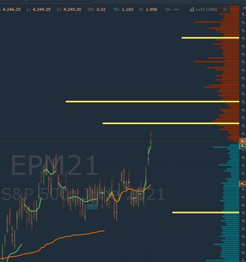

# Level2 indicator

Как увидеть стакан ордеров прямо на графике в реальном режиме времени? 

**Индикатор Level2** отображает данные журнала ордеров на графике. Все лимитные ордера в реальном режиме на графике помогут моментально отслеживать изменение поведения крупных игроков.



В связке с другими поверхностями, Level2 indicator станет незаменимым помощником в визуальном представлении рыночной ситуации в текущем моменте времени. 

### Настройки Level2 indicator:

* **Закрепить к шкале цен.** Для более наглядного отображения уровней цен в стакане, нужно отметить данную опцию, которая "закрепляет" ордера в стакане к шкале цен на графике. 
* **Количество уровней.**  Отображение количества уровней. Максимально допустимое значение 9999. 


Чем больше количество анализируемых уровней, тем больше нагрузка, поэтому  максимальные значения лучше использовать только тогда, когда это действительно необходимо для более глубокого анализа.


* **Высота гистограммы \(%\).** 
* **Выделить большие объемы.** Можно задать значения объемов, которые будут визуально выделяться другим цветом.

При необходимости проанализировать значения каждого объема в определенном месте, нужно увеличить масштаб.

