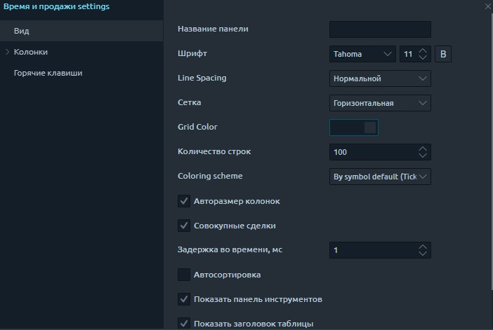

# Лента сделок

## Фильтрация в таблице "Время и продажи"Что такое лента сделок

Панель **Time & Sales \(Лента сделок\)**  отображает все сделки, которые происходят по выбранному инструменту, и предоставляет подробную информацию по каждой сделке, включая дату, время, цену и количество. Каждая строка имеет цветовую кодировку, чтобы указать, была ли сделка результатом агрессивного покупателя или продавца.

Панель **Лента сделок** ведет текущий учет сделок по выбранным инструментам, отображаемый в хронологическом порядке. Каждая новая запись добавляется в начало списка, в результате чего экран панели автоматически прокручивается вниз.



## Режимы реального времени и исторический

В режиме реального времени отображаются все текущие сделки. Исторический режим позволяет получить все прошлые сделки за указанный период времени прямо на панели.

## Общие настройки

Основные настройки в ленте сделок аналогичны параметрам большинства панелей в Quantower - полная гибкость в настройках цвета, шрифтах, видимости столбцов, положении данных относительно столбца и т. Д.

Но некоторые настройки уникальны для этой панели:

* **Количество строк** - это количество строк, которые будут отображаться в таблице, чтобы сэкономить память вашего компьютера. Когда количество строк превышает указанное значение, старые значения будут удаляться по мере появления новых.
* **Цветовая схема** - этот параметр устанавливает цветовую схему для всех строк таблицы в зависимости от выбранного условия: -если вы выбрали «**By Aggressor Flag**», то для сделок с направлением Buy линия будет синего цвета, а для сделок Sell - красного цвета. Если флаг «Агрессор» не определен \(«Нет»\), цвет лайма будет белым. -Если вы выбрали «**По направлению тика**», то линии будут окрашены в соответствии с изменением последней цены.
* **Совокупные сделки** - этот режим позволяет отслеживать крупных трейдеров, суммируя сделки, совпадающие по цене, направлению и времени.
* **Задержка по времени, ms** - будет продолжать суммировать данные в течение указанного времени, с той же ценой и направлением торговли.

## Экспорт данных

Панель Time & Sales позволяет экспортировать выполненные сделки в файлы CSV или HTML для дальнейшего анализа. Вскоре мы добавим возможность автоматического обновления данных непосредственно во внешнем файле с помощью функций DDE и RTD.

* Выберите **«Экспорт данных»** в меню панели.
* Выберите необходимые данные, которые вы хотите экспортировать, и нажмите кнопку \[Экспорт файла\].
* Укажите тип файлов и путь для их сохранения

## Действия настройки - фильтры и действия

Мы писали об этой функции в разделе [**«Дополнительные фильтры и действия таблицы»**](https://help.quantower.com/getting-started/table-management#advanced-table-filter), в котором подробно объясняется процесс добавления фильтров и создания различных уведомлений. Здесь мы кратко опишем процесс фильтрации в таблице и настройки различных действий.

### Фильтрация в таблице "Лента сделок"

Строки в таблице могут быть отфильтрованы по некоторому значению данных в их столбце. Есть два способа применить фильтрацию:

* Доступ к быстрой фильтрации можно получить, щелкнув значок «Фильтр» в заголовке любого столбца таблицы.

После выбора какой-либо опции - строки таблицы будут отфильтрованы до тех, которые содержат выбранное значение. Быстрый фильтр можно отменить, нажав опцию «**Отменить фильтрацию»**.


Быстрая фильтрация может применяться только к одному столбцу таблицы. Для фильтрации нескольких столбцов мы рекомендуем использовать **«Действия по настройке».**


* Расширенная фильтрация для применения более сложной фильтрации \(**мультифильтрация\)**. В контекстном меню панели выберите пункт «Фильтры и алерты».

Слева на этом экране есть две вкладки, первая из которых представляет собой расширенный фильтр.

Этот экран позволяет включать / отключать фильтрацию, а также настраивать условия фильтрации. Эти условия установлены как:  
                      **\_IF \\(condition1 AND condition2 ...\\) OR \\(conditionN...\\) …\_**

Вы можете установить столько условий, сколько захотите. Из-за возможной сложной логики фильтрации вам необходимо применить изменения после завершения настройки фильтра.

Если у вас есть дополнительные вопросы или предложения по этому функционалу, не стесняйтесь обращаться к нам. Мы здесь чтобы помочь вам!

