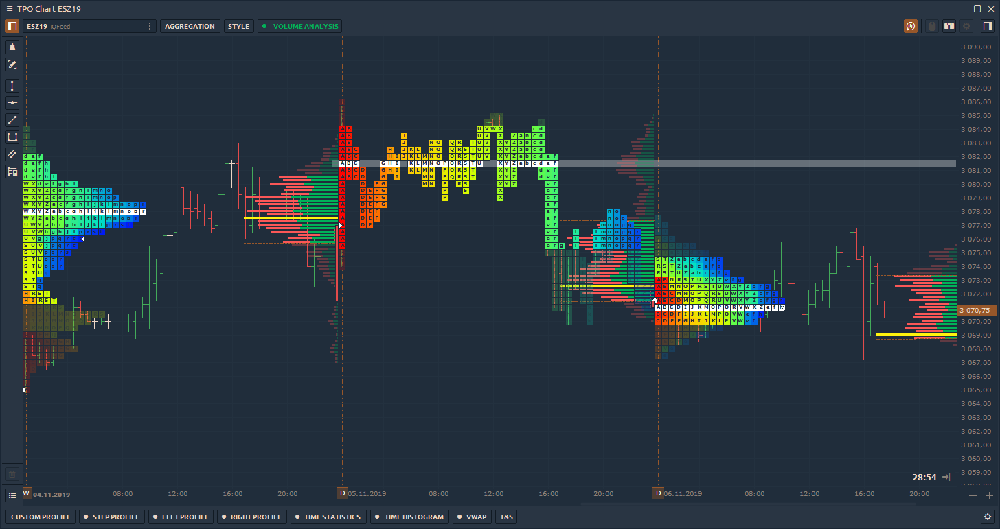
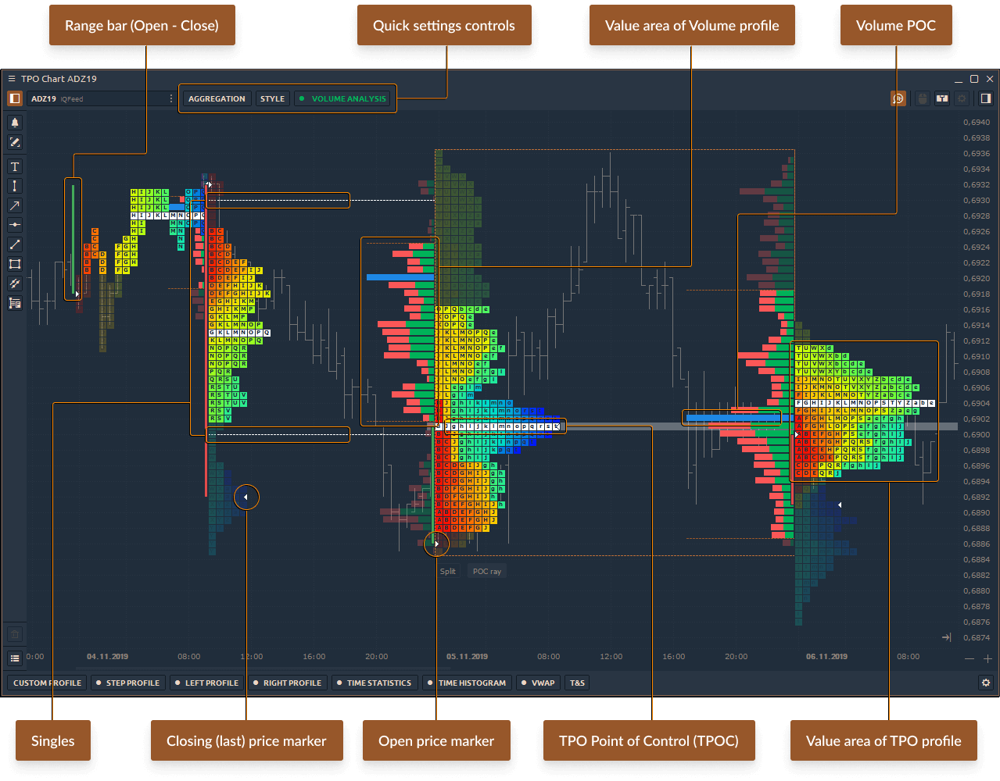
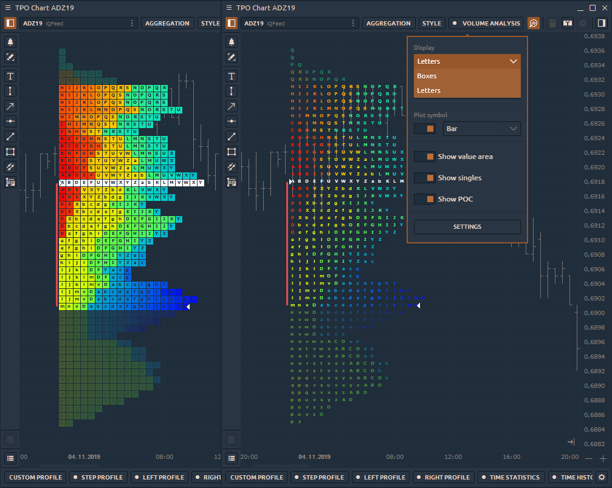

# TPO диаграмма



**Time Price Opportunity**  или TPO график показывает распределение цен в течение указанного времени, формируя таким образом профиль. Это позволяет понять, на каких уровнях или диапазонах цена провела больше всего времени, а также определить основные уровни поддержки и сопротивления.

Чтобы открыть новую панель TPO, перейдите в Главное меню (значок с логотипом) и выберите «Диаграмма TPO» в разделе «Аналитика».

### Kлючевые элементы диаграммы профиля TPO

**Point of Control (POC**) - ценовой уровень наибольшей рыночной активности или объема торгов. На этом уровне цена большую часть времени проводила в диапазоне профиля.

**Value Area** - ценовой диапазон, в котором происходило примерно 68% - 70% рыночной активности или объема торгов.

**Отдельные или одиночные отпечатки** профиля размещаются в середине конструкции профиля, а не на верхнем или нижнем крае. Они возникают при импульсных движениях и используются как зоны поддержки / сопротивления, которые цена может протестировать в ближайшем будущем. Линия синглов указывает, где начинают формироваться синглы (в случаях, когда имеется несколько одиночных отпечатков).

**Буквы TPO** - базовый элемент диаграммы TPO, где каждая буква соответствует определенному времени («Build From»).

## Основные элементы управления TPO графика

На верхней панели инструментов панели TPO графика есть три основных элемента управления:

* ****[**Агрегирование диаграммы профиля TPO**](tpo-chart.md#agregirovanie-diagrammy-profilya-tpo)****
* ****[**Настройки стиля диаграммы профиля TPO**](tpo-chart.md#nastroiki-stilya-diagrammy-profilya-tpo)****
* [**Volume Analysis**](tpo-chart.md#volume-analysis)

### Агрегирование диаграммы профиля TPO

Базовым элементом диаграммы TPO являются буквы, которые используются для построения структуры профиля рынка. Каждая буква изначально представляет собой получасовой период. Quantower предлагает указать в настройках агрегирования любые значения, на основе которых будет строиться профиль. Например, дневной профиль из 30-минутных баров считается «стандартным». Но вы можете установить более низкое значение «Построить из», и профиль будет более детальным. И наоборот, установите значение выше, и форма профиля будет более гладкой.

* **Строить из (**Минута, Час, День**)** — этот параметр определяет продолжительность построения каждой буквы (для A, B, C и т. д.).
* **Агрегация профиля** — определяет диапазон для каждого профиля TPO. Стандартный диапазон - 1 день, но есть несколько базовых диапазонов для построения каждого профиля - Минута, Час, День. Например, однодневный диапазон начинается в начале торгового дня и заканчивается в конце текущего торгового дня (определяемого в торговых часах или индивидуальной сессией).
* **Диапазон истории** - определяет глубину истории для построения профилей TPO. При большой глубине истории профили объемов можно строить долго, потому что они используют тиковые данные.
* **Пользовательский шаг (тики)** - этот параметр определяет высоту и количество букв в профиле. Если включено, высота буквы будет соответствовать количеству отметок, заданному в параметре. Если этот параметр отключен, высота и количество букв будут выбираться автоматически с использованием интеллектуального алгоритма. В результате график будет выглядеть наиболее оптимальным для анализа.

### Настройки стиля диаграммы профиля TPO

Выберите любую цветовую схему для лучшего представления и анализа профиля TPO, а также включите POC, Value Area, Singles, Standard Chart и т.д.

* **Display** - режим отображения писем профиля TPO - Ячейки  или Буквы&#x20;

* **Цветовая схема** — выберите любую цветовую схему для лучшего представления и анализа профиля TPO. В настоящее время доступно 10 различных цветовых режимов  - **один цвет, профиль вверх / вниз, бары вверх / вниз, тепловая карта, профиль дельты, дельта прайс, дельта бар, профиль объема, цена объема, столбцы объема.**
* **POC типы** — уровень цен наибольшей активности на рынке или объем торгов на графике. Доступны два типа:&#x20;
  * окончательный, показывает единственную строку Migrating POC,
  * перенос ,  показывает изменение POC в течение торгового дня или выбранной сессии.

* **Plot Symbol** — показать / скрыть стандартный график на графике TPO Profile.  Для режима "показать" выберите список доступных типов графика.

* **Показать значения областей** - включить ценовой диапазон, в котором имела место примерно 68% - 70% рыночной активности или объема торгов.
* **Показать Одиночные** или одиночные отпечатки профиля размещаются в середине конструкции профиля, а не на верхнем или нижнем крае. Они возникают при импульсных движениях и используются как зоны поддержки / сопротивления, которые цена может протестировать в ближайшем будущем. Линия синглов указывает, где начинают формироваться синглы (в случаях, когда имеется несколько одиночных отпечатков).

### Анализ объема

Профили TPO используются сами по себе для поиска областей поддержки и сопротивления, а также могут использоваться вместе с профилями объема. Для этого мы добавили элемент управления Volume Analysis на верхнюю панель инструментов панели. Здесь вы можете выбрать тип данных и показать / скрыть POC & Value Area.

Switch Volume Profile between [**different data types**](volume-analysis-tools/#data-types-of-volume-analysis-tools), such as delta, buy\&sell, trades, volume, etc.

## Splitting & Merging of TPO Profile Chart

Use TPO splitting for a detailed analysis of profile formation. There are two splitting modes available in the platform:

* **Split full profile**, that separates the TPO profile into each bar or letter. To separate profile into columns, click on the profile and press _**"Split"**_ button that is placed on the lower border of a selected profile.

* **Divide by bar**, that option splits the profile in half on the selected bar. To separate TPO profile in half, select a necessary profile and right-click to open the context menu and click on _**"Divide by bar"**_ button.

### Merging of TPO Profile

**Merge** is a feature that combines several profiles into one. Right-click on the selected profile to open the context menu and select **Merge Left** or **Merge Right**. To return profiles to their original positions, press the Reset button.

## Session Time

Set the custom time range for the necessary trading session and the profile will be built within this range. The rest of the time the profile will not take into account.

To set the time of the necessary session, go to the **TPO Chart settings -> View -> Custom session.** Set the time according the time zone.

## Additional settings of TPO Profile

Right-click on the chart area -> **Settings** to open the general settings of the TPO Chart panel.

