# TPO диаграмма



**Time Price Opportunity**  или TPO график показывает распределение цен в течение указанного времени, формируя таким образом профиль. Это позволяет понять, на каких уровнях или диапазонах цена провела больше всего времени, а также определить основные уровни поддержки и сопротивления.

Чтобы открыть новую панель TPO, перейдите в Главное меню \(значок с логотипом\) и выберите «Диаграмма TPO» в разделе «Аналитика».

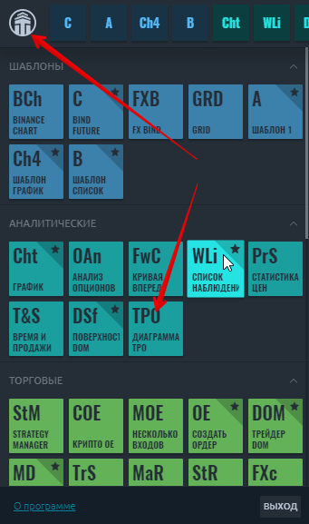

### Kлючевые элементы диаграммы профиля TPO

**Point of Control \(POC**\) - ценовой уровень наибольшей рыночной активности или объема торгов. На этом уровне цена большую часть времени проводила в диапазоне профиля.

**Value Area** - ценовой диапазон, в котором происходило примерно 68% - 70% рыночной активности или объема торгов.

**Отдельные или одиночные отпечатки** профиля размещаются в середине конструкции профиля, а не на верхнем или нижнем крае. Они возникают при импульсных движениях и используются как зоны поддержки / сопротивления, которые цена может протестировать в ближайшем будущем. Линия синглов указывает, где начинают формироваться синглы \(в случаях, когда имеется несколько одиночных отпечатков\).

**Буквы TPO** - базовый элемент диаграммы TPO, где каждая буква соответствует определенному времени \(«Build From»\).

## Основные элементы управления TPO графика

На верхней панели инструментов панели TPO графика есть три основных элемента управления:

* \*\*\*\*[**Агрегирование диаграммы профиля TPO**](tpo-chart.md#agregirovanie-diagrammy-profilya-tpo)\*\*\*\*
* \*\*\*\*[**Настройки стиля диаграммы профиля TPO**](tpo-chart.md#nastroiki-stilya-diagrammy-profilya-tpo)\*\*\*\*
* [**Volume Analysis**](tpo-chart.md#volume-analysis)

### Агрегирование диаграммы профиля TPO

Базовым элементом диаграммы TPO являются буквы, которые используются для построения структуры профиля рынка. Каждая буква изначально представляет собой получасовой период. Quantower предлагает указать в настройках агрегирования любые значения, на основе которых будет строиться профиль. Например, дневной профиль из 30-минутных баров считается «стандартным». Но вы можете установить более низкое значение «Построить из», и профиль будет более детальным. И наоборот, установите значение выше, и форма профиля будет более гладкой.

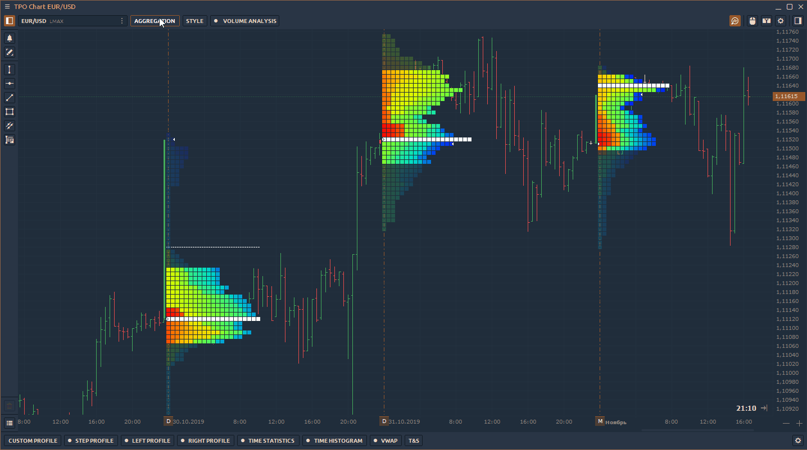

* **Строить из \(**Минута, Час, День**\)** — этот параметр определяет продолжительность построения каждой буквы \(для A, B, C и т. д.\).
* **Агрегация профиля** — определяет диапазон для каждого профиля TPO. Стандартный диапазон - 1 день, но есть несколько базовых диапазонов для построения каждого профиля - Минута, Час, День. Например, однодневный диапазон начинается в начале торгового дня и заканчивается в конце текущего торгового дня \(определяемого в торговых часах или индивидуальной сессией\).
* **Диапазон истории** - определяет глубину истории для построения профилей TPO. При большой глубине истории профили объемов можно строить долго, потому что они используют тиковые данные.
* **Пользовательский шаг \(тики\)** - этот параметр определяет высоту и количество букв в профиле. Если включено, высота буквы будет соответствовать количеству отметок, заданному в параметре. Если этот параметр отключен, высота и количество букв будут выбираться автоматически с использованием интеллектуального алгоритма. В результате график будет выглядеть наиболее оптимальным для анализа.

### Настройки стиля диаграммы профиля TPO

Выберите любую цветовую схему для лучшего представления и анализа профиля TPO, а также включите POC, Value Area, Singles, Standard Chart и т.д.

* **Display** - режим отображения писем профиля TPO - Ячейки  или Буквы 

* **Coloring Mode —** choose any color scheme for better representation and analysis of the TPO profile. Currently, there are 10 different coloring modes available — **Single Color, Up/Down Profile, Up/Down Bars, Heatmap, Delta Profile, Delta Price, Delta Bars, Volume Profile, Volume Price, Volume Bars**. 
* **POC типы** — уровень цен наибольшей активности на рынке или объем торгов на графике. Доступны два типа: **Final POC**, показывает единственную строку **Migrating POC**, которая показывает изменение POC в течение торгового дня или выбранной сессии.
* Цветовая схема — выберите любую цветовую схему для лучшего представления и анализа профиля TPO. В настоящее время доступно 10 различных режимов окраски - один цвет, профиль вверх / вниз, полосы вверх / вниз, тепловая карта, профиль дельты, цена дельты, столбцы дельты, профиль объема, цена объема, столбцы объема.

  POC типы — уровень цен наибольшей активности на рынке или объем торгов на графике. Доступны два типа: Final POC, показывает единственную строку Migrating POC, которая показывает изменение POC в течение торгового дня или выбранной сессии.

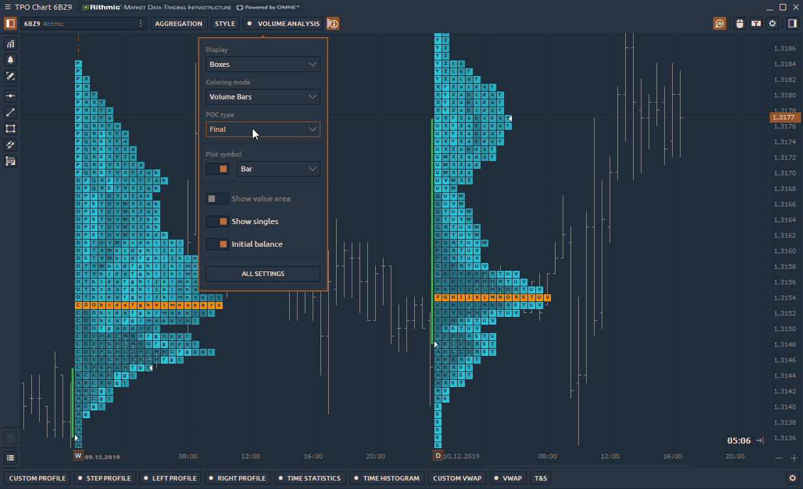

* **Plot Symbol** — show/ hide the standard chart on the TPO Profile chart. Select a **\*\*\[**chart style**\]\(chart/chart-types/\#chart-types-and-styles\)**: **\_**Bar, Candle, Line, Area, Dotted Line, Quantower style\*\*\_.

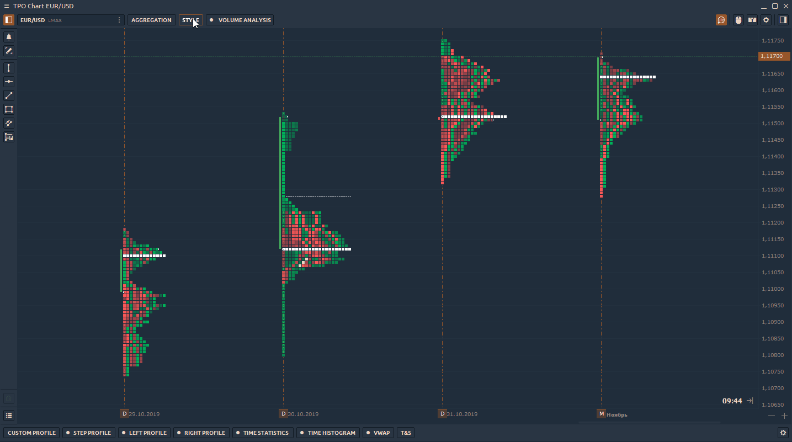

* **Show Point of Control \(POC\)** — enable a price level of the greatest market activity or trading volume on the chart. At this level, the price spent most time over the profile range. 
* **Show Value Area** — enable price range in which approximately 68% - 70% of the market activity or trading volume took place. 
* **Show Singles** or **single prints** of the profile are placed in the middle of a profile structure, not at the upper or lower edge. They occur on impulse movements and are used as support/resistance zones, which the price can test in the near future. The singles line indicates where the singles begin to form \(in cases when there are several single prints\).

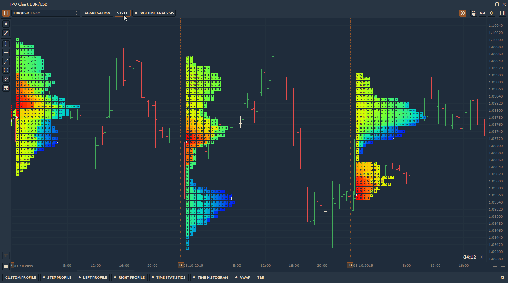

### Volume Analysis

TPO profiles are used on their own to find areas of support and resistance, and can also be used in conjunction with volume profiles. For this, we have added **Volume Analysis** control to the top toolbar of the panel. Here you can select the data type and show/hide the POC & Value Area.

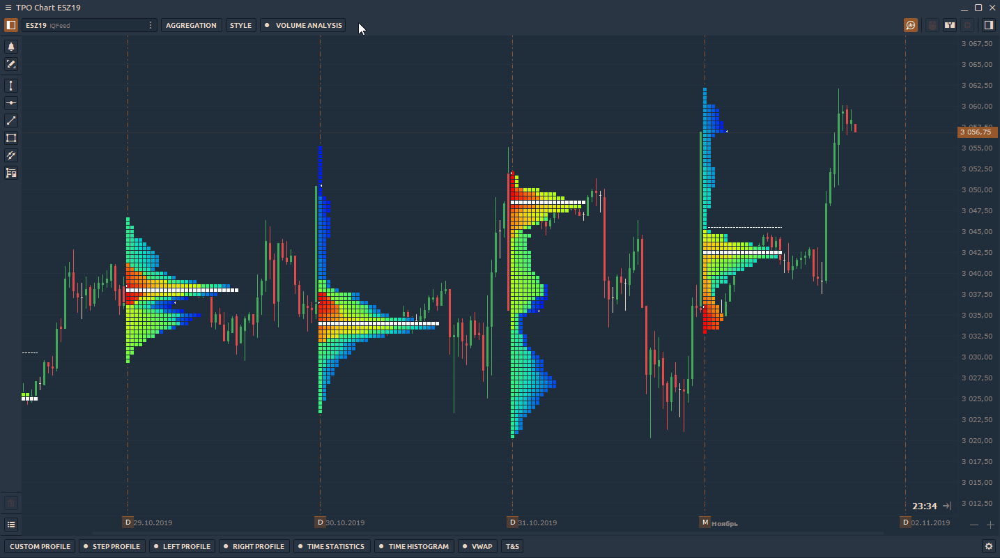

Switch Volume Profile between [**different data types**](volume-analysis-tools/#data-types-of-volume-analysis-tools), such as delta, buy&sell, trades, volume, etc.

## Splitting & Merging of TPO Profile Chart

Use TPO splitting for a detailed analysis of profile formation. There are two splitting modes available in the platform:

* **Split full profile**, that separates the TPO profile into each bar or letter. To separate profile into columns, click on the profile and press _**"Split"**_ button that is placed on the lower border of a selected profile.

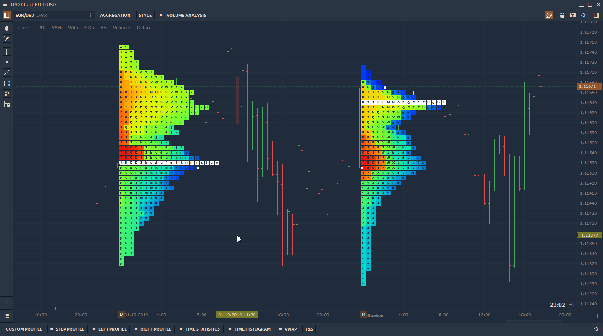

* **Divide by bar**, that option splits the profile in half on the selected bar. To separate TPO profile in half, select a necessary profile and right-click to open the context menu and click on _**"Divide by bar"**_ button.

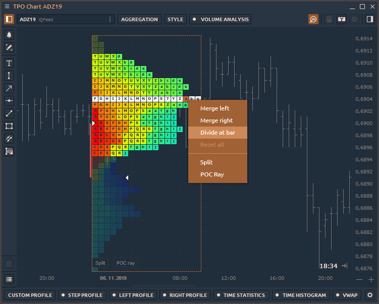

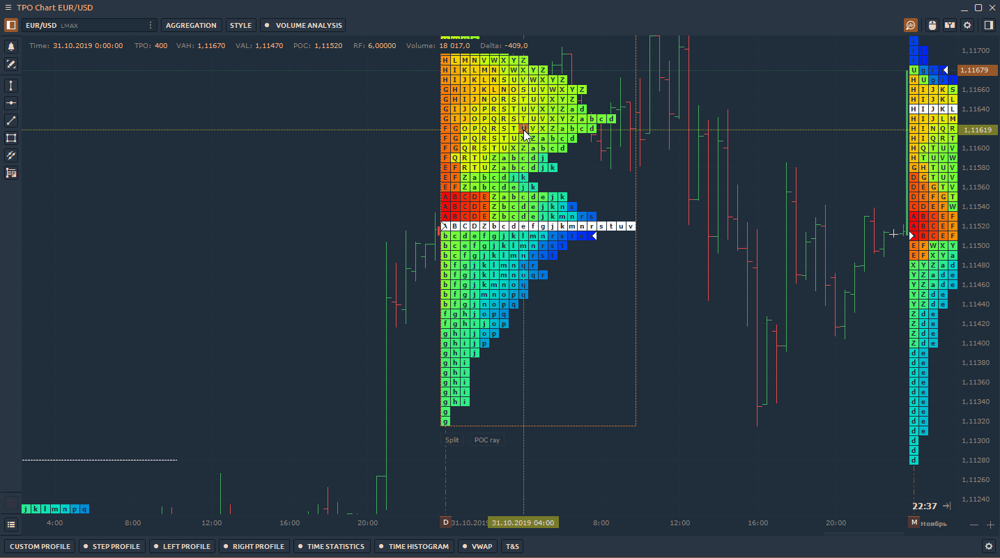

### Merging of TPO Profile

**Merge** is a feature that combines several profiles into one. Right-click on the selected profile to open the context menu and select **Merge Left** or **Merge Right**. To return profiles to their original positions, press the Reset button.

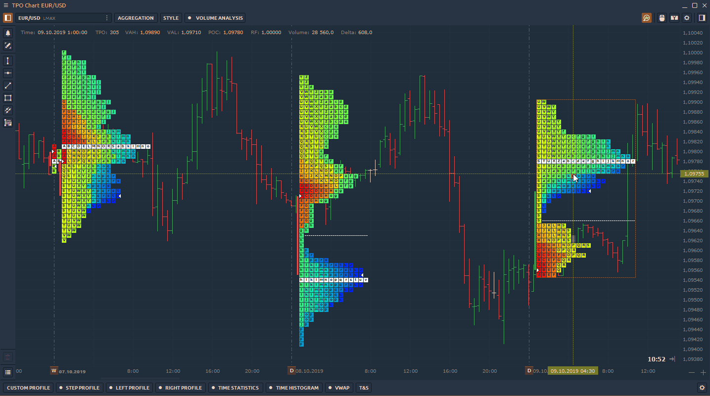

## Session Time

Set the custom time range for the necessary trading session and the profile will be built within this range. The rest of the time the profile will not take into account.

To set the time of the necessary session, go to the **TPO Chart settings -&gt; View -&gt; Custom session.** Set the time according the time zone.

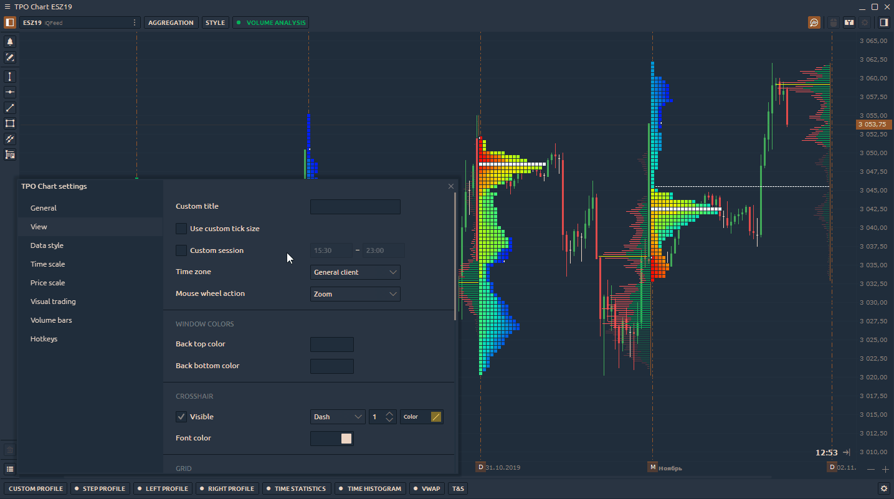

## Additional settings of TPO Profile

Right-click on the chart area -&gt; **Settings** to open the general settings of the TPO Chart panel.

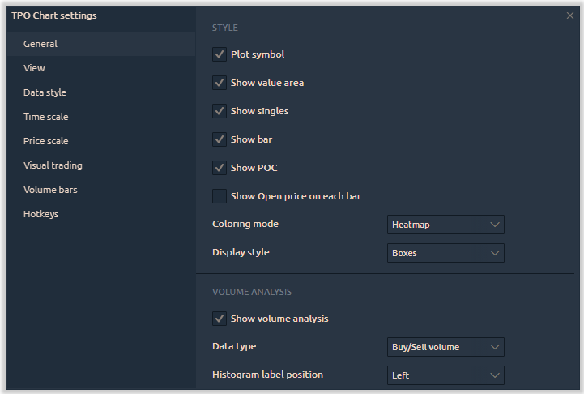

