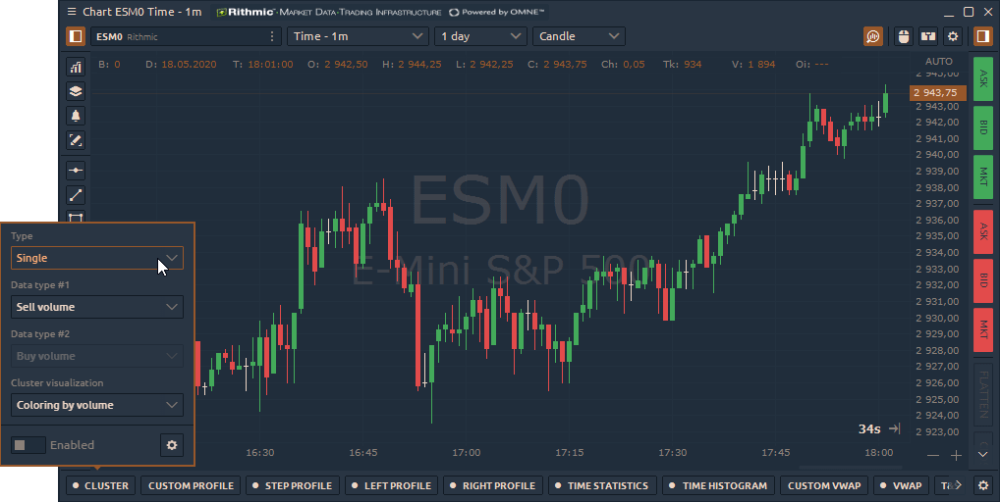
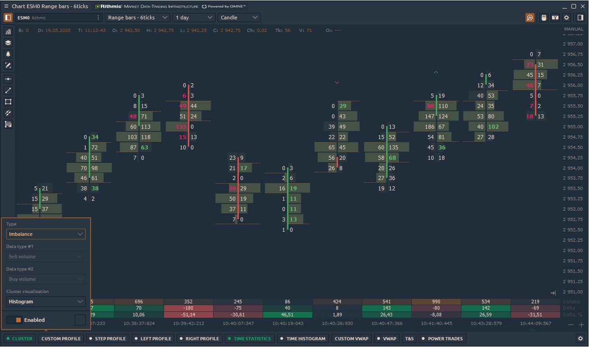
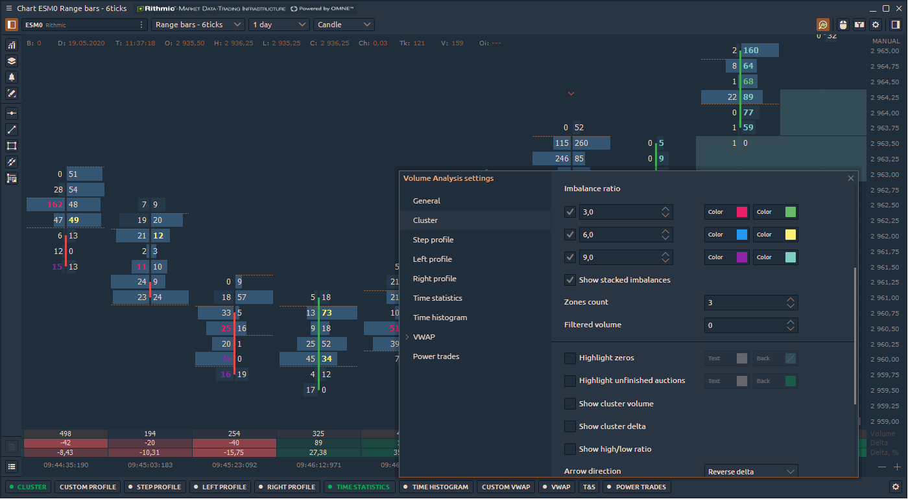
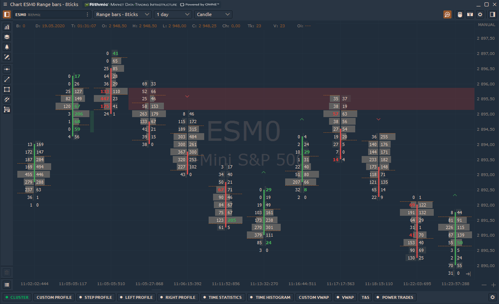

# Кластер

* \*\*\*\*[**Что такое Кластер?**](cluster-chart.md#chto-takoe-klaster)\*\*\*\*
* \*\*\*\*[**Как включить кластерный график?**](cluster-chart.md#kak-vklyuchit-klasternyi-grafik)\*\*\*\*
* \*\*\*\*[**Общие настройки кластерного графика**](cluster-chart.md#obshie-nastroiki-klasternogo-grafika)\*\*\*\*
* \*\*\*\*[**Как установить отфильтрованный объем?**](cluster-chart.md#kak-ustanovit-otfiltrovannyi-obem)\*\*\*\*
* \*\*\*\*[**Что такое Пользовательский шаг и как его правильно настроить?**](cluster-chart.md#chto-takoe-polzovatelskii-shag-i-kak-ego-pravilno-nastroit)\*\*\*\*
* \*\*\*\*[**Дисбаланс**](cluster-chart.md#imbalance-chart)\*\*\*\*



## Что такое Кластер?

**Кластер график**, известный как график футпринт на других торговых платформах, представляет собой расширенный тип диаграммы, который показывает полное представление свечной диаграммы. Это позволяет заглянуть внутрь цены и увидеть все рыночные действия. Кластерный график сочетает в себе несколько важных характеристик, таких как время, цены OHLC, объем торгов, количество сделок на покупку и продажу.

Используя эту информацию, трейдер может оценить:

* объем торгов, выполненных по каждой цене
* зоны максимального накопления объема
* зоны повышенного торгового интереса \(максимальное количество сделок\)
* количество покупателей и продавцов на каждом уровне цен

## Как включить кластерный график?

Перед активацией кластерной диаграммы необходимо включить панель инструментов Volume Analysis. Для этого в правом верхнем углу панели диаграммы **щелкните значок «Лупа**». Внизу диаграммы появится панель инструментов с инструментами анализа объема - кластер, [**пошаговый профиль, левый профиль, правый профиль,**](https://app.gitbook.com/@quantower/s/quantower-ru/~/drafts/-MbGJgxlm-Fa2OVgQcQw/analytics-panels/chart/volume-analysis-tools/volume-profiles) ****[статистика по времени](https://app.gitbook.com/@quantower/s/quantower-ru/~/drafts/-MbGJgxlm-Fa2OVgQcQw/analytics-panels/chart/volume-analysis-tools/time-statistics), [гистограмма по времени](https://app.gitbook.com/@quantower/s/quantower-ru/~/drafts/-MbGJgxlm-Fa2OVgQcQw/analytics-panels/chart/volume-analysis-tools/time-histogram), [**T&S по барам**](https://app.gitbook.com/@quantower/s/quantower-ru/~/drafts/-MbGJgxlm-Fa2OVgQcQw/analytics-panels/chart/volume-analysis-tools/historical-time-and-sales)**,** [**пользовательский объем.**](https://app.gitbook.com/@quantower/s/quantower-ru/~/drafts/-MbGJgxlm-Fa2OVgQcQw/analytics-panels/chart/volume-analysis-tools/volume-profiles#custom-volume-profile)\*\*\*\*

1. Щелкните **кластер** и включите его.
2. Выберите тип данных \(вы можете выбрать один или два разных типа данных одновременно\)
3. Настройте визуализацию данных
4. Используйте расширенные настройки \(значок шестеренки\) для более подробной настройки диаграммы.


Для более эффективного анализа с помощью кластерной диаграммы вы можете одновременно отображать два разных типа данных на одной панели.


## Общие настройки кластерного графика

Кластерный график имеет различные настройки, позволяющие отображать объемные данные с разных сторон. Например, вы можете выбрать разные типы данных для каждого бара, а также настроить цвета, что упростит восприятие и анализ объемов, сделок и т. Д.

Основные типы данных для кластерной диаграммы:

* **Сделки** - это количество контрактов \(сделок\), заключенных на каждом ценовом уровне.
* **Сделки на покупку \(или продажу\)** - это количество сделок на покупку \(или продажу\), выполненных на каждом ценовом уровне.
* **Объем** - общий размер всех позиций, исполненных на каждом ценовом уровне или ценовом диапазоне.
* **Объем покупки \(или продажи\)** - общий размер всех позиций на покупку \(или продажу\), выполненных на каждом ценовом уровне или ценовом диапазоне.
* **Объем покупки \(или продажи\),%** - показывает, сколько процентов от общего объема относится к сделкам на покупку \(или продажу\).
* **Дельта и Дельта%** - показывает разницу в торговом объеме между покупателями и продавцами. Это позволяет оценить, кто в данный момент контролирует цену на рынке. Дельта% = Дельта / Объем \* 100
* **Средний размер** - средний объем позиции, которая была исполнена по определенной цене или ценовому диапазону.
* **Средний размер покупки** - средний объем позиции на покупку, которая была исполнена по определенной цене или в ценовом диапазоне.

  Средний размер продажи - средний объем позиции на продажу, которая была исполнена по определенной цене или ценовому диапазону.

* **Максимальный объем одной сделки \(значение и%\)** - показывает максимальный объем одной сделки, которая была исполнена по определенной цене или ценовому диапазону \(в зависимости от настройки Custom Step \(ticks\)\).
* **Отфильтрованный объем \(значение и%\)** - этот параметр отображает объемы, превышающие размер, указанный в фильтре. Если размер тома меньше указанного в фильтре, то значения будут нулевыми.
* **Отфильтрованный объем Buy \(или Sell\)** - параметр отображает объемы Buy \(или Sell\), превышающие размер, указанный в фильтре.

## Как установить отфильтрованный объем?

Для всех инструментов объемного анализа есть общие настройки, позволяющие установить отфильтрованный объем и настроить шаг для агрегирования данных объема. По высоколиквидным активам, таким как биткойны или фьючерсы на S & P500, объем торгов за торговую сессию велик. Установите минимальные значения объема, которые будут отображаться на графике. Это позволит вам сосредоточиться на значимых ценовых уровнях и более четко видеть зоны поддержки / сопротивления.


У каждого инструмента есть индивидуальные настройки фильтруемого объема в зависимости от ликвидности.


Выберите «**Отфильтрованный объем»** в качестве типа данных в кластерах, чтобы отобразить их на диаграмме. Все значения, меньшие отфильтрованного объема, отображаются как нули.

## Что такое Пользовательский шаг и как его правильно настроить?

Кластерный график показывает данные об объеме на каждом уровне цен за указанный период. Но при большом количестве уровней кластерный график становится трудночитаемым.

**Пользовательский шаг** суммирует данные об объеме для всех уровней цен, указанных в настройке. По умолчанию значение настраиваемого шага установлено на 1 тик, что означает, что данные об объеме отображаются на каждом уровне цен.

### Дисбаланс 

Кластерный график в платформе Quantower позволяет вам видеть объем торгов на каждом уровне цен и понимать намерения трейдеров относительно будущей цены. В новой версии мы изменили настройки и добавили 3 типа кластерного графика: одиночный, двойной и дисбаланс.

* **Один кластер** показывает только один тип данных для каждой полосы.
* **Двойной кластер** позволяет выбрать два типа данных, которые будут отображаться на каждой панели. Например, вы можете выбрать Volume для первого типа данных и Delta для второго типа данных.
* **Дисбаланс на графике**  показывает уровни цен, на которых объем сделки на покупку превышает объем сделки на продажу. Диагональный дисбаланс Bid / Ask отображает агрессивные рыночные ордера на покупку, поднимающие предложение, и агрессивные рыночные ордера на продажу, достигающие бид.

В настройках кластерного графика можно указать соотношение объемов покупок и продаж по диагонали на каждом уровне цен. Например, Ratio = 3 покажет на графике все дисбалансы, где превышение покупки над продажей будет выше 300%.

Кроме того, вы можете установить три разных уровня дисбаланса и указать настройки цвета для каждого из них.

Уровни Imbalances показывает зоны нескольких последовательных дисбалансов, возникающих на стороне спроса или предложения. Эти зоны являются важными уровнями поддержки / сопротивления, потому что это уровни, на которых участники агрессивно хотели войти в рынок. Поэтому, когда рынок повторно тестирует эти уровни, те же участники могут появиться снова.

Незавершенный аукцион также известен как незавершенный бизнес по барной цене максимум / минимум, когда продавались и покупались объемы. Появление незавершенного аукциона говорит о возможном продолжении движения.

