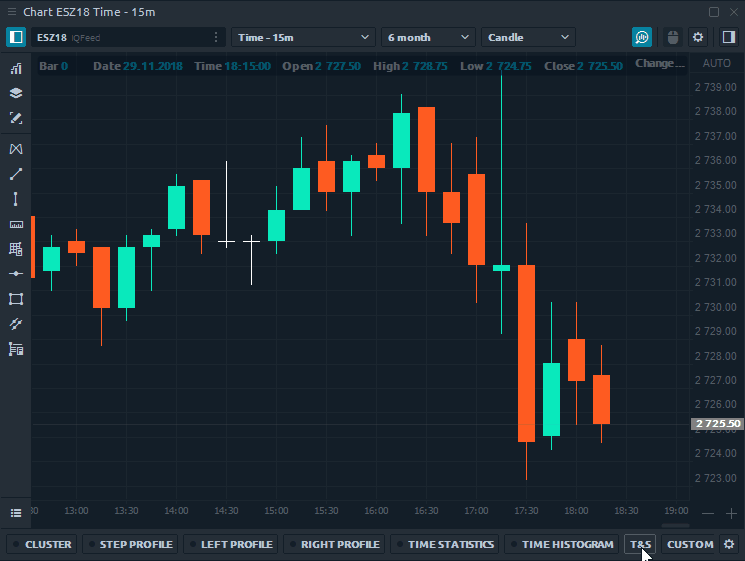
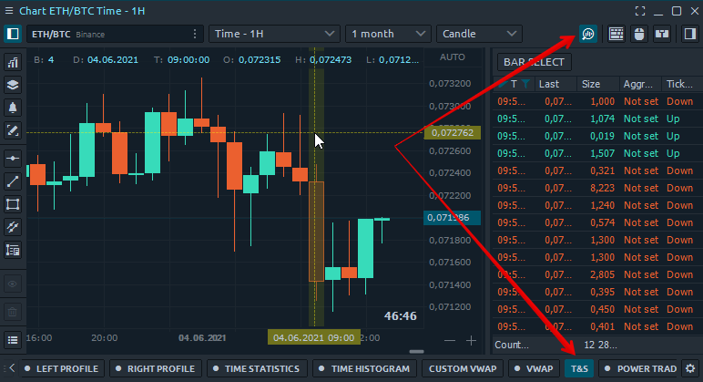
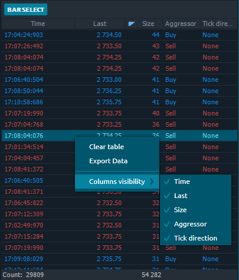

# История ленты сделок

Инструмент **«T\&S»** показывает все сделки для выбранного бара в форме «Лента сделок». После того, как вы активировали "Историю ленты сделок"  и выбрали желаемый исторический бар на графике, все его сделки будут показаны в таблице в порядке их исполнения.&#x20;

Включите кнопку **«Bar Select» **и выберите столбец, бар, (свечу), для которого вы хотите загрузить данные. Когда этот режим выключен, вы можете продолжить работу с графиком, при этом загруженные данные останутся в таблице.

## Параметры таблицы

По умолчанию в таблице отображается пять столбцов - Время, Последняя цена, Размер сделки, Флаг агрессора, Направление тика. Вы можете перемещать любой столбец таблицы влево или вправо, а также сортировать или фильтровать данные.

При щелчке правой кнопкой мыши по таблице появится контекстное меню с несколькими опциями:

* Очистить таблицу. Удалить все данные из таблицы
* Экспорт данных во внешний файл .csv или .html.
* Видимость столбца. Включение или отключение столбцов в таблице
