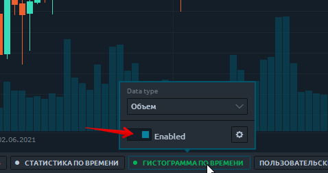
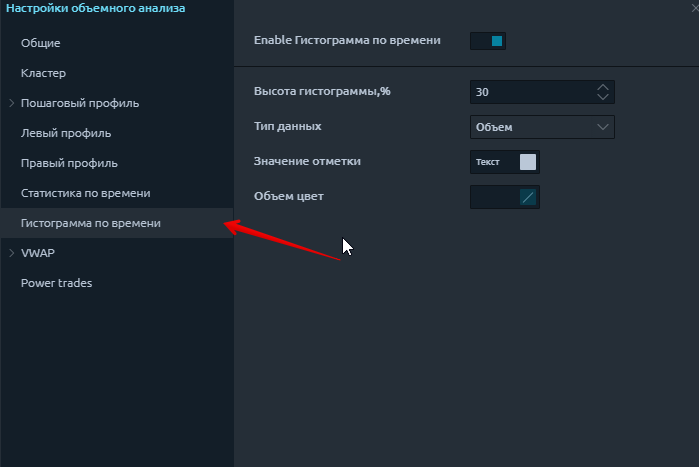
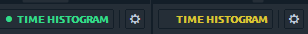
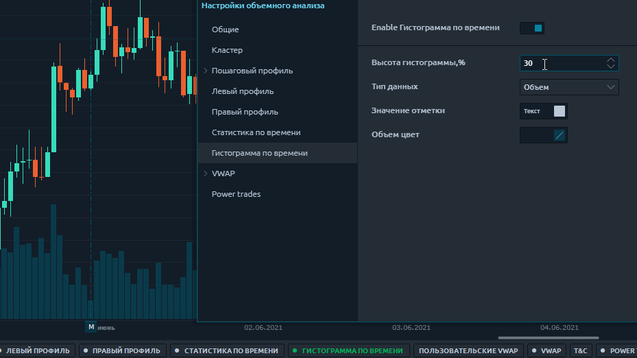

# Гистограмма по времени

**Гистограмма по времени** похожа на инструмент временной статистики, который показывает данные объема в виде вертикальной гистограммы для каждого столбца. Но в отличие от статистики по времени, он позволяет визуально оценивать данные для каждого столбца не только по цветам, но и по форме гистограммы.

Щелкните по **временной гистограмме** и переключите кнопку «Включить», чтобы активировать функцию на графике. Гистограмма времени поддерживает обширный список типов данных, которые вы можете изменить либо в настройках, либо непосредственно в режиме активации.

Включить гистограмму времени - активирует функцию отображения на графике. После его активации начнется процесс загрузки тиковых и объемных данных.&#x20;

**Желтый цвет** укажет, что данные загружаются. \
**Зеленый цвет** означает, что данные для выбранной глубины истории загружены полностью.

* **Высота гистограммы,%** - определяет, какая часть области графика будет занята для отображения объемных данных. Если вы установите значение 50%, то половина области диаграммы будет заполнена данными временной гистограммы.

* **Типы данных** - различные типы объемных данных, которые могут отображаться на графике. Есть сделки, объем, сделки спроса и предложения, объем, отфильтрованные данные и т. Д. Полный список с описанием этих типов данных вы можете найти в нашей справочной документации, в которой описывается общая информация об инструментах анализа объема.
* **Метка значения и Цвет типа данных** - здесь вы устанавливаете настройки цвета для шрифта и гистограммы соответственно.

## Основные типы данных для временной гистограммы:

* **Сделки** - это количество контрактов (сделок), заключенных на каждом ценовом уровне.
* **Сделки на покупку (или продажу)** - это количество сделок на покупку (или продажу), выполненных на каждом ценовом уровне.
* **Объем** - общий размер всех позиций, исполненных на каждом ценовом уровне или ценовом диапазоне.
* **Объем покупки (или продажи)** - общий размер всех позиций на покупку (или продажу), выполненных на каждом ценовом уровне или ценовом диапазоне.
* **Объем покупки (или продажи),%** - показывает, сколько процентов от общего объема относится к сделкам на покупку (или продажу).
* **Дельта и Дельта%** - показывает разницу в торговом объеме между покупателями и продавцами. Это позволяет оценить, кто в данный момент контролирует цену на рынке. Дельта% = Дельта / Объем \* 100
* **Накопительная дельта** - данные строятся путем добавления текущего значения дельты к каждому последующему значению дельты за определенный период времени (или количество баров).
* **Средний размер** - средний объем позиции, которая была исполнена по определенной цене или ценовому диапазону.
* **Средний размер покупки** - средний объем позиции на покупку, которая была исполнена по определенной цене или в ценовом диапазоне.
* **Средний размер продажи** - средний объем позиции на продажу, которая была исполнена по определенной цене или ценовому диапазону.
* **Максимальный объем одной сделки (значение и%)** - показывает максимальный объем одной сделки, которая была исполнена по определенной цене или ценовому диапазону (в зависимости от настройки Custom Step (ticks)).
* **Отфильтрованный объем (значение и%)** - этот параметр отображает объемы, превышающие размер, указанный в фильтре. Если размер тома меньше указанного в фильтре, то значения будут нулевыми.
* **Отфильтрованный объем Buy (или Sell)** - параметр отображает объемы Buy (или Sell), превышающие размер, указанный в фильтре.
