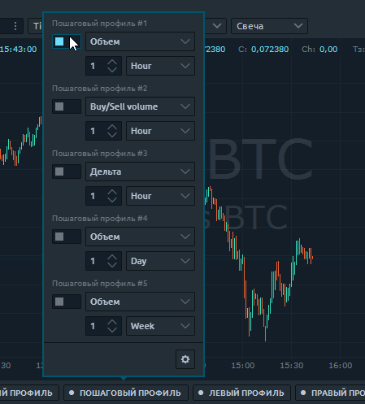
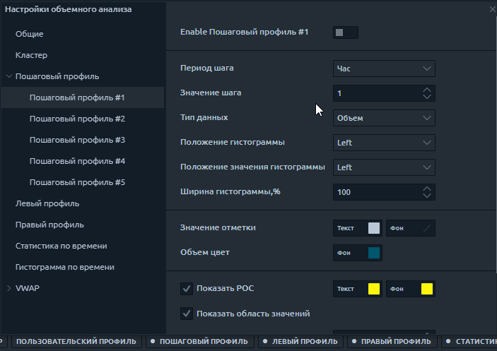
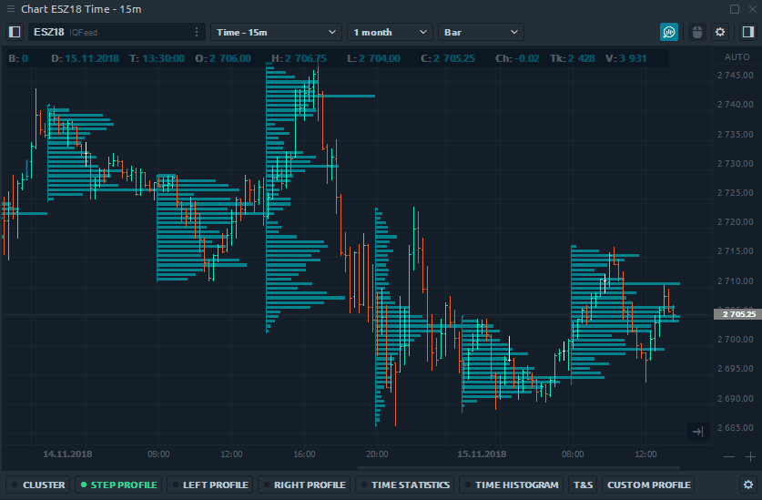
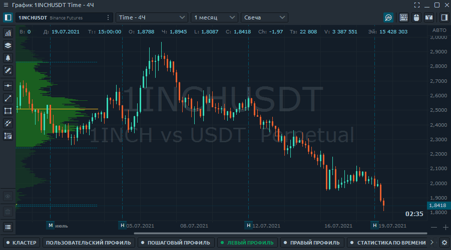
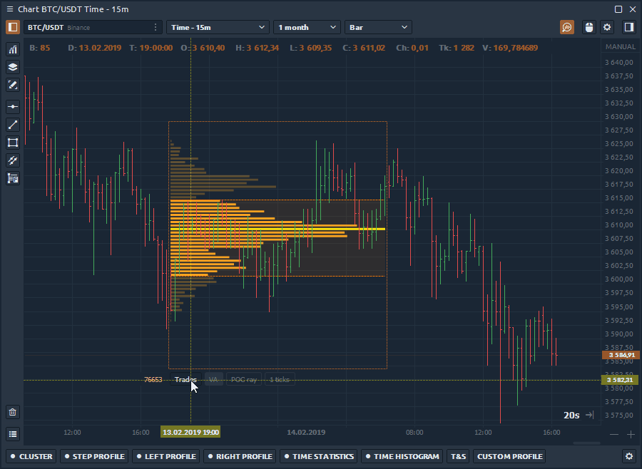
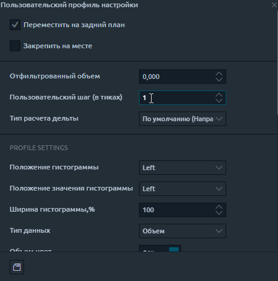

# Профили объема

**Профиль объема** отображает торговую активность за определенный период времени на определенных ценовых уровнях. Это означает, что он показывает, что было куплено и продано на этих текущих уровнях, и отображает их в виде гистограммы сбоку от вашего графика. Профиль объема позволяет увидеть зоны максимального торгового интереса и, как следствие, «истинные» уровни поддержки / сопротивления.

Платформа Quantower предлагает четыре типа профилей объема:

* [**Пошаговый профиль объема**](volume-profiles.md#poshagovyi-profil-obema)&#x20;
* [**Общие настройки**](volume-profiles.md#obshie-nastroiki)
* [**Левый и правый профиль объема**](volume-profiles.md#levyi-i-pravyi-profil-obema)
* [**Пользовательский профиль объема**](volume-profiles.md#polzovatelskii-profil-obema)
* [**Дополнительные настройки** ](volume-profiles.md#dopolnitelnye-nastroiki-dlya-polzovatelskogo-profilya)

## Пошаговый профиль объема&#x20;

Пошаговый профиль отображает профили объема с определенным временным шагом. Например, установите период шага равным 1 часу, и вы увидите профили с одинаковыми почасовыми шагами на графике. Изменяя типы данных, вы увидите распределение торгового объема, выполненных сделок, а также дельту для каждого часа торговой сессии.

Вы можете включить профиль шага через панель инструментов анализа объема или их настройки.

### Общие настройки&#x20;

* **Период шага и значение шага** - определяют шаг построения профиля. Период шага имеет четыре типа: минута, час, день, неделя.
* **Тип данных** - выберите любой из [**20+ типов данных** ](https://app.gitbook.com/@quantower/s/quantower-ru/\~/drafts/-MbGwguxgp06fdcWVgd1/analytics-panels/chart/volume-analysis-tools#data-types-of-volume-analysis-tools)для создания профиля шага
* **Положение гистограммы** - расположение профиля слева или справа относительно начальной точки.
* **Положение значения гистограммы** - определяет положение значения данных: слева, справа или нет
* **Ширина гистограммы (в %)** - показывает ценовую зону с 70% торговой активности за указанный временной диапазон. По умолчанию установлено значение 70%, но пользователь может изменить его по своему усмотрению.
* Показать границы области значений - отображение внешних границ области значений в виде пунктирных линий.
* Выделить максимальное значение - уровни с максимальным значением выделяются заданным цветом
* **Показать итоги** - эта опция суммирует данные, на основе которых построен профиль.

## Левый и правый профиль объема

**Левый и правый профиль объема** можно разместить слева и справа от графика соответственно. Например, вы можете установить дельта-данные для одного профиля, а для другого - общий объем за тот же период времени. Вы можете объединить несколько профилей, созданных для разных периодов времени, в один **комбинированный профиль** и поместить его в левую или правую позицию графика.

Вы можете изменить "шаг" построения профиля объема в настройках, как указано ниже:

## Пользовательский профиль объема

Пользовательский профиль позволяет создать профиль для любого временного диапазона. Например, вы хотите увидеть распределение дельты на плоском графике или на импульсном баре. Как и в случае с другими инструментами объемного анализа, вы можете выбрать для отображения любые доступные типы данных.

После того, как вы разместите настраиваемый профиль на графике, рядом с ним появится панель управления с пятью параметрами.

.png>)

* Дублировать профиль с тем же диапазоном и настройками
* Переместить профиль на задний план или на передний план
* Заблокировать текущее положение профиля. Запрещает движение профиля.
* Дополнительные настройки для выбранного профиля
* Удалить выбранный профиль

## Дополнительные настройки для пользовательского профиля

Помимо настроек для быстрого управления пользовательским профилем, есть дополнительные настройки. Давайте подробнее рассмотрим, что вы можете настроить.

Настроек очень много, но самые интересные:

* **Ширина гистограммы(%)** - показывает ценовую область с 70% торговой активности за указанный временной диапазон. По умолчанию установлено значение 70%, но пользователь может изменить его по своему усмотрению.
* **POC Ray** расширяет уровень максимального объема (Point of Control) до ценовой шкалы
* **Показать общее - показать** / скрыть общее количество в определенном профиле
* **Пользовательский шаг (тики)** суммирует данные об объеме для такого количества ценовых уровней, которое указано в настройке. По умолчанию значение настраиваемого шага установлено на 1 тик, что означает, что данные об объеме отображаются на каждом уровне цен.
