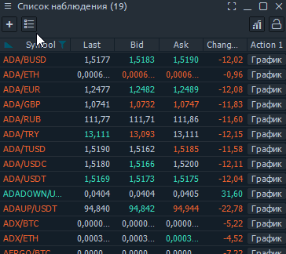
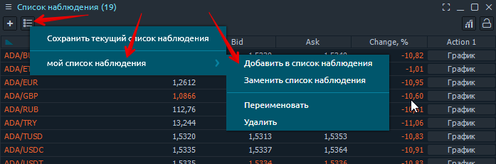
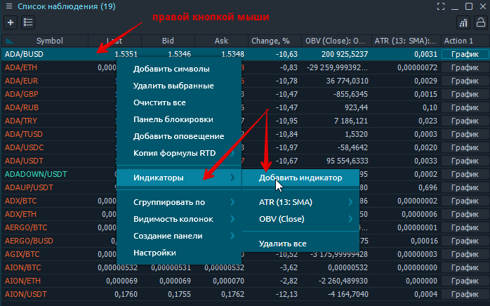
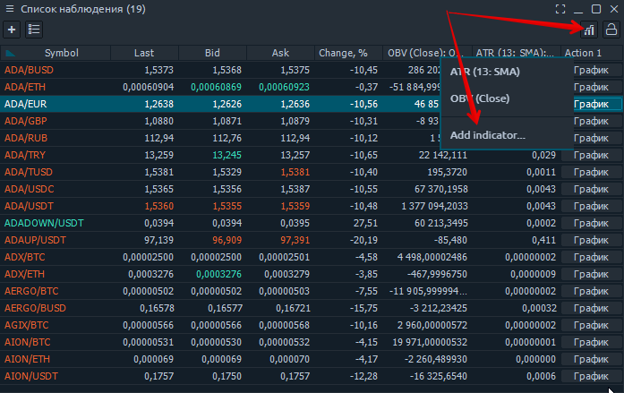

# Список наблюдения

Панель Watchlist - это стандартная табличная панель, представляющая различную торговую информацию для указанного списка символов. Список символов можно настроить с помощью экрана поиска символов, доступного при нажатии кнопки \[+\] на панели инструментов, или из контекстного меню таблицы - опция «Добавить символы».

Каждый символ, добавленный в список наблюдения, можно удалить через контекстное меню в строке символа. Вы также можете очистить весь список через контекстное меню.


Когда вы добавляете символ, который уже присутствует в текущем списке, он будет добавлен в конец списка, создавая дубликаты.


## Управление столбцами

## Избранные списки

Вы можете захотеть сохранить несколько списков для панели Watchlist. Чтобы сохранить какой-либо список в качестве избранного, вы можете использовать кнопку \[Сохраненные списки\] на панели инструментов. Если у вас еще нет сохраненных списков, откроется всплывающее окно «Сохранить текущий список», где вы можете указать имя для сохраняемого списка.

После того, как вы нажмете кнопку \[СОХРАНИТЬ\], новый список будет добавлен в Избранное и станет доступен из раскрывающегося списка «Сохраненные списки» на панели инструментов.

Используя раскрывающийся список «Избранные списки», вы можете управлять текущими сохраненными списками \(редактировать имя, удалять\) и инициировать сохранение текущего списка.


Когда вы нажимаете на любой из списков избранного, он будет добавлен под текущим списком. Если вы хотите видеть только выбранный список, вам следует сначала очистить список наблюдения.


## Индикаторы

Панель Watchlist поддерживает отображение значений индикаторов в отдельные столбцы. Чтобы добавить какой-нибудь индикатор, есть два способа:

* щелкните правой кнопкой мыши таблицу списка наблюдения и перейдите к пункту **«Индикаторы» -&gt; «Добавить индикатор».** Откроется экран поиска индикаторов, на котором вы должны выбрать нужный.

* через значок «Добавить индикатор» в правом верхнем углу панели списка наблюдения

Когда вы выбираете индикатор, вы увидите новый столбец \(с выбранным названием индикатора\), добавленный в правую часть таблицы списка наблюдения. Чтобы удалить индикатор, перейдите в категорию «Индикаторы» в контекстном меню и выберите опцию «Удалить имя индикатора».


Некоторым индикаторам требуется время, чтобы рассчитать свои значения. В таких ячейках вы увидите текст «Инициализация ...».


Если вы создали \(или добавили\) пользовательский индикатор на платформе и хотите добавить его в панель Watchlist, вам необходимо добавить дополнительный параметр в код. Более подробную информацию о том, как это сделать, можно найти в нашем руководстве [**«Добавление пользовательского индикатора в список наблюдения».**](https://app.gitbook.com/@quantower/s/quantower-ru/~/drafts/-MbgdCPmH-O1LnB4lpnw/quantower-algo/custom-indicator-to-watchlist)\*\*\*\*

