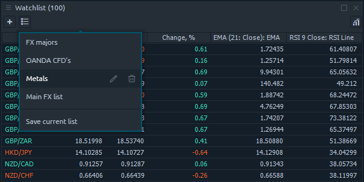
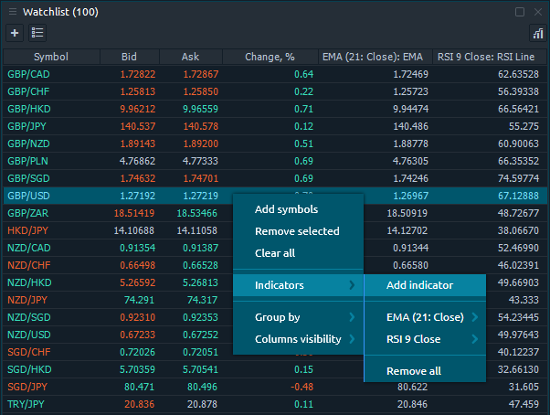
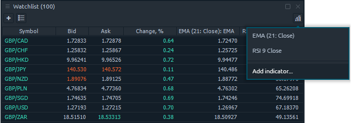

# Список наблюдения

Панель Watchlist - это стандартная табличная панель, представляющая различную торговую информацию для указанного списка символов. Список символов можно настроить с помощью экрана поиска символов, доступного при нажатии кнопки \[+\] на панели инструментов, или из контекстного меню таблицы - опция «Добавить символы».

Каждый символ, добавленный в список наблюдения, можно удалить через контекстное меню в строке символа. Вы также можете очистить весь список через контекстное меню.


Когда вы добавляете символ, который уже присутствует в текущем списке, он будет добавлен в конец списка, создавая дубликаты.


## Управление столбцами

## Избранные списки

Вы можете захотеть сохранить несколько списков для панели Watchlist. Чтобы сохранить какой-либо список в качестве избранного, вы можете использовать кнопку \[Сохраненные списки\] на панели инструментов. Если у вас еще нет сохраненных списков, откроется всплывающее окно «Сохранить текущий список», где вы можете указать имя для сохраняемого списка.

Once you press the **\[ SAVE \]** button, the new list will be added to the Favorites and became available from the _**“Saved lists”**_ drop-down on the toolbar.

Using the _**“Favorite lists”**_ drop-down, you can manage the current saved lists \(edit name, remove\) and initiate the current list save.


Please notice. When you click on any of favorite lists it will be added below the current list. If you want to see the selected list only, you should clear the Watchlist first.


## Indicators

The Watchlist panel supports the indicators value display in separate columns. In order to add some indicator, thare are two ways to to it:

* right-click on watchlist table and proceed to _**"Indicators" -&gt; "Add indicator"**_ option. This opens an indicators lookup screen, where you should select the required one.

* through the icon _**"Add indicator"**_ in the upper right corner of the Watchlist panel

When you select an indicator, you will see the new column \(with the selected indicator name\) added to the right side of watchlist table. To remove indicator, go to the Indicators category in the context menu and click the _**“Remove Indicator Name”**_ option.


Some indicators need time to calculate their values. You will see the “Initializing...” text in such cells.


If you have created \(or added\) a custom indicator in the platform and want to add it to the Watchlist panel, you need to add an additional parameter to the code. More information about how to do this is given in our guide "[**Adding a custom indicator to Watchlist**](../quantower-algo/custom-indicator-to-watchlist.md)".

