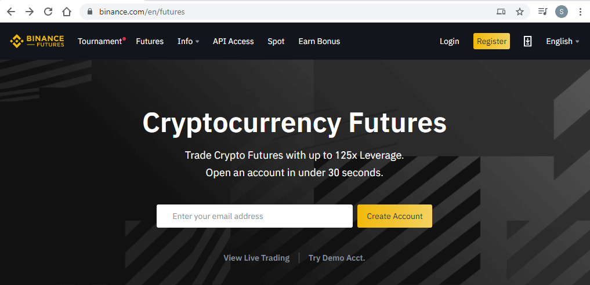
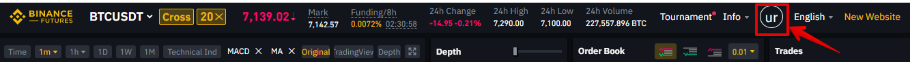
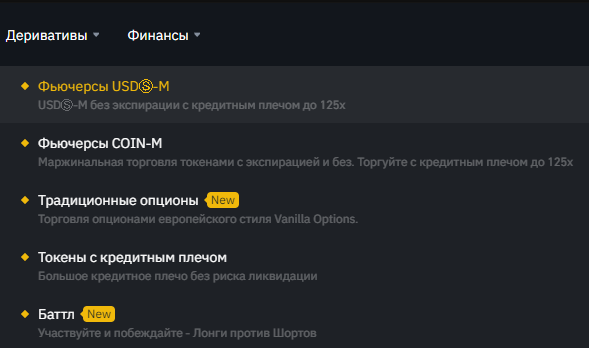
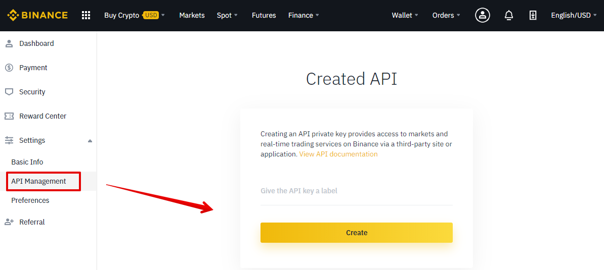
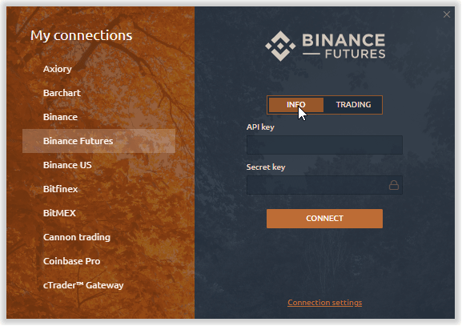
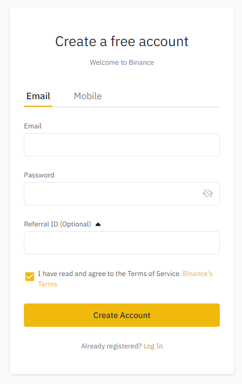
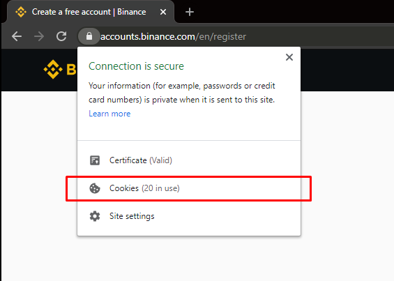
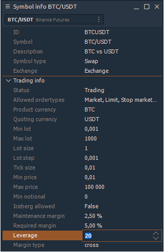
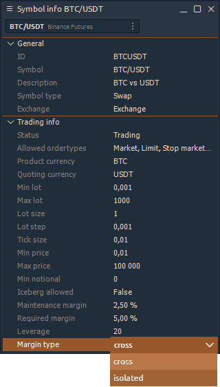
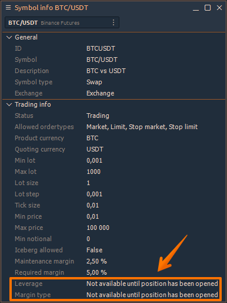

# Подключение к Binance и Binance Futures


Если у вас уже есть  аккаунт  Binace не старше 1 февраля 2021 года и он был создан без реферальной ссылки то вы можете получить все премиальные функции Quantower.  Если ваш аккаунт не соответствует этим условиям то ничего страшного просто создайте новый 


Для того, чтобы начать торговать на Binance Futures через платформу Quantower, вам необходимо открыть учетную запись и создать **API-ключ** и **Секретный ключ**. В этом руководстве мы шаг за шагом покажем вам, как настроить соединение, изменить тип маржи и размер кредитного плеча.

* **Как создать новую учетную запись Binance Futures**
* [**How to connect to Binance Futures in Quantower platform**](./#how-to-connect-to-binance-futures-in-quantower-platform)
* [**How to get Full License of Quantower for free with Binance?**](./#how-to-get-full-license-of-quantower-for-free-with-binance)
* [**How to change Leverage and Margin Type**](./#how-to-change-leverage-and-margin-type)
* [**How to load the history of past trades \(for previous days\)**](./#how-to-load-the-history-of-past-trades-for-previous-days)
* [**How to change Hedge Mode \(One position & Multiple positions\)**](./#how-to-change-hedge-mode-one-position-and-multiple-positions)
* [**Possible Errors with Binance Futures connection**](errors-with-binance-connection.md)

## Как создать новую учетную запись Binance Futures

Прежде чес создать новый аккаунт необходимо убедится что 


Пожалуйста, обратите внимание! Поле «Идентификатор реферала» должно быть пустым. А так же Вам следует ОЧИСТИТЬ СВОИ COOKIES РЕФЕРРАЛЬНОГО ИДЕНТИФИКАЦИИ в браузере перед регистрацией


* Если Вы хотите открыть реальный счет, перейдите по ссылке [https://www.binance.com/en/futures](https://www.binance.com/en/futures) **\[\***Binance Futures**\]**
* Если нужно открыть тестовый счет, перейдите по ссылке [https://testnet.binancefuture.com/en/futures](https://testnet.binancefuture.com/en/futures) **\[\***Testnet Binance Futures\]

  

* Заполните форму регистрации учетной записи, указав свой адрес электронной почты и надежный пароль. Нажмите «Создать учетную запись», и вскоре вы получите письмо с подтверждением. Следуйте инструкциям в электронном письме, чтобы завершить регистрацию.
* Перейдя на страницу Binance Futures, вы должны увидеть первые два символа вашего адреса электронной почты, связанного с вашей учетной записью, в правом верхнем углу.

Вам необходимо перейти меню фьючерсная торговля и пройти небольшой тест для активации фьючерсного рынка.

* Нажмите на логотип своей учетной записи и в разделе «Настройки» выберите «Управление API». Создайте новый ключ API \(если у вас его нет\) и сохраните его.

После того, как вы создадите ключ API, нажмите меню «Кошелек» и выберите раздел «Фьючерсы». После подтверждения открытия фьючерсного счета для вашего ключа появится дополнительная опция, которая называется «Включить фьючерсы».


Сохраните API-ключ и Секретный ключ в надежном месте. Секретный ключ вам будет показан единожды. Ключи всегда можно отменить или переделать в личном кабинете.


Пожалуйста, активируйте фьючерсную торговлю поставив галочку в соответствующем поле, После этого вы сможете подключиться к Binance Futures в Quantower

## Как подключится  Binance Futures или Binance spot используя  Quantower

* Запустите платформу Quantower и откройте диспетчер подключений. Выберите в списке Binance Futures или  Binance и выберите тип подключений - ИНФОРМАЦИОННЫЙ или ТОРГОВЫЙ режим. 

* Для торговли введите свой ключ API и секретный ключ.

## Как получить бесплатно все функции Quantower для Binance?


Если у вас уже есть  аккаунт  Binace не старше 1 февраля 2021 года и он был создан без реферальной ссылки то вы можете получить все премиальные функции Quantower.  Если ваш аккаунт не соответствует этим условиям то ничего страшного просто создайте новый 


First, you need to register a new account on Binance exchange, that wouldn’t be connected with any referral previously. In order to do this, please follow the [https://accounts.binance.com/en/register](https://accounts.binance.com/en/register) link and fill in the registration form.


Пожалуйста, обратиnt внимание! Поле «Идентификатор реферала» должно быть пустым. А так же Вам следует ОЧИСТИТЬ СВОИ COOKIES РЕФЕРРАЛЬНОГО ИДЕНТИФИКАЦИИ в браузере перед регистрацией.


### Очистка файлов cookie идентификатора реферала

Чтобы удалить сохраненные файлы cookie в браузере Chrome, перейдите к «Блоку информации о сайте» и перейдите в раздел «Файлы cookie».

Теперь выберите каждую группу файлов cookie и нажмите кнопку «Удалить». Когда в списке не будет файлов cookie, нажмите кнопку «Готово». Теперь вам следует обновить страницу регистрации и убедиться, что поле «Реферальный идентификатор» пусто.

Создав новую учетную запись на бирже Binance, вы можете войти в систему, используя свои новые учетные данные через терминал Quantower. Если вы строго следовали руководству то  начнете  использовать все его премиум-функции бесплатно.

### Как проверить что у вас полная лицензия Quantower?

После того, как вы создали новую учетную запись на Binance Spot, Binance Futures, войдите на платформу в режиме торговли с вашими ключами API. После этого откройте  ****Панель информации об учетной записи  и убедитесь, что в поле **Полная лицензия включена** .

## Как сменить кредитное плече

Binance Futures позволяет торговать различными инструментами и вручную изменять кредитное плечо для каждого из них. Чтобы изменить его, откройте панель «Информация о символе» и выберите нужный символ. Внизу этой панели есть поле «Кредитное плечо», где вы можете изменить значение и применить его, нажав кнопку «Ввод».

Binance предлагает два типа маржи для торговли фьючерсами: ‌ 

**Режим кросс-маржи**: разделите свой маржинальный баланс между всеми открытыми позициями, чтобы избежать ликвидации. В случае ликвидации вы рискуете потерять полный баланс маржи вместе с любыми оставшимися открытыми позициями. ‌ 

**Режим изолированной маржи**: управляйте своим риском по отдельным позициям, ограничивая размер маржи, выделяемой для каждой позиции. Если коэффициент маржи позиции достиг 100%, позиция будет ликвидирована. Маржа может быть добавлена ​​или удалена с позиций с помощью этого режима.


Для новых счетов, на которых не было сделок, невозможно изменить кредитное плечо и тип маржи. 

Чтобы включить эти функции, вам необходимо совершить как минимум 1 сделку по текущему символу. После этого перезапустите платформу, и эти функции станут доступны.


## **How to load the history of past trades \(for previous days\)**

All trades made during the active session of the platform can be displayed on the chart, as well as in the Trades panel. To display trades for previous days, you need to activate the option **"Load user trades history"** in the connection settings.


Due to Binance API limitations, it takes several minutes \(up to 5 minutes\) to load data on past trades. In addition, only data from the last 7 days can be downloaded.


## **How to change Hedge Mode \(One position & Multiple positions\)**

**One Position mode** means that traders can only hold positions in one direction under one contract. If you open a short position, anticipating that the price will go down in the longer timeframe, but in the meanwhile wanted to open a long to do a trade for a shorter time frame. You are unable to open positions in both directions at the same time. Opening positions in both directions would result in canceling one another out.

**Multiple Positions mode** means that traders can hold positions in both long and short directions at the same time under the same contract. For example, you could now hold both long and short positions of the BTCUSDT contract at the same time.

