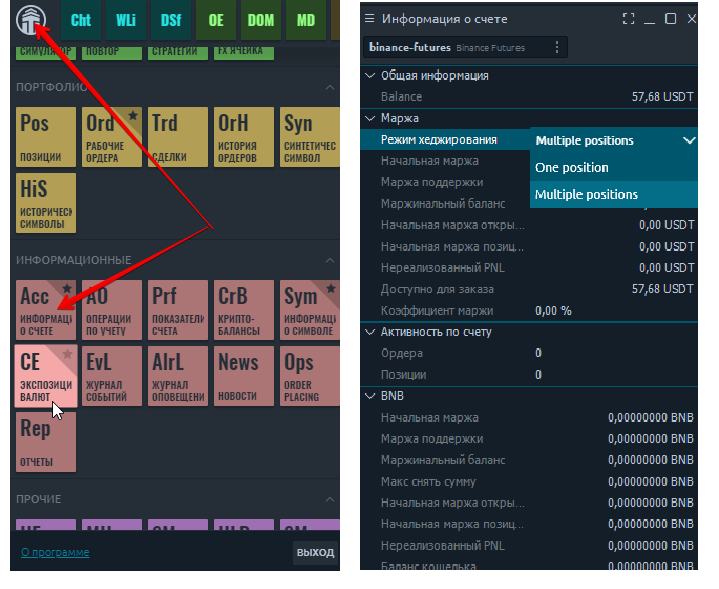

# Подключение к Binance и Binance Futures


Если у вас уже есть  аккаунт  Binace не старше **1 февраля 2021** года и он был создан **без реферальной** ссылки то вы можете получить все премиальные функции Quantower. &#x20;

Если ваш аккаунт не соответствует этим условиям то ничего страшного просто создайте новый&#x20;


Для того, чтобы начать торговать на Binance Futures через платформу Quantower, вам необходимо открыть учетную запись и создать **API-ключ** и **Секретный ключ**. В этом руководстве мы шаг за шагом покажем вам, как настроить соединение, изменить тип маржи и размер кредитного плеча.

* ****[**Как создать новую учетную запись Binance Futures**](./#kak-sozdat-novuyu-uchetnuyu-zapis-binance-futures)**?**
* ****[**Как подключится  Binance Futures или Binance spot используя  Quantower?**](./#kak-podklyuchitsya-binance-futures-ili-binance-spot-ispolzuya-quantower)****
* ****[**Как получить бесплатно все функции Quantower для Binance?**](./#kak-poluchit-besplatno-vse-funkcii-quantower-dlya-binance)****
* ****[**Как очистить cookie файлы идентификатора реферала**](./#kak-ochistit-cookie-faily-identifikatora-referala)****
* ****[**Как проверить что у вас полная лицензия Quantower?**](./#kak-proverit-chto-u-vas-polnaya-licenziya-quantower)****
* ****[**Как загрузить историю прошлых сделок (за предыдущие дни)**](./#kak-zagruzit-istoriyu-proshlykh-sdelok-za-predydushie-dni)****
* ****[**Как сменить кредитное плеч**](./#kak-smenit-kreditnoe-pleche)**о**
* ****[**Как изменить Тип режима для позиций** ](./#kak-izmenit-tip-rezhima-dlya-pozicii)****
* [**Possible Errors with Binance Futures connection**](errors-with-binance-connection.md)

### Как создать новую учетную запись Binance Futures

Прежде чем создать новый аккаунт необходимо убедится что:&#x20;


&#x20;Поле «Идентификатор реферала» должно быть пустым. А так же Вам следует [**ОЧИСТИТЬ СВОИ COOKIES РЕФЕРАЛЬНОЙ ИДЕНТИФИКАЦИИ**](./#kak-ochistit-cookie-faily-identifikatora-referala) в браузере перед регистрацией


* Если Вы хотите открыть реальный счет, перейдите по ссылке [https://www.binance.com/en/futures](https://www.binance.com/en/futures)
* Если нужно открыть тестовый счет, перейдите по ссылке [https://testnet.binancefuture.com/](https://testnet.binancefuture.com/en/futures/BTCUSDT)

* Заполните форму регистрации учетной записи, указав свой адрес электронной почты и надежный пароль. Нажмите «Создать учетную запись», и вскоре вы получите письмо с подтверждением. Следуйте инструкциям в электронном письме, чтобы завершить регистрацию.
* Перейдя на страницу Binance Futures, вы должны увидеть первые два символа вашего адреса электронной почты, связанного с вашей учетной записью, в правом верхнем углу.

Вам необходимо перейти меню фьючерсная торговля и пройти небольшой тест для активации фьючерсного рынка.

* Нажмите на логотип своей учетной записи и в разделе «Настройки» выберите «Управление API». Создайте новый ключ API и сохраните его.


Сохраните API-ключ и Секретный ключ в надежном месте. Секретный ключ вам будет показан единожды. Ключи всегда можно отменить или переделать в личном кабинете.


После того, как вы создадите ключ API, нажмите меню «Кошелек» и выберите раздел «Фьючерсы». После подтверждения открытия фьючерсного счета для вашего ключа появится дополнительная опция, которая называется «**Включить фьючерсы**».

Пожалуйста, **активируйте** фьючерсную торговлю поставив галочку в соответствующем поле, После этого вы сможете подключиться к Binance Futures в Quantower

.png>)

.png>)


Перейдите в раздел фьючерсной торговли и пройдите тест, чтобы активировать свой фьючерсный счет.


.png>)

### Как подключится  Binance Futures или Binance spot используя  Quantower

* Запустите платформу Quantower и откройте диспетчер подключений. Выберите в списке Binance Futures или  Binance и выберите тип подключений - ИНФОРМАЦИОННЫЙ или ТОРГОВЫЙ режим.&#x20;

* Для торговли введите свой ключ API и секретный ключ.

### Как получить бесплатно все функции Quantower для Binance?


Если у вас уже есть  аккаунт  Binace **не старше 1 февраля 2021** года и он был создан **без реферальной ссылки** то вы можете получить все премиальные функции Quantower. &#x20;

Если ваш аккаунт не соответствует этим условиям то ничего страшного просто создайте новый&#x20;


Во-первых, вам необходимо зарегистрировать новую учетную запись на бирже Binance, которая ранее не была связана с каким-либо рефералом. Для этого перейдите по ссылке [https://accounts.binance.com/en/register](https://accounts.binance.com/en/register) и заполните регистрационную форму.


Пожалуйста, обратите внимание! Поле «Идентификатор реферала» должно быть пустым. А так же Вам следует ОЧИСТИТЬ СВОИ COOKIES РЕФЕРРАЛЬНОГО ИДЕНТИФИКАЦИИ в браузере перед регистрацией.


### Как очистить cookie файлы идентификатора реферала

Чтобы удалить сохраненные файлы cookie в браузере Chrome, перейдите к «Блоку информации о сайте» и перейдите в раздел «Файлы cookie».

Теперь выберите каждую группу файлов cookie и нажмите кнопку «Удалить». Когда в списке не будет файлов cookie, нажмите кнопку «Готово». Теперь вам следует обновить страницу регистрации и убедиться, что поле «Реферальный идентификатор» пусто.

.png>)

Создав новую учетную запись на бирже Binance, вы можете войти в систему, используя свои новые учетные данные через терминал Quantower. Если вы строго следовали руководству то  начнете  использовать все его премиум-функции бесплатно.

### Как проверить что у вас полная лицензия Quantower?

После того, как вы создали новую учетную запись на Binance Spot, Binance Futures, войдите на платформу в режиме торговли с вашими ключами API. После этого откройте **** Панель информации об учетной записи  и убедитесь, что напротив поля **"Полная лицензия"** установлено **- "Доступна"** .

.png>)

### Как сменить кредитное плечо

Binance Futures позволяет торговать различными инструментами и вручную изменять кредитное плечо для каждого из них. Чтобы изменить его, откройте панель «Информация о символе» и выберите нужный символ. Внизу этой панели есть поле «Кредитное плечо», где вы можете изменить значение и применить его, нажав кнопку «Ввод».

Binance предлагает два типа маржи для торговли фьючерсами: ‌&#x20;

**Режим кросс-маржи**: разделите свой маржинальный баланс между всеми открытыми позициями, чтобы избежать ликвидации. В случае ликвидации вы рискуете потерять полный баланс маржи вместе с любыми оставшимися открытыми позициями. ‌&#x20;

**Режим изолированной маржи**: управляйте своим риском по отдельным позициям, ограничивая размер маржи, выделяемой для каждой позиции. Если коэффициент маржи позиции достиг 100%, позиция будет ликвидирована. Маржа может быть добавлена ​​или удалена с позиций с помощью этого режима.


Для **новых счетов**, на которых не было сделок, невозможно изменить кредитное плечо и тип маржи.&#x20;

Чтобы включить эти функции, вам необходимо совершить как минимум **1 сделку** по текущему символу. После этого перезапустите платформу, и эти функции станут доступны.


### Как загрузить историю прошлых сделок (за предыдущие дни)

Все сделки, совершенные во время активной сессии платформы, могут отображаться на графике, а также на панели «Сделки». Для отображения сделок за предыдущие дни необходимо в настройках подключения активировать опцию «**Загружать историю сделок пользователя**».


Из-за ограничений API Binance загрузка данных о прошлых сделках занимает несколько минут (до 5 минут). Кроме того, можно загрузить только данные за последние 7 дней.


.png>)

### Как изменить Тип режима для позиций&#x20;

**Односторонний режим** - **Режим одной позиции** означает, что трейдеры могут удерживать позиции только в одном направлении по одному контракту. Если вы открываете короткую позицию, ожидая, что цена пойдет вниз на более длинном таймфрейме, но тем временем хотели открыть длинную позицию, чтобы совершить сделку на более коротком таймфрейме. Вы не можете открывать позиции в обоих направлениях одновременно. Открытие позиций в обоих направлениях приведет к взаимной отмене друг друга. ‌&#x20;

**Режим хеджирования** - **Режим нескольких позиций** означает, что трейдеры могут одновременно удерживать позиции как в длинных, так и в коротких направлениях по одному и тому же контракту. Например, теперь вы можете одновременно держать как длинные, так и короткие позиции по контракту BTCUSDT.

Для биржи Binance тип режима для позиций можно изменять во вкладке "информация об аккаунте" :

Подробнее о типах режимов Вы можете узнать со статьи биржи Binance [**Типы режимов позиции**](https://www.binance.com/ru/support/faq/360041513552)&#x20;
