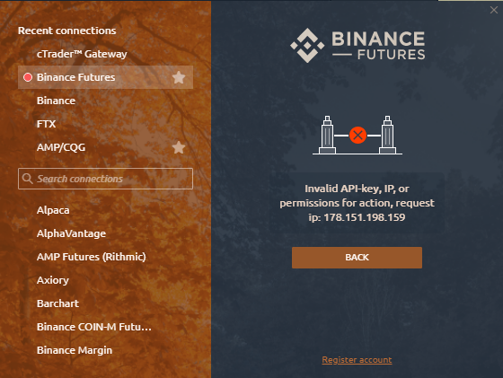

# Ошибки при подключении к Binance

Список наиболее распространенных ошибок и проблем с подключениями Binance Futures

* \*\*\*\*[**Error "Invalid API-key, IP, or permissions for action"**](errors-with-binance-connection.md#oshibka-nedopustimyi-api-klyuch-ip-ili-razresheniya-na-deistvie)\*\*\*\*
* \*\*\*\*[**Error "API key format invalid"**](errors-with-binance-connection.md#error-api-key-format-invalid-oshibka-nedeistvitelnyi-format-klyucha-api)\*\*\*\*
* \*\*\*\*[**Error "Timestamp for this request was 1000ms ahead of the server's time"**](errors-with-binance-connection.md#error-timestamp-for-this-request-was-1000ms-ahead-of-the-servers-time-oshibka-otmetka-vremeni-dlya-etogo-zaprosa-na-1000-ms-operezhaet-vremya-servera)\*\*\*\*
* \*\*\*\*[**Error "Timestamp for this request is outside of the recvWindow"**](errors-with-binance-connection.md#error-timestamp-for-this-request-is-outside-of-the-recvwindow-oshibka-otmetka-vremeni-dlya-etogo-zaprosa-nakhoditsya-za-predelami-recvwindow)\*\*\*\*
* \*\*\*\*[**Error "Order's notional must be no smaller than 5.0**](errors-with-binance-connection.md#error-orders-notional-must-be-no-smaller-than-5-0-unless-you-choose-to-reduce-only-oshibka-uslovnoe-znachenie-zakaza-dolzhno-byt-ne-menshe-5-0-usd-esli-tolko-vy-ne-vyberete-tolko-umenshenie)\*\*\*\*
* \*\*\*\*[**Error "Margin is insufficient"**](errors-with-binance-connection.md#error-margin-is-insufficient-oshibka-marzha-nedostatochna)\*\*\*\*
* \*\*\*\*[**Error "Too many new orders"**](errors-with-binance-connection.md#error-too-many-new-orders-oshibka-slishkom-mnogo-novykh-zakazov)\*\*\*\*
* \*\*\*\*[**Error "Balance is insufficient"**](errors-with-binance-connection.md#error-balance-is-insufficient-oshibka-balans-nedostatochen)\*\*\*\*
* \*\*\*\*[**Error "This listenKey does not exist"**](errors-with-binance-connection.md#error-this-listenkey-does-not-exist-oshibka-etot-listenkey-ne-sushestvuet)\*\*\*\*
* \*\*\*\*[**Не могу закрыть позицию**](errors-with-binance-connection.md#an-error-has-occurred-i-cant-close-the-position-request-was-executed-partially-the-value-of-the-open-position-is-less-than-usd-5-proizoshla-oshibka-ne-mogu-zakryt-poziciyu-zapros-vypolnen-chastichno-stoimost-otkrytoi-pozicii-menshe-5-dollarov)\*\*\*\*
* \*\*\*\*[**Error "Too much requests weight used; current limit is 1200 request weight per 1 minute**](errors-with-binance-connection.md#error-too-much-requests-weight-used-current-limit-is-1200-request-weight-per-1-minute-please-use-the-websocket-for-live-updates-to-avoid-polling-the-api-oshibka-ispolzovan-slishkom-bolshoi-ves-zaprosov-tekushii-predel-sostavlyaet-1200-zaprosov-v-minutu-ispolzuite-veb-soket-dlya-obnovlenii-v-realnom-vremeni-chtoby-izbezhat-oprosa-api)**.** 
* \*\*\*\*[**Error "Parameter 'start time' is invalid"**](errors-with-binance-connection.md#error-parameter-start-time-is-invalid-oshibka-parametr-vremya-nachala-nedeistvitelen)\*\*\*\*
* \*\*\*\*[**Error "Signature for this request is not valid"**](errors-with-binance-connection.md#error-signature-for-this-request-is-not-valid-oshibka-podpis-dlya-etogo-zaprosa-nedeistvitelna)
* **E**[**rror "User data stream expired. You will be disconnected. If you see this error, please contact support"** ](errors-with-binance-connection.md#error-signature-for-this-request-is-not-valid-oshibka-podpis-dlya-etogo-zaprosa-nedeistvitelna-1)\*\*\*\*

##   ****Ошибка «Недопустимый API-ключ, IP или разрешения на действие»

**"Неверный ключ API"** эта ошибка появляется по следующим причинам:

* трейдер не дал разрешение для Future Trading в личном кабинете на сайте Binance
* API ключи были скопированы с ошибкой.


Если вы уверены, что сделали все правильно, создайте новые ключи, и проблема будет решена. Лучше делать новые ключи  через другой браузер \(иногда возникают ошибки при создании через Google Chrome\).


Чтобы решить эту проблему, убедитесь, что у вашего ключа API есть разрешения на **торговлю фьючерсами**. Перейдите на официальный сайт Binance&gt; В своей учетной записи выберите Управление API&gt; проверьте и активируйте торговлю фьючерсами

## Error "API key format invalid" Ошибка «Недействительный формат ключа API»

Убедитесь, что ваш **ключ API и секрет API** указаны правильно

## Error "Timestamp for this request was 1000ms ahead of the server's time" Ошибка "Отметка времени для этого запроса на 1000 мс опережает время сервера"

Ошибка «**TimeStamp**» возникает, когда время на сервере Binance не совпадает со временем на компьютере пользователя.

Чтобы решить эту проблему, перейдите в «**Настройки Windows**»&gt; «**Время и язык**»&gt; и нажмите кнопку «**Синхронизировать сейчас**».

## Error "Timestamp for this request is outside of the recvWindow" Ошибка "Отметка времени для этого запроса находится за пределами recvWindow"

Платформа синхронизирует время с биржей Binance во время подключения. Если десинхронизация достигает определенного предела, то любые \(авторизованные\) запросы будут отображать эту ошибку.

Чтобы решить эту проблему, перейдите в «**Настройки Windows**»&gt; «**Время и язык**»&gt; и нажмите кнопку «**Синхронизировать сейчас**»

## Error "Order's notional must be no smaller than 5.0 \(unless you choose to reduce only\) Ошибка "Условное значение заказа должно быть не меньше 5,0$ \(если только вы не выберете только уменьшение\).

По состоянию на 24 февраля 2021 года стоимость бессрочного фьючерсного ордера должна быть не менее **5 долларов США**. Если оно меньше, заказ будет отклонен. Если вы столкнулись с этой ошибкой, увеличьте размещаемый объем, чтобы он был больше или равнялся 5 долларам США.

Пример: при открытии 0,001 ETH стоимость ордера превышает 5 долларов США, поэтому он будет размещен. Заказ на 1 ANK стоит менее 5 долларов, поэтому он будет отклонен.

## Error "Margin is insufficient" Ошибка «Маржа недостаточна»

Эта ошибка возникает при попытке разместить заказ. Пожалуйста, проверьте баланс своего кошелька и убедитесь, что в нем достаточно монет для совершения сделки. При торговле фьючерсами USDS-M на Binance Futures на счете кошелька должны быть токены USDT.

## Error "Too many new orders" Ошибка "Слишком много новых заказов"

Достигнут лимит на количество ордеров \(обычно это лимит по конкретному инструменту\). Может быть лимит на сам инструмент, или лимит на заказы, отправленные в определенный период \(например, 10 ордеров в секунду - спам\).

## Error "Balance is insufficient" Ошибка «Баланс недостаточен»

Эта ошибка возникает, когда у вас недостаточно средств на балансе. Проверьте баланс своего кошелька и убедитесь, что у вас достаточно монет для транзакции.

## Error "This listenKey does not exist" Ошибка «Этот listenKey не существует»

Эта ошибка возникает, когда трейдер подключается к бирже Binance с одним и тем же ключом API на разных платформах. У каждой платформы должен быть свой API-ключ. **Создайте новый ключ API для платформы Quantower.**

## An error has occurred: "I can't close the position. Request was executed partially - the value of the open position is less than $5. Произошла ошибка: «Не могу закрыть позицию. Запрос выполнен частично - стоимость открытой позиции меньше 5 долларов.

Эта ситуация связана с правилом торговли Binance Futures о минимальном объеме лота от 5 долларов. Вы можете закрыть позицию стоимостью менее 5 долларов, используя следующие методы:

1. Купите до минимального объема и разместите лимитный ордер на закрытие позиции. 
2. Установите отложенный стоп-приказ, чтобы закрыть позицию с объемом, равным позиции. 
3. Установите Stop-Loss или Take-Profit на стороне сервера. Закройте заказ через сайт Binance Futures.
4. Купите до минимального объема и разместите лимитный ордер на закрытие позиции.

## Error "Too much requests weight used; current limit is 1200 request weight per 1 minute. Please use the websocket for live updates to avoid polling the API" Ошибка «Использован слишком большой вес запросов; текущий предел составляет 1200 запросов в минуту. Используйте веб-сокет для обновлений в реальном времени, чтобы избежать опроса API»

‌ Binance установил лимит запросов на определенное время \(например, отправка ордера, запрос таблицы инструментов\). При превышении лимита может появиться соответствующее сообщение, либо IP будет заблокирован для выполнения запросов на некоторое время.

## **Error "Parameter 'start time' is invalid"** Ошибка «Параметр« время начала »недействителен» 

Эта ошибка не влияет на правильную загрузку данных или торговлю. Сообщение появляется при переключении на символ, который еще не был загружен в текущем активном сеансе.

## Error "Signature for this request is not valid" Ошибка «Подпись для этого запроса недействительна»

Обычно ошибка указывает на то, что ключи введены неправильно. Вероятно, что ключ API / секретный ключ введен правильно, но, возможно, «сломан». Убедитесь, что APIKey и APISecret введены правильно, или сгенерируйте ключи.

## Error "User data stream expired. You will be disconnected. If you see this error, please contact support" Ошибка «Срок действия потока пользовательских данных истек. Вы будете отключены. Если вы видите эту ошибку, обратитесь в службу поддержки.» 

Данная ошибка говорит том, что одни и те же ключи используются одновременно. Это может быть либо дубль подключения, либо эти же ключи используются на другой платформе. Убедитесь что Ваши ключи надежно сохранены в недоступном месте. 

