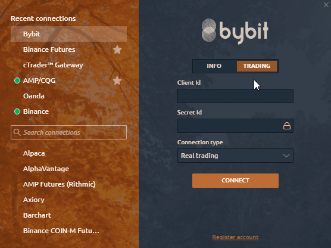
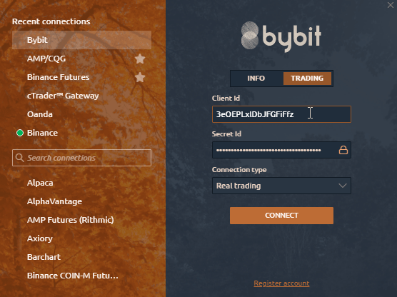
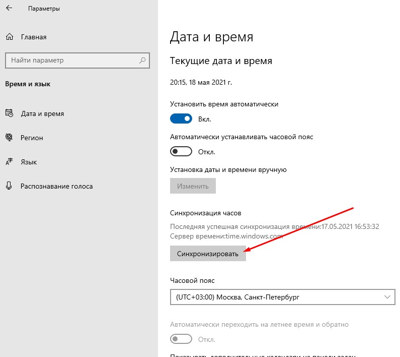

# Подключение к Bybit

В этом руководстве мы шаг за шагом рассмотрим как создать торговый счет на Bybit и подключиться к платформе Quantower.

* [**Open an account on Bybit to get personal API keys**](connection-to-bybit.md#open-an-account-on-bybit-to-get-personal-api-keys)
* [**Possible Errors with Bybit connection**](connection-to-bybit.md#possible-errors-with-bybit-connection)

Обратите внимание, что в платформе Quantower вы можете подключиться к бирже в двух режимах:

* **Информационный режим** — бесплатный и быстрый способ просмотра графиков и других данных по криптовалютам на бирже Bybit без необходимости вводить ключи.
* **Торговый режим**— для торговли на бирже Bybit в демо или реальном режиме. Ключи API обязательны. Ниже мы покажем, как получить ключи для торговли.

## Откройте аккаунт на Bybit, чтобы получить личные ключи API


Для РЕАЛЬНОЙ торговли, пожалуйста, создайте учетную запись на Bybit.com [https://www.bybit.com/en-US/invite/?ref=n9X0D](https://www.bybit.com/en-US/invite/?ref=n9X0D)

Для DEMO торговли создайте учетную запись на Testnet.Bybit.com [https://testnet.bybit.com/](https://testnet.bybit.com/)


Переходите на **Bybit official website** используя [**эту ссылку**](https://www.bybit.com/en-US/invite?ref=n9X0D) и пройдите процедуру регистрации нового аккаунта на бирже.

Для "регистрации по электронной почте" введите свой адрес электронной почты, желаемый пароль и \(!\) Реферальный код **n9X0D**

Перейдите на страницу проверки и введите проверочный код, отправленный на ваш почтовый ящик.

Чтобы создать ключи Bybit API или управлять ими, щелкните в правом верхнем углу на иконку "аккаунт" со своим именем пользователя. В выпадающем меню нажмите **'API'.**

Нажмите на предложение создать ключи **'Create New Key'** \(создать новый ключ\) расположенное справа, после того, как перейдете на вкладку  **'API Management'** 


Вам необходимо настроить двухфакторную авторизацию на Bybit. Это необходимо для создания ключей.


Появится следующее всплывающее окно. Пожалуйста, настройте свой ключ API в соответствии с вашими торговыми потребностями. введите Ваш код Google Authenticator 2FA и нажмите  'Confirm' to proceed

Введите информацию о вашем API:  
-**'Name'** введите информацию о вашем API  
-**'Key Permission'**  выберите из выпадающего списка  **'Active Order and Positions'**   
-**'Google authenticator 2FA'** введите код Google authenticator 2FA   
И подтвердите ввод данных **“Confirm”**

**\(!!\)** Получив ключи, сохраните их. После закрытия окна вы не сможете снова увидеть только что созданные ключи  

Полученные таким образом ключи API, используйте для входа в свой торговый счет на платформе Quantower.

## Возможные ошибки при подключении Bybit

**"Timestamp error"** означает, что ваше местное время на ПК отличается от времени на серверах Bybit и его следует синхронизировать.

Чтобы ее исправить, перейдите в настройки **Windows Параметры &gt; Время и Язык &gt;**  нажмите кнопку **"Синхронизировать"** **.**

