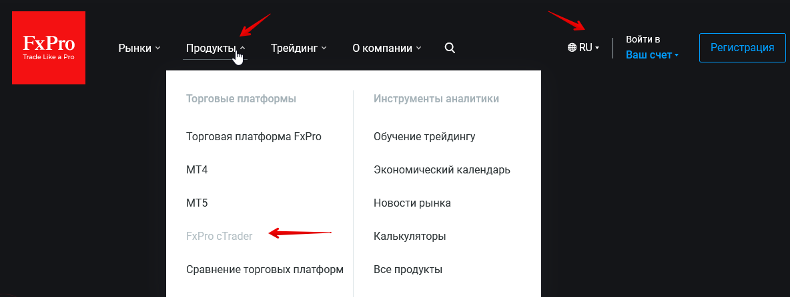
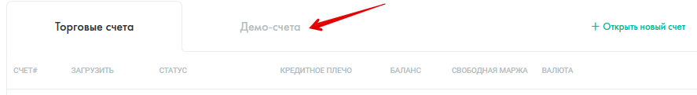
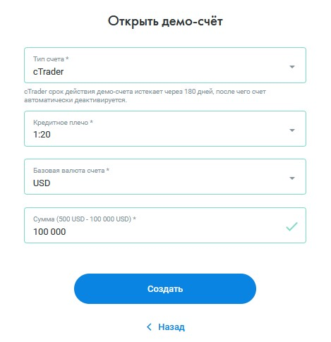
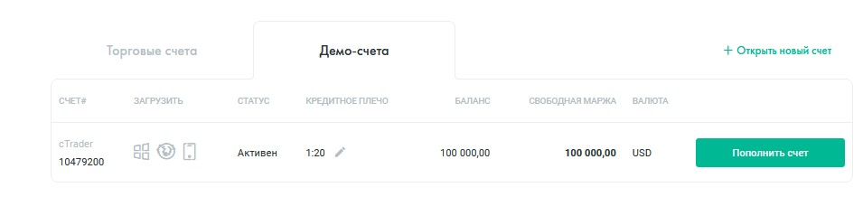
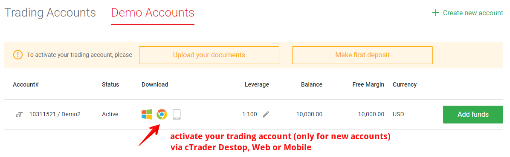
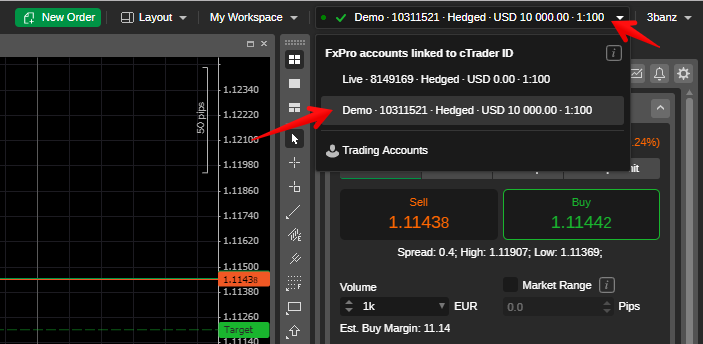
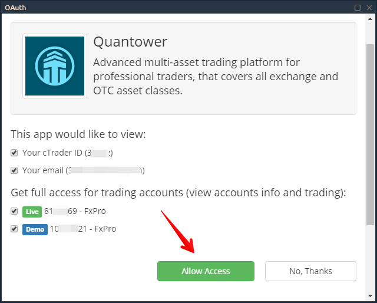
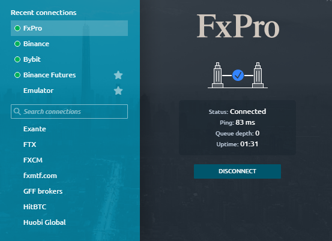

# Как подключиться к FxPro через Quantower

Чтобы подключить платформу Quantower к брокеру FxPro и отправлять торговые приказы, вам необходимо использовать cTrader Gateway. Если у вас уже есть торговый счет в FxPro, перейдите к предпоследнему шагу в этом руководстве.



* Перейдите на официальный сайт FxPro и в [**разделе Инструменты**](https://www.fxpro.com/trading-platforms/ctrader) выберите платформу cTrader.
* Создайте торговый счет, заполнив регистрационную форму. Демо-счет и реальный счет создаются под одним идентификатором cTrader ID, поэтому существует только одна форма для открытия счета. При регистрации всегда выбирайте платформу cTrader, где вам нужно ее указать.

* После регистрации вам необходимо создать демо-счет под своим cTrader ID.

* Выберите платформу cTrader, кредитное плечо, валюту счета и размер счета

* После создания демо-учетной записи проверьте адрес электронной почты, который вы использовали при регистрации учетной записи.&#x20;


В письме с темой «Добро пожаловать в cTrader ID» указан ваш **идентификатор, который будет использоваться в качестве логина на платформах Quantower и cTrader.** Установите пароль для авторизации, нажав на кнопку «Установить пароль».



Чтобы войти на платформу Quantower, используйте идентификатор cTrader и пароль, которые вы установили на предыдущем шаге.


* Перед первым подключением через платформу Quantower вам необходимо активировать свою учетную запись в системе cTrader. Вы можете сделать это через веб-платформу FxPro cTrader [https://ct.fxpro.com/](https://ct.fxpro.com/)

* Откройте веб- терминал  cTrader как указано на рисунке выше.
* После входа в веб-терминал cTrader примите соглашение и переключитесь на демо-счет в правом верхнем углу веб-терминала. Это необходимо для активации как Реального, так и Демо-счетов по отдельности.

* После этого на платформе Quantower в диспетчере подключений выберите соединение cTrader Gateway с Demo или Real и нажмите кнопку «Подключить». Появится форма авторизации, где нужно указать адрес электронной почты или cTrader ID, а также пароль. Это стандартная авторизация OAUTH, где вы можете увидеть информацию о подключении. Разрешите доступ и начните торговать :)

* Вы можете размещать заказы через Quantower или cTrader. Удачи!

